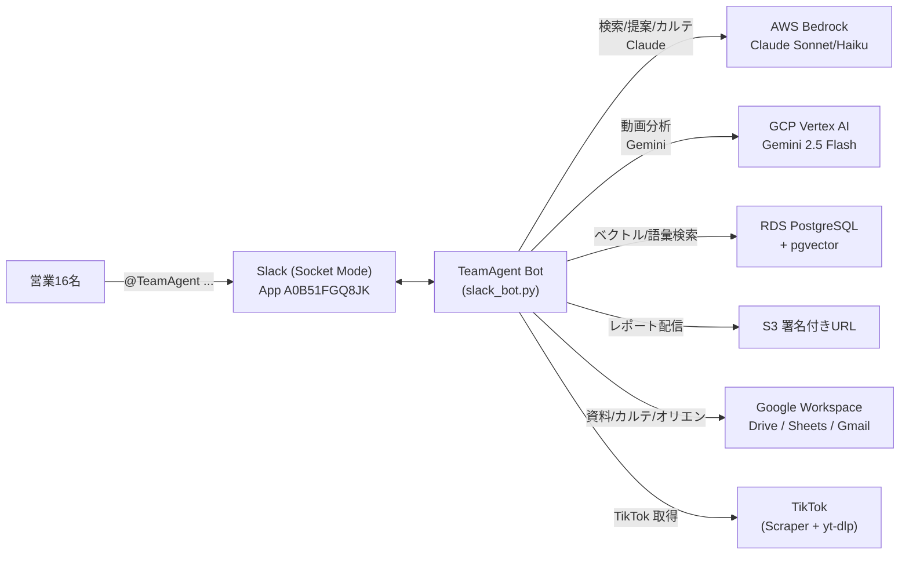
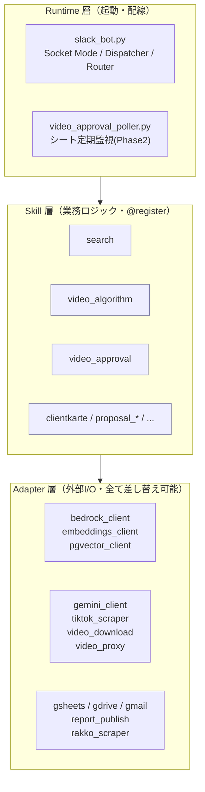
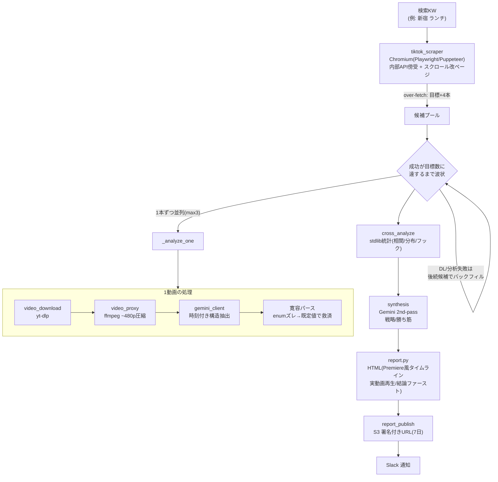
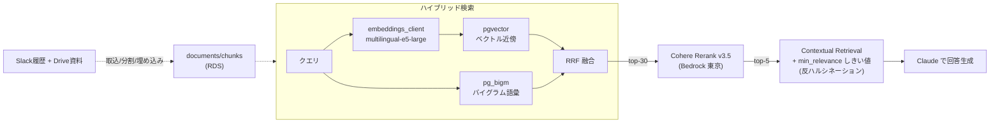
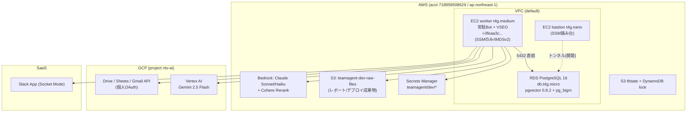
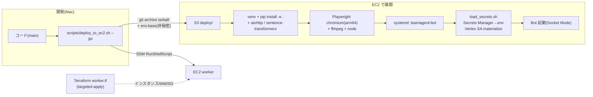
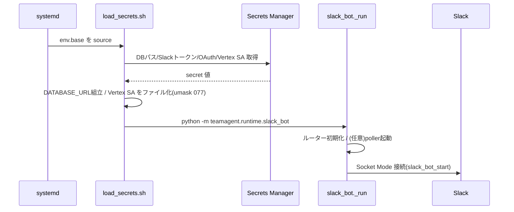

# TeamAgent — アーキテクチャ & フロー（紹介用）

> ベクトル社の営業16名向け **Slack AI エージェント**。1つの Bot が複数の「Skill」を束ね、
> 検索ナレッジ / 提案ドラフト / クライアントカルテ / 動画分析（VSEO）/ 動画一次FB審査 を担う。
> 本書は社内外に**そのまま見せられる**全体像・データフロー・インフラ・運用をまとめたもの。

最終更新: 2026-06-04 / 対象バージョン: v3.2

---

## 1. 何ができるか（Skill カタログ）

| Skill | 役割 | 主な技術 |
|---|---|---|
| **search** | 営業ナレッジ横断検索（Slack＋Drive）。RRF ハイブリッド＋Cohere Rerank＋Contextual Retrieval | pgvector / BM25(pg_bigm) / Bedrock |
| **clientkarte** | クライアント別の時系列カルテ生成 | pgvector timeline |
| **proposal_draft** | 提案書ドラフト自動生成（検索基盤を再利用） | Bedrock Claude |
| **proposal_review** | 提案書のレビュー・改善提案 | Bedrock Claude |
| **video_algorithm (VSEO)** | 検索KWの TikTok 上位動画を取得→マルチモーダル分析→「なぜ上位か」をHTMLレポート化 | Scraper / yt-dlp / Gemini / ffmpeg / S3 |
| **video_analysis** | 単体動画URLの内容分析 | Gemini |
| **video_approval** | 納品動画をオリエンと照合する一次FB審査（Phase2で自動監視） | Gemini / Sheets |
| **tiktok_search** | TikTok 検索（上位N本のメタ＋分析） | Scraper |
| **operation_log** | Slack 会話 → CRM 営業活動ログ化 | Bedrock |

起動は **Slack メンション**：`@TeamAgent <自然文>`。LLM ルーター（Haiku）が意図を解釈し適切な Skill へ振り分ける。

---

## 2. システム文脈（誰が・何に繋がるか）



- **2系統のLLM**: テキスト系（検索/提案/カルテ/ルーター）は **AWS Bedrock の Claude**、動画マルチモーダルは **GCP Vertex の Gemini**。
- ナレッジの正本は **RDS(pgvector)**。レポート等の生成物は **S3**。

---

## 3. 3層アーキテクチャ

責務を Runtime / Skill / Adapter に厳密分離（テスト容易・差し替え可能）。



- **Skill** は入出力 Pydantic スキーマ＋`run()` を持ち、`@register` で自動登録。プロンプトは `prompts/<skill>/<version>/*.md` のファイル。
- **Adapter** は外部依存を隠蔽。Skill から見ると全て callable で**テスト時はモックに差し替え可能**（負荷テストもこれで GCP 課金ゼロ）。

---

## 4. VSEO（video_algorithm）パイプライン — 看板機能

検索KW → TikTok上位N本 → 各動画を時刻付き構造分析 → 横断統計＋戦略シンセシス → 自己完結HTMLレポート → S3。



### 失敗ゼロ化（堅牢性の核）
| 失敗モード | 対策 |
|---|---|
| **DL失敗**（プロキシSSL/削除/地域制限） | **over-fetch バックフィル**: 目標+4本検索し、失敗分を後続候補で補填。再検索ループは作らず early-stop。繰上げ本数を明示 |
| **Gemini出力の enumズレ/型ズレ** | **寛容パース**: ValidationError の原因フィールドだけ schema 既定値に戻して再検証（最大8回）。診断＋救済をログ化（サイレント補正にしない） |
| 一過性ネットワーク | yt-dlp retries 3 + fragment_retries + worst フォールバック |

> 実測: 要求10本 → 分析成立10本（旧版8/10）。会社プロキシ外（EC2）では TikTok CDN の SSL も根治。

---

## 5. 検索（search）パイプライン — RAG 基盤



- 取込: Slack チャンネル履歴 + Drive 資料 → チャンク化 → e5 埋め込み → RDS。
- 検索: ベクトル + 語彙(BM25) を **RRF 融合** → **Cohere Rerank** → **min_relevance** で弱根拠を「記載なし」に（ハルシネーション抑止）。

---

## 6. インフラ構成



| 種別 | リソース | 用途 / 課金 |
|---|---|---|
| Compute | EC2 worker `t4g.medium`(arm64) | 常駐Bot+VSEO。≈$29/mo（停止時EBSのみ≈$2.4） |
| DB | RDS `db.t4g.micro` + pgvector | ナレッジ正本 |
| LLM(text) | **AWS Bedrock** Claude | 検索/提案/カルテ/ルーター → **AWS課金** |
| LLM(video) | **GCP Vertex** Gemini | 動画分析(VSEO/審査) → **GCP課金** ⚠️請求先は要・会社アカウント |
| 秘密 | Secrets Manager | DBパス/Slackトークン/Google OAuth/Vertex SA。**実値はコード/S3に置かない** |
| 配信 | S3 署名付きURL | レポート(7日有効) |

---

## 7. デプロイ & 運用フロー



- **IaC**: `infra/terraform/worker.tf`（ドリフトのため **targeted apply 必須**）。
- **2モード**: 開発は Mac（SSMトンネルでRDS）、本番は EC2（VPC内直結）。差分は `infra/deploy/ec2.overrides.env` で吸収。
- **二重起動禁止**: Slack Socket Mode は Mac と EC2 を同時接続させない（Mac停止→EC2起動の順）。詳細 `docs/v3.2/ec2_cutover_runbook.md`。

### Bot 起動シーケンス


---

## 8. セキュリティ & 設計原則

- **秘密の実値はコード/S3/チャットに出さない** → Secrets Manager のみ。`load_secrets.sh` が起動時展開。
- **シート書込は「削除ゼロ」** → 単一セル更新のみ、既存列の右端に追記。範囲/行削除APIは使わない。
- **個人OAuth強制** → 組織ポリシーで SA がDrive/Sheetsを読めないため、各人のGoogle OAuth(drive.readonly)を使用。Gemini(Vertex)はSA。
- **反ハルシネーション** → 検索は `min_relevance` 未満を「記載なし」に。VSEOは「相関≠因果」「n極小」を明示し確信度に天井。
- **IMDSv2必須 / SSMのみ接続 / インバウンドゼロ**（EC2）。

---

## 9. リポジトリの歩き方

```
src/teamagent/
  runtime/    slack_bot.py(配線) / video_approval_poller.py
  skills/     <skill>/{schema.py, skill.py, prompts経由}  ← @register で自動登録
  adapters/   外部I/O（bedrock/gemini/pgvector/tiktok_scraper/...）
  prompts/    <skill>/<version>/*.md（プロンプトはコードでなくファイル）
infra/terraform/  worker.tf 他（IaC）
infra/deploy/     ec2.overrides.env（EC2固有設定）
scripts/    deploy_to_ec2.sh / load_secrets.sh
docs/v3.2/  本書 / ec2_cutover_runbook.md / aws_compute_migration_ec2_vs_ecs.md
tests/      Skill/Adapter 単体（モックで外部I/Oを差し替え）
```

CI（`.github/workflows/ci.yml`）: ruff(lint+format) / mypy(strict) / pytest / bandit / gitleaks。
依存は `--no-deps` ＋ **手動列挙**（新importは ci.yml にも追加。pyproject の不足に注意）。
