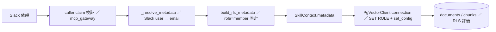

# RLS と実行ロール

## 何を守っているか

検索コーパス（`documents` / `chunks`）と本人ごとの表（`oauth_tokens`・`slack_oauth_tokens`・`digest_ack` など）は、PostgreSQL の Row Level Security（RLS）で「誰の依頼か」に応じて見える行を絞る。アプリ側の WHERE 句に頼らず、DB が最後の防壁になる設計。

これが効くには 3 つの条件がそろっている必要がある。

| 条件 | 担当 | 外れたときに起きること |
|---|---|---|
| 表の owner ではないロールで問い合わせる | migration `0002` の `teamagent_app` と `PgVectorClient.connection(app_role=...)` | owner は RLS を実質すり抜ける（`0002` 冒頭に経緯） |
| 依頼者の身元を session 変数（GUC）で渡す | `identity.build_rls_metadata` → `SkillContext.metadata` → `_apply_session` | email 未注入なら何も見えない（fail-safe） |
| 使い回す接続にロールや GUC を残さない | `adapters/pg_pool.py` の返却時リセット | 前の借用者の権限で次の依頼が走る |

たとえるなら、master 接続は「建物の合鍵」、`teamagent_app` は「受付で借りる来客用カード」、GUC は「カードに書き込む今日の訪問先」。合鍵のまま歩き回らず、必ずカードに持ち替え、帰るときにカードを返却して書き込みを消す。

## ロールの構成

| ロール | 作成 | 属性 | 使いどころ |
|---|---|---|---|
| `teamagent`（RDS master） | RDS | 表の owner・migration 実行者 | 接続のログインにだけ使う。ここから `SET ROLE` で切り替える |
| `teamagent_app` | `0002` | `NOLOGIN NOBYPASSRLS` | 検索・ingest・OAuth token・usage 記録・朝ダイジェストの状態表 |
| `teamagent_dashboard` | `0007` | `NOLOGIN NOBYPASSRLS`・読み取り専用 | 利用状況画面（`user_role='admin'` と組で使う） |
| `personal_memory_*` | `0029` | `NOLOGIN NOBYPASSRLS NOINHERIT` | 本人メモ専用。既存ロールには表の権限が無い（[本人メモ](../architecture/hermes-personal-memory.md)） |

`0002` は `GRANT teamagent_app TO teamagent` で master から切り替えられるようにする。追加の接続パスワードは不要で、`teamagent_app` 自体は直接ログインできない。`documents` / `chunks` への DML、`schema_migrations` の SELECT、`ALTER DEFAULT PRIVILEGES` による「今後作られる表とシーケンスへの自動付与」もここで入る。後から追加した usage / metrics 系は `0009` で SELECT/UPDATE/DELETE を剥がして INSERT 中心にし、`0024` で `ON CONFLICT` に要る `request_id` 列だけの SELECT を戻している（詳細は [スキーマとマイグレーション](postgres-schema-and-migrations.md)）。

## 接続と session 変数の注入

入口は `src/teamagent/adapters/pgvector_client.py` の `PgVectorClient.connection()`。呼び出し側は `app_role` と RLS 用の値を渡す。

```python
with pg.connection(app_role="teamagent_app",
                   user_email=..., user_groups=[...], user_role="member") as conn:
    ...
```

`_apply_session` が接続を借りた直後に次を実行する（プール経路・直結経路で共通）。

1. `application_name` があれば `set_config('application_name', ..., true)`（NUL 禁止・63 バイト以内）。ingest は固定名を入れて `pg_stat_activity` で見分ける。
2. `SET ROLE <app_role>`。識別子はパラメータ化できないので、英数字と `_` 以外を含むと `ValueError`。
3. `set_config('app.user_role' / 'app.user_email' / 'app.user_groups', 値, true)`。第 3 引数 `true` で **transaction-local**＝commit / rollback で消える。`user_groups` はカンマ連結して 1 つの文字列にする。
4. `SEARCH_HNSW_EF_SEARCH` が正なら `hnsw.ef_search` も同じく transaction-local で入れる（本番 100）。

ブロックを正常に抜ければ commit、例外なら rollback。`app_role=None` なら `SET ROLE` しない（ローカルで `0002` 未適用でも動くための後方互換）が、本番の `documents` / `chunks` 検索は必ず `teamagent_app` を渡す契約。

接続は `_connect_pg` が作り、`statement_timeout`（`PG_STATEMENT_TIMEOUT_MS` 既定 30 秒）・`lock_timeout`（5 秒）・`idle_in_transaction_session_timeout`（30 秒）・`connect_timeout`（5 秒）と TCP keepalive を付ける。DSN 側に `options=` を足すとこの値が上書きされる点に注意（コード内注記）。

`connection()` は同期 API で、プールの空き待ちで最大 `PGVECTOR_POOL_TIMEOUT_S` 秒ブロックする。async 文脈から直接呼ぶと Slack bot 全体が固まるので、Skill は `run_in_executor` のワーカースレッドで使う。

## 身元から GUC までの流れ



`src/teamagent/identity.py` の `build_rls_metadata` が「解決済み身元 → RLS メタ」の唯一の変換点。

- `user_role` は常に `member`。引数で admin を渡す口が無いので、MCP 越しの admin 昇格は構造的に不可能。LEGACY モード（resolver なし・テスト用）でも `member` を強制する。
- email は `normalize_email` で strip + lower + 形式検証。`unknown`・空白入り・非 ASCII（同型字対策）は `None`。
- `user_groups` は email のドメイン＋解決済みグループ。カンマを含むグループは `string_to_array(..., ',')` を壊すので除外する。
- `TEAMAGENT_ALLOWED_EMAIL_DOMAINS` 指定下でドメインが外れる、非メンバー、email 不正のときは `None`＝呼び出し側で fail-closed。

caller claim の検証と Slack 本人解決の詳細は [呼び出し元の証明とボタン束縛](../architecture/caller-identity-and-button-bindings.md) と [Slack の本人確認](../integrations/slack-identity-and-oauth.md)。

## RLS ポリシー

### documents / chunks

`0001` で両表に `ENABLE` と `FORCE ROW LEVEL SECURITY` を付けた。`documents_user_acl`（SELECT）は次のどれかに当たる行だけを見せる。

1. `app.user_role = 'admin'`
2. `app.user_email` が `owner_email` と一致
3. `app.user_email` が `acl_emails` のどれかと一致
4. `app.user_groups`（カンマ区切り）と `acl_groups` が 1 つ以上重なる

`current_setting(..., true)` は未設定なら NULL を返すので、GUC を入れ忘れると何も見えない（fail-safe）。`chunks` の `chunks_via_document` は `documents` への `EXISTS` で判定するので、親文書が見えるチャンクだけが見える。`0003` で chunks の INSERT/UPDATE/DELETE と documents の UPDATE/DELETE ポリシーを追加した（`ON CONFLICT DO UPDATE` に UPDATE ポリシーが要るため）。

### email の大文字小文字（0010）

`build_rls_metadata` が GUC 側を lower に揃えた一方、`owner_email` / `acl_emails` / `acl_groups` は取り込み時の表記のまま混在しうる。生比較のままだと「本人なのに自分の行が見えない」ので、`0010` が `documents_user_acl` と `documents_owner_insert` を **両側 `lower()`** の比較で作り直した（`DROP POLICY IF EXISTS` → `CREATE` で冪等。admin 例外と可視範囲の意図は不変）。

注意点:

- `0003` の `documents_owner_update` / `documents_owner_delete` は `0010` の対象外で、生比較のまま残っている。ingest は `user_role='admin'` で書くので現状は影響しないが、member で更新・削除する経路を足すなら揃える必要がある。
- 本人ごとの表（`oauth_tokens`・`slack_oauth_tokens`・`digest_ack`・`digest_delivery` など）は `user_email = current_setting('app.user_email', true)` の生比較。保存側が lower（`oauth_token_store` の `strip().lower()`）で、GUC も lower なので整合する。`digest_delivery` には admin 例外が無い。
- 旧 `proposals_chunks` 系は RLS 対象外。

### 会社共有グループ（§G）

社内の営業ナレッジは全員可視という方針で、`TEAMAGENT_SHARED_COMPANY_DOMAINS`（カンマ区切り）を単一の真実源にして両側を揃える。

| 側 | 実装 | 何をするか |
|---|---|---|
| 書く側 | `ingest/pipeline.py` `_company_acl_groups()` | 新規取り込みの `documents.acl_groups` に会社ドメインを付ける（未設定なら `[]`） |
| 過去分 | migration `0011` | 既存の `slack` / `gsheets` 行の `acl_groups` に会社ドメインを冪等に追加 |
| 読む側 | `mcp_gateway/server.py` `_resolve_metadata` | 会社共有モードでは、署名済み caller と Slack 本人解決に成功した場合だけ `user_groups` に会社ドメインを足す |

会社共有モードでも `user_email` は解決した本人の email になる（`mail_*` や朝ダイジェストが本人の OAuth token を引けるように）。`identity.company_member_metadata` の docstring は `user_email=None` と書いているが、実際の `_resolve_metadata` はそれを本人 email で上書きしてから使う。`build_server` は会社共有モードなのに resolver が無い、または caller claim 検証器が無い構成で起動を拒否する。

## ingest とダッシュボードの admin GUC

`ingest/repository.py` は `teamagent_app` に `SET ROLE` したうえで `user_role='admin'` を入れて書く（`_document_connection` / `_ops_connection`）。ロールは最小権限のまま、行の可視性だけ admin 例外で外す形。ダッシュボードは `teamagent_dashboard` + `user_role='admin'`。どちらも MCP の利用者経路からは到達しない（MCP 側の role は常に `member`）。本人メモの表はこの admin GUC を立てても権限そのものが無いので読めない。

## pg_pool（返却時に RLS をリセットするプール）

`src/teamagent/adapters/pg_pool.py` は依存ゼロの最小プール。`PgVectorClient.from_env()` が既定で有効にする。

| env | 既定 | 意味 |
|---|---|---|
| `PGVECTOR_POOL_MAX` | 8 | 総接続上限。`0` でプール無効（毎回 connect → close） |
| `PGVECTOR_POOL_MIN` | 0（MCP task は 2） | 起動時ウォームアップ数（失敗しても遅延生成に任せる） |
| `PGVECTOR_POOL_TIMEOUT_S` | 10 | 空き待ちの上限。超えると `PoolTimeoutError` |

肝は `SET ROLE` が **session 持続**（commit をまたいで残る）こと。そこで返却時の `_default_reset` が `rollback()` → `RESET ROLE` → `commit()` を必ず行う（rollback だけだと `RESET ROLE` 自体が巻き戻る）。GUC は transaction-local なので rollback で消えるが、保険としてここでも捨てる。reset が失敗した接続や閉じた接続はプールに戻さず破棄し、`reset_failures` を数える。総貸出数は `threading.Semaphore` で上限管理し、permit 確保後の失敗では必ず permit を返す。観測値（`PoolStats`）は `pool_stats()` から `runtime_metrics` の定期スナップショットに入る。

## テストと使い捨てロール

- `tests/test_rls_email_ci_migration.py`: `0010` が冪等（DROP IF EXISTS → CREATE）で、email・group を両側 `lower()` で比較し、admin 例外を残していることを SQL 文字列で固定する。実 DB での 2 利用者の相互確認は本番適用時の手作業（承認が要る操作）。
- `tests/adapters/test_pg_pool.py`: 返却時に `RESET ROLE` が発行され commit されること、壊れた接続の破棄、上限とタイムアウト、スレッド並行時の上限。
- `tests/adapters/test_pgvector_schema.py`: `teamagent_app` で GUC 未設定なら 0 件・ACL 内の利用者だけ見えること、`connection()` が `current_user=teamagent_app` と GUC を設定すること、不正な `app_role` の拒否。実 DB 部分は env `TEAMAGENT_DB_DSN` があるときだけ動き、CI はこの env を設定しないので CI では skip される。
- CI（`.github/workflows/ci.yml` の 2 つの pytest ジョブ）は PostgreSQL 16 のサービスコンテナに対し、「Prepare disposable PostgreSQL test role」で `teamagent_app` を `NOSUPERUSER NOCREATEDB NOCREATEROLE NOBYPASSRLS NOLOGIN` で作り、接続ユーザーに GRANT してから `TEAMAGENT_TEST_DB_DSN` で DB テストを流す。
- DB テストは本番と同じ関係を使い捨てで再現する。ingest 系は `uuid` 付きのスキーマを作って `teamagent_app` に USAGE を与え、`SET ROLE teamagent_app` で権限と RLS を確かめ、最後に `DROP SCHEMA ... CASCADE`。ingest 系は `teamagent_app` が無い・切り替えられない環境では skip する。本人メモ系（`tests/personal_memory/conftest.py`）は `uuid` 付きの master 相当ロールと DB を作り、`teamagent_app` / `teamagent_dashboard` が無ければ作ったうえで `GRANT teamagent_app TO <master>` と `0002` の既定権限を再現してから migration を流す。どちらも `TEAMAGENT_TEST_DB_DSN` が無ければ skip。

CI と同じ依存での実行方法は [テストの走らせ方と CI](../testing/running-tests.md)。検索側でこのメタがどう使われるかは [ナレッジ検索](../workflows/knowledge-search.md)。

## 変更するときの注意

- 新しい表を足すと `0002` の既定権限で `teamagent_app` に S/I/U/D が自動で付く。INSERT だけにしたい表は `0009` のように明示的に REVOKE する。最小権限にすると `ON CONFLICT` / `RETURNING` が SELECT 不足で落ちることがある（`0024` の経緯）。
- 本人ごとの表のポリシーは `user_email = current_setting('app.user_email', true)` の形に揃え、保存時に lower 正規化する。admin 例外を安易に写さない。
- `app_role` を増やすときは英数字と `_` だけの固定値にする（`SET ROLE` はパラメータ化できない）。
- プールを `psycopg_pool` に置き換える場合も「返却時に `RESET ROLE` を確定させる」不変条件を保つ。
