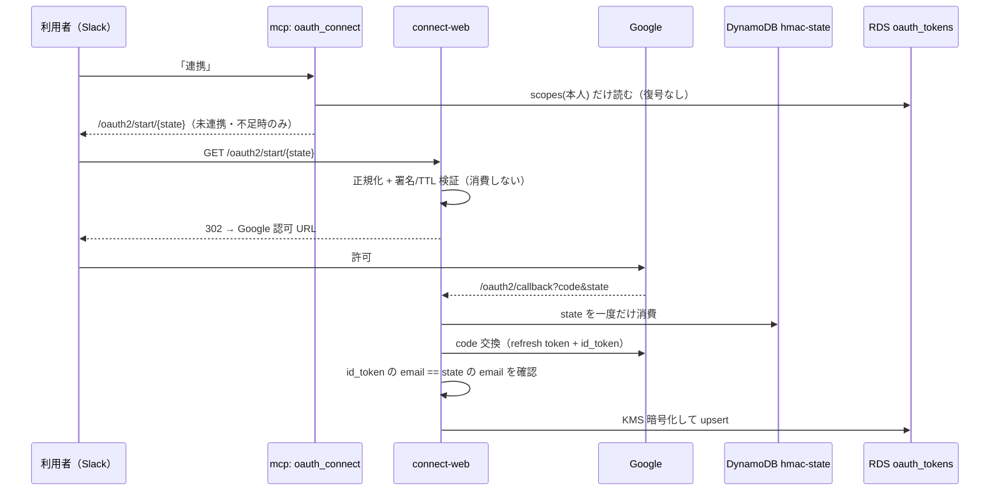

# Google OAuth とトークン保管（connect-web）

## 責任範囲

Aico のメール・カレンダー・Drive 系ツールは、**呼び出した本人の Google 権限**でしか動かない（DWD のような代理権限は使わない）。各利用者が自分で Google を認可し、得た refresh token を本人単位で保管して、ツール実行時に本人の分だけを取り出す。

| 部品 | 場所 | 役割 |
|---|---|---|
| 連携リンク発行 | `src/teamagent/skills/oauth_connect/skill.py` | 未連携・スコープ不足のサービスだけ、本人専用の認可リンクを返す（URL を作るだけ） |
| 同意フロー | `src/teamagent/adapters/google_oauth_flow.py` | state の署名/検証/ワンタイム消費、認可 URL 生成、code → refresh token 交換 |
| 受け口 | `src/teamagent/connect_web/app.py`（`python -m teamagent.connect_web`） | `/oauth2/start/{state}` と `/oauth2/callback`。検証 → 交換 → 本人照合 → 保存 |
| 保管 | `src/teamagent/adapters/oauth_token_store.py` + `infra/migrations/0006_oauth_tokens.sql` | KMS 暗号化した refresh token を RDS `oauth_tokens` に置く。RLS で本人行のみ |
| 利用 | `src/teamagent/adapters/google_auth.py` | `build_user_credentials` で本人 token から Google `Credentials` を作る |
| 診断 | `src/teamagent/connect_diagnostics.py` | 失敗経路ごとの `CONNECT-xxx` コードと、利用者が転送できる 1 行 |

たとえるなら、oauth_connect は「本人名入りの申込書を渡す窓口」、connect-web は「申込書の割り印と本人の顔を確かめて金庫に預ける受付」、token store は「本人の鍵でしか開かない貸金庫」。Slack の個人トークン（xoxp）も同じ connect-web と KMS 鍵を使うが、詳細は [Slack の本人確認と OAuth](slack-identity-and-oauth.md) を参照。

## 流れ

## oauth_connect（リンク発行）

- ツールは `USE_OAUTH_CONNECT_TOOL` が真のときだけ登録される（コード既定 OFF、本番 `fargate.tf` は `true`）。MCP gateway は、別ツールの引数に連携依頼が含まれていると検証済み caller のまま `oauth_connect` へ寄せ替える（`mcp_gateway/server.py`）。OpenClaw 側の多層防御は [呼び出し元の証明とボタン束縛](../architecture/caller-identity-and-button-bindings.md)。
- 対象は常に本人。`SkillContext.metadata["user_email"]` が無ければ `PermissionError`（I02）で fail-closed し、他人分の URL は作らない。
- Google の状態判定は「行がある」ではなく **保存済み scopes ⊇ `WORKSPACE_SCOPES`**。足りなければ再連携リンクを出す（スコープ追加後に既連携者が機能を使えなくなった事故への対策）。判定中の例外は「未連携」とみなしてリンクを出す（連携導線を塞がない）。
- **生存確認（`OAUTH_CONNECT_LIVENESS_PROBE`、既定 OFF・本番は tfvars の `oauth_connect_liveness_probe` で渡す）**: パスワード変更などで refresh token が失効した人に「連携済み・操作不要」と返してしまう行き止まりを防ぐため、ON のときは「連携済み」と答える前に、本番のアダプタと同じ組み立て（`build_user_credentials` → `Credentials.refresh`）で token endpoint を 1 回だけ叩く（`adapters/google_liveness.py`、既定 5 秒で打ち切り）。結果は `alive` / `token_dead`（`invalid_grant` か refresh token が空のときだけ）/ `scope_missing` / `unknown` の 4 つで、`unknown` はリンクを出す安全側に倒す。Gmail・Calendar の API は呼ばず、ログには分類コードと例外の型名だけを出す。
- `OAUTH_REDIRECT_URI` が無い、または URL 生成に失敗したら `ValueError`（L01）。
- `USE_OAUTH_START_LINKS` が真かつ `CONNECT_BASE_URL` があるとき、長い認可 URL の代わりに `{base}/oauth2/start/{state}` を返す。LLM が約 600 字のクエリを再タイプして state を壊す事故（S01）への対策で、署名をクエリから path へ移す。`CONNECT_BASE_URL` が無ければ warning を出して従来の URL を返す。

## state（CSRF 対策とワンタイム消費）

- `make_state` は `email|発行時刻|nonce` を `OAUTH_STATE_SECRET` で HMAC-SHA256 署名し、base64url にする。email は lower/trim 済み。
- `inspect_state` は `ok` / `bad_signature` / `expired` / `malformed` を返す。有効期限は 30 分、発行時刻が 60 秒より未来でも `expired`。署名が合った `expired` だけ email を返す（診断行に本人を出せる）。
- state は mcp が署名し connect-web が検証するため、**`OAUTH_STATE_SECRET` は両サービスで同一値**でなければならない（`fargate.tf` / `connect_web.tf` が同じ Secrets Manager を参照）。
- `consume_state_once` は hmac-state テーブル（`TEAMAGENT_HMAC_STATE_TABLE` / `_SCOPE`）へ `OAUTH_STATE#<sha256(state)>` を `attribute_not_exists` 条件付きで書く。再利用なら `False`、env 未設定なら `RuntimeError`。消費するのは callback だけ。

## 認可 URL と code 交換

- `WORKSPACE_SCOPES` は `openid`・`userinfo.email`・`gmail.modify`・`drive.readonly`・`documents.readonly`・`spreadsheets.readonly`・`presentations.readonly`・`calendar.readonly`・`calendar.events`・`contacts.readonly`。Gmail の送信/削除や Calendar の削除/更新はスコープ上は可能でも、アダプタ層の denylist で封鎖している（[メール系ツール](../workflows/mail-tools.md)）。
- URL は `access_type=offline`・`prompt=consent`（refresh token を確実に得る）・`login_hint=本人メール`・`hd`（`CONNECT_SEARCH_ALLOWED_HD`、無ければ `TEAMAGENT_SHARED_COMPANY_DOMAINS` が 1 つのときその値）。`include_granted_scopes` は使わない。
- PKCE は無効。URL 生成（mcp）と交換（connect-web）が別プロセスで code_verifier を共有できないため。機密（web 型）クライアントの secret で守る。
- `exchange` は `OAUTHLIB_RELAX_TOKEN_SCOPE` を立てて scope の食い違いで落ちないようにし、refresh token が無ければ `ValueError`。id_token は照合用に一時的に持つ。
- 連携用クライアントは `connect_client_id_secret()` が選ぶ: `CONNECT_GOOGLE_CLIENT_ID/SECRET` 優先、無ければ `GOOGLE_CLIENT_ID/SECRET`。連携は web 型、共有 OAuth は desktop 型という分離のため。

## connect-web の 2 ルート

**`/oauth2/start/{state}`**（GET/HEAD）: 2,048 字超や base64url 以外は S01。`_canonical_oauth_state` で strict decode → 正規形に再エンコードする（末尾 `=` 欠けは救い、`state.` のような変種で消費キーが増えるのを防ぐ）。`inspect_state` で検証するだけで**消費しない**ので何度開いても同じ URL へ飛ぶ。mcp と同じ `OAuthConsentFlow.authorization_url(email, state=canonical)` で URL を組み直し、`Cache-Control: no-store` の 302 を返す。リダイレクト先はサーバが組むので open redirect にならない。state は email を含むため、uvicorn のアクセスログではこのパスを伏せる（`_RedactOAuthStartAccessLog`）。

**`/oauth2/callback`** は次の順に確かめ、外れたら診断行つきの失敗ページ（`_connect_failure`）を返す。

1. `error` パラメータ（許可画面で拒否）→ S05。`code`/`state` 欠落 → S01。
2. `inspect_state` → 署名不一致・壊れは S01、期限切れは S02。
3. ワンタイム消費: `RuntimeError`（保管先未設定）→ S06/500、その他の例外（一時障害）→ S06/503、`False`（再利用）→ S03。例外を「使用済み」と混同しない（混同して利用者に何度も押させた事故がある）。
4. code 交換失敗 → S06。id_token 欠落・検証失敗 → S06/403。
5. id_token の `email` が state の email と完全一致し、`email_verified` が真 → そうでなければ S04/403（別アカウントで許可された）。
6. `_put_verified_oauth_token` が照合済みのときだけ `store.put` を通す。保存するのは refresh token と scopes だけで、id_token は捨てる。保存失敗は S06。

## 保管（oauth_tokens・KMS・RLS）

- `RdsTokenStore` は email を lower/trim して、`KmsCipher.encrypt(..., context={"user_email": email})` で暗号化した BYTEA を `ON CONFLICT (user_email) DO UPDATE` で upsert する。EncryptionContext を本人メールに束縛するので、別人の行の暗号文を持ってきても復号できない。KMS 鍵の region は `OAUTH_KMS_REGION`（既定 ap-northeast-1）。
- 接続は `pgvector.connection(app_role, user_email)` が `app.user_email` GUC を立て、テーブルは `FORCE ROW LEVEL SECURITY` で「本人行または `app.user_role=admin`」だけ見える。詳細は [RLS と実行ロール](../data/rls-and-app-role.md)。
- `scopes()` は scopes 列だけ読み、KMS 復号しない（oauth_connect の状態判定用。無駄な Decrypt と監査ログを避ける）。
- `OAuthToken` の `repr` は token を `***` に伏せる。
- ストアの構築は `orchestrator/factory._build_token_store`（Slack Bot 経路は `runtime/slack_bot.py` の `SkillDispatcher._get_token_store`）。**`OAUTH_KMS_KEY_ID` が無いと `InMemoryTokenStore`（空＝全員未連携）に落ちる（例外にならない）**ので、RDS に token があってもメール系が「連携してください」になる。本番の mcp・connect-web・morning-digest は同じ KMS 鍵（`alias/teamagent-oauth-tokens`）を設定している。

## 利用（build_user_credentials）

`build_user_credentials(token)` は `Credentials(token=None, refresh_token=…, token_uri=…, client_id/secret=連携用クライアント, scopes=保存済み scopes)` を返す。クライアント未設定・refresh token 空は `ValueError`。`GmailClient` / `GCalendarClient` / `GDriveClient` / `GSheetsClient` / `GDocsClient` / `GSlidesClient` / `GPeopleClient` の `from_user_token` がこれを使う。

- refresh は token を発行した**同じ web 型クライアント**でないと `RefreshError` になる。morning-digest のタスクに `CONNECT_GOOGLE_CLIENT_SECRET` を渡し忘れて収集が全 0 件になった回帰があり、`morning_digest_schedule.tf` に注記がある（[朝ダイジェスト](../workflows/morning-digest.md)）。
- メール系は `skills/_shared/mail_connection.py` の `resolve_gmail_for_user` を通す。ネットワーク I/O をしないので token の生死までは分からない。token 無し → `not_connected`、`ValueError` → `reauth_needed`。受信箱を叩いて失効が露見したら `classify_gmail_failure` が `RefreshError`/`invalid_grant`/401 等を `reauth_needed`、それ以外を `gmail_api_failed` に分ける。どれも「0 件」とは別の構造化エラーとして返し、SOUL の「再連携へ誘導」契約に載せる。

## 共有 OAuth・Vertex SA・GOOGLE_FORCE_OAUTH

per-user とは別に、案件シートやナレッジ用共有ドライブの読み取りには「共有 OAuth」（1 本の refresh token）を使う。

| 用途 | 資格情報 | 選び方 |
|---|---|---|
| 本人のメール・予定・Drive | per-user token（`build_user_credentials`） | TokenStore から本人分 |
| 共有 Drive / シート（ingest・knowledge_deliver・動画審査） | 共有 OAuth（`build_oauth_credentials`: `GOOGLE_OAUTH_REFRESH_TOKEN` + `GOOGLE_CLIENT_ID/SECRET`、スコープは `GOOGLE_OAUTH_SCOPES` で上書き可） | `GDriveClient` / `GSheetsClient` の `_build_credentials` |
| Gemini（Vertex AI） | Vertex SA（ADC） | entrypoint が `VERTEX_SA_JSON` をファイル化し `GOOGLE_APPLICATION_CREDENTIALS` に設定 |

`_build_credentials` は「`GOOGLE_APPLICATION_CREDENTIALS` があり、かつ `GOOGLE_FORCE_OAUTH` が偽なら SA」を最優先する。Vertex 用に SA を置いたコンテナではそのままだと Drive まで SA になり、SA は組織ポリシーで外部共有の Drive/シートを読めない（ingest の walk が 0 件、資料 DL 失敗）。そのため mcp（`fargate.tf`）と ingest（`ingest_schedule.tf`）は `GOOGLE_FORCE_OAUTH=1` を設定し、SA は Gemini 専用・Drive は共有 OAuth、と分けている。ingest は `GOOGLE_OAUTH_JSON` を `scripts/run_ingest_fargate.py` が 3 つの env に展開する。

## 接続診断（CONNECT-xxx）

連携失敗は 9 型あるが利用者向けの文言が数種類しかなく、原因を追えなかった。そこで `ConnectDiag` が系統別のコードを定める: S01〜S06（主に Google の callback・start。S05・S06 は Slack 側でも使う）、I01a/b/c・I02・I03（mcp 側の本人特定）、L01（リンク生成）、T01・T02（Slack callback）。

- 失敗経路は必ず `診断: <CODE> <YYYY-MM-DD HH:MM JST> <マスク済みメール or Slack user ID or -> [request_id]` を末尾に付ける。request_id は ALB の `X-Amzn-Trace-Id` の Root（無ければ `X-Request-Id`）で、warning ログにも同じ `request_id=`・`diag=`・`state_reason=` を載せる。
- 不変条件: 診断行に state・code・token・secret を入れない。署名未検証（S01）の email は出さない。`format_diag_line` は素のメールが来てもマスクする。
- `DIAG_SPECS` がコードごとの意味・利用者の対処・対応ログ event を持つ単一情報源。転送先の管理者名は `CONNECT_ADMIN_NAME` で差し替える。運用手順は `docs/runbooks/connect_diagnostics.md`。
- `/oauth2/start` は消費しないので S03 を出さない（使用済みは callback だけが判定する）。

## 設定

| env | 読む所 | 意味 |
|---|---|---|
| `OAUTH_STATE_SECRET` | mcp・connect-web | state 署名鍵（両者で同一値必須） |
| `OAUTH_REDIRECT_URI` | mcp・connect-web | 公開 callback URL（GCP 登録値と一致） |
| `CONNECT_GOOGLE_CLIENT_ID` / `_SECRET` | mcp・connect-web・morning-digest | 連携用 web 型クライアント |
| `OAUTH_KMS_KEY_ID` | 同上 | token 暗号化鍵。無いと InMemory に落ちる |
| `TEAMAGENT_HMAC_STATE_TABLE` / `_SCOPE` | connect-web | state のワンタイム消費先 |
| `USE_OAUTH_CONNECT_TOOL` / `USE_OAUTH_START_LINKS` / `CONNECT_BASE_URL` | mcp | ツール公開、path 形式リンク |
| `GOOGLE_FORCE_OAUTH` | Drive/Sheets アダプタ | SA より共有 OAuth を優先 |

## docs・注記との食い違い

- `docs/poc/workspace_integration_design.md` は「5 サービス・全て readonly」「保管先は未確定」と書くが、コードは `gmail.modify`・`calendar.events` を含む 7 サービス分のスコープを要求し、保管先は RDS + KMS に確定している。
- `oauth_token_store.py` 冒頭の「本番バックエンドは設計確定後に差し替える」は古く、同じファイルに `RdsTokenStore` がある。
- `oauth_connect/skill.py` の docstring は `USE_OAUTH_START_LINKS` を「既定 OFF」とする。コード既定は OFF だが、Terraform 変数 `use_oauth_start_links` の既定は `"1"` で本番は ON。
- `connect_web/__main__.py` の docstring は `GOOGLE_CLIENT_ID/SECRET` を挙げるが、実際は `CONNECT_GOOGLE_CLIENT_*` が優先される。

## 代表的なテスト

- `tests/adapters/test_google_oauth_flow.py`・`test_oauth_state_inspect.py`: state の署名・期限・失敗理由。
- `tests/adapters/test_oauth_token_store.py`・`test_oauth_tokens_rls.py`: 暗号化保存と本人行 RLS。
- `tests/connect_web/test_callback.py`・`test_callback_state_errors.py`・`test_callback_diagnostics.py`: id_token 不一致で保存しない、消費失敗の出し分け、診断コード。
- `tests/connect_web/test_oauth_start.py`・`test_start_diagnostics.py`: start が消費しないこと、正規化、mcp と同一 URL。
- `tests/skills/oauth_connect/`・`tests/test_connect_diagnostics.py`: 未連携だけ案内、スコープ不足の再連携、診断行の不変条件。
