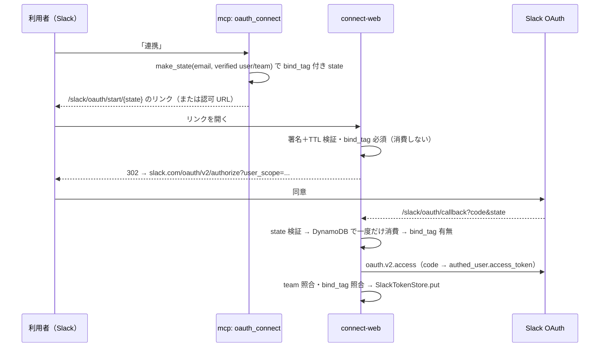

# Slack の本人確認と連携

## 責任範囲

Slack との接点は、共有の bot token（xoxb、env `SLACK_BOT_TOKEN`）と、利用者ごとの user token（xoxp）の 2 系統に分かれる。xoxb は「Aico という bot」として動き、xoxp は「その営業本人」として動く。取り違えると他人の権限で Slack を読むことになるので、構築口も保管先も分けてある。

| 部品 | 場所 | 使うトークン | 役割 |
|---|---|---|---|
| 本人確認 | `src/teamagent/adapters/slack_client.py` の `resolve_identity` | xoxb | 署名済みの Slack user_id をサーバ側で email に解決する。怪しければ None |
| OAuth 同意 | `src/teamagent/adapters/slack_oauth_flow.py` | （発行元） | 本人専用の認可 URL と state を作り、code を xoxp に交換する |
| callback | `src/teamagent/connect_web/app.py`（`/slack/oauth/start/{state}`・`/slack/oauth/callback`） | xoxp | state を検証・消費し、同意した Slack アカウントが依頼者本人か照合して保存する |
| 保管 | `src/teamagent/adapters/oauth_token_store.py` の `SlackTokenStore`、`infra/migrations/0018_slack_oauth_tokens.sql` | xoxp | KMS 暗号化＋本人行 RLS |
| 本人として読む | `src/teamagent/adapters/slack_user_reader.py` | xoxp | スレッド取得・横断検索・表示名解決（読み取り専用） |
| ファイル取得ガード | `src/teamagent/adapters/slack_file_guard.py` と `SlackClient.download_file_guarded` / `download_file_bounded` | xoxb | `url_private` のホスト検証・1 回だけのリダイレクト追従・容量上限 |
| 在籍者名簿 | `src/teamagent/adapters/slack_member_directory.py` | xoxb | 本人メモの人名ガード用に同僚の名前集合を作る |
| チャンネル取り込み | `src/teamagent/adapters/slack_channel_ingest_client.py` | xoxb | 履歴・スレッド・メンバー取得（ingest の ACL 源） |

たとえるなら、xoxb は受付に置いた「会社の代表印」、xoxp は各営業が自分で作って金庫に預けた「本人の実印」。代表印で本人確認をし、本人の用件には本人の実印だけを使う。

## resolve_identity（本人確認の fail-closed 判定）

<!-- openwiki: broken internal link [/openwiki/architecture/caller-identity-and-button-bindings.md] link "/openwiki/architecture/caller-identity-and-button-bindings.md" is root-absolute, which no real consumer resolves against the repository root (not a coding agent reading the page, not GitHub's Markdown renderer, not a local viewer); use a path relative to this file instead. Fix the href or restore the target, then delete this comment. -->
<!-- openwiki: broken internal link [/openwiki/architecture/mcp-gateway.md] link "/openwiki/architecture/mcp-gateway.md" is root-absolute, which no real consumer resolves against the repository root (not a coding agent reading the page, not GitHub's Markdown renderer, not a local viewer); use a path relative to this file instead. Fix the href or restore the target, then delete this comment. -->
呼び出し元の Slack user_id は OpenClaw の caller claim で署名されて届く（[呼び出し元の証明とボタン束縛](/openwiki/architecture/caller-identity-and-button-bindings.md)）。mcp_gateway の `build_slack_identity_resolver` は `SLACK_BOT_TOKEN` があるときだけ `SlackClient.resolve_identity` を resolver として返し、本番エントリポイントは resolver が無いと起動しない。`_resolve_metadata` は resolver が None を返すか例外を投げると `identity_spoof_rejected`（`resolve_none` / `resolver_error`）で依頼を拒否する。モードの違いは [MCP gateway](/openwiki/architecture/mcp-gateway.md) を参照。

`resolve_identity` は次のどれか 1 つでも当てはまれば None を返す。

1. user_id が `^U[A-Z0-9]{8,}$` に合わない（空・`unknown`・小文字・Enterprise Grid の `W…` を含む）。この判定は API を呼ぶ前に行う。
2. `users.info` が失敗した。
3. `deleted`・`is_bot`・`is_restricted`（ゲスト）・`is_ultra_restricted`（シングルチャンネルゲスト）・`is_stranger`（Slack Connect の外部ユーザー）のどれかが真。
4. env `SLACK_TEAM_ID` が未設定か `^T[A-Z0-9]{8,}$` に合わない（設定不備も拒否側に倒す）。
5. ユーザーの `team_id` が `SLACK_TEAM_ID` と一致しない（別ワークスペース）。
6. `profile.email` が `identity.normalize_email` を通らない（空・`unknown`・非 ASCII・空白含み・ドメインに `.` 無し）。

通れば `ResolvedIdentity(slack_user_id, email=正規化済み, is_member=True, groups=(), source="slack_users_info")` を返す。その後 `build_rls_metadata` が許可ドメイン（`TEAMAGENT_ALLOWED_EMAIL_DOMAINS`）を見て RLS メタに変える。

結果は `SlackClient` インスタンスの辞書に、成功も失敗も 60 秒だけキャッシュする（`_IDENTITY_TTL_OK` / `_IDENTITY_TTL_NONE`）。60 秒は caller claim の最長寿命に合わせた値で、退職・ゲスト化・無効化をそれ以上古い情報で通さないためのもの。resolver はプロセスで 1 つなので、キャッシュは mcp タスク単位になる。

## Slack user token（xoxp）の OAuth

- **scope**: `SLACK_USER_SCOPES` は `search:read`・`channels:history`・`groups:history`・`im:history`・`mpim:history`・`users:read` の読み取り系だけ。本人名義の投稿（`chat:write` の user scope）は付けない。認可 URL は bot 用の `scope=` ではなく `user_scope=` に並べる。xoxp は応答トップではなく `authed_user` の下から取る。
- **state**: `email|発行時刻|nonce` を env `SLACK_OAUTH_STATE_SECRET`（Google の state 鍵とは別）で HMAC-SHA256 署名し base64url にしたもの。有効期限 1800 秒、未来の発行時刻は 60 秒まで許す。`oauth_connect` は mcp が検証済みの `verified_slack_user_id` / `verified_slack_team_id` を渡し、nonce の後ろに `~` と bind_tag（`slackbind:v1:{team}:{user}` の HMAC 先頭 32 桁）を付ける。検証済み ID が無いときは Slack のリンクを出さない（`oauth_connect_slack_url_suppressed`）。
- **start**: `/slack/oauth/start/{state}` は署名＋TTL と bind_tag の有無だけを見て Slack の認可 URL へ 302 する。消費は callback の責務。
- **callback の検査順**: `error` パラメータ（利用者キャンセル・S05）→ `code`/`state` 欠落 → 署名・期限（T01）→ `consume_state_once(st.sig, record_prefix="SLACK_OAUTH_STATE#")` による一度きりの消費（DynamoDB の条件付き更新。使用済みは T01、消費先未設定は S06）→ bind_tag 無し（旧形式 state）を拒否 → code 交換 → 交換結果に user/team が無い → `SLACK_TEAM_ID` との team 照合 → 交換した token の team/user から計算し直した bind_tag と state の bind_tag を `hmac.compare_digest` で照合。照合で拒否したときは取得済みの xoxp を `auth.revoke` で best-effort に無効化し、403 を返す。
- 最後の保存は `_put_verified_slack_token(identity_verified=True)` だけを通る。

「連携リンクを他人に転送され、別の Slack アカウントで同意される」事故は、この bind_tag 照合で止まる。

## 保管（slack_oauth_tokens）

- `SlackTokenStore.put` は xoxp を `KmsCipher` で暗号化し、KMS の EncryptionContext に `{"user_email": email}` を付ける。復号時も同じ context が要るので、別人の行の暗号文を持ってきても復号できない。KMS 鍵は env `OAUTH_KMS_KEY_ID`（region は `OAUTH_KMS_REGION`、既定は東京）。
<!-- openwiki: broken internal link [/openwiki/data/rls-and-app-role.md] link "/openwiki/data/rls-and-app-role.md" is root-absolute, which no real consumer resolves against the repository root (not a coding agent reading the page, not GitHub's Markdown renderer, not a local viewer); use a path relative to this file instead. Fix the href or restore the target, then delete this comment. -->
- DB 接続は `pgvector.connection(app_role, user_email)` で `app.user_email` GUC を立て、テーブルは `FORCE ROW LEVEL SECURITY` の本人行ポリシー（`app.user_role = 'admin'` だけ全行）。詳しくは [RLS と実行ロール](/openwiki/data/rls-and-app-role.md)。
- `(team_id, slack_user_id)` の部分一意インデックスがあり、同じ Slack アカウントを 2 つの email に紐付けようとすると callback は `UniqueViolation` を 409 で返す。
- `slack_user_id()` は KMS 復号をせずに保存済み Slack ID だけを読む。`oauth_connect` はこれを検証済み ID と比べ、空や不一致なら「要再連携」としてリンクを出し直す。
- `SlackOAuthToken.__repr__` は `access_token` を `***` に伏せる（ログ・例外への漏洩防止）。

<!-- openwiki: broken internal link [/openwiki/integrations/google-oauth-and-token-store.md] link "/openwiki/integrations/google-oauth-and-token-store.md" is root-absolute, which no real consumer resolves against the repository root (not a coding agent reading the page, not GitHub's Markdown renderer, not a local viewer); use a path relative to this file instead. Fix the href or restore the target, then delete this comment. -->
Google 側の対になる仕組みは [Google の OAuth とトークン保管](/openwiki/integrations/google-oauth-and-token-store.md)。

## 本人として読む（SlackUserReader）

`SlackUserReader` は xoxp を受け取って `conversations.replies` / `conversations.history` / `search.messages` / `users.info` を呼ぶ読み取り専用 adapter。skill は同期実行なので、内部で `_run_sync` が async クライアントを回す（実行中ループがあれば別スレッド）。

- `read_thread` / `search` / `get_display_name` は fail-open（失敗は空か None）。メール下書きの文脈集め（`skills/_shared/slack_context.py`）や未返信検出（`slack_unreplied.py`）が使い、下書き生成を止めない。
- `read_thread_checked` / `read_channel_checked` は Slack の error code（`not_in_channel` など）を `SlackThreadRead.error` で返す。「権限なし」と「空」を区別したい `slack_summary` が使う。
- 表示名は 24 時間、解決失敗は 10 分キャッシュする。キャッシュはインスタンス（＝1 人の xoxp）に閉じる。ここでは `W…` の ID も受け付ける（`resolve_identity` は受け付けない）。
- ログは件数・latency・error code だけ。本文・permalink・channel 名・実名は出さない。

## ファイル取得ガード

`url_private` へは Authorization ヘッダに bot token を載せて GET する。ホストを検証しないと、`files` 配列に混ざる外部共有ファイル（Drive / Box など）の URL へ token を送ってしまう。

| メソッド | ホスト検査 | 使う所 |
|---|---|---|
| `download_file_guarded` | `validate_slack_file_url`。既定は `files.slack.com` だけ（env `SLACK_FILE_ALLOWED_HOSTS` で追加） | `attachment_assist`（事前選別も同じ関数と `is_external_file` を使う） |
| `download_file_bounded` | `slack_file_url_allowed`。`slack.com` と `*.slack.com` の正規 HTTPS | `video_capture` |
| `download_file` | 無し（全量をメモリに読んでから MB で判定） | 旧 Socket Mode bot（`runtime/slack_bot.py`）だけ |

guarded と bounded の共通点は次のとおり。

- httpx には `follow_redirects=False` のまま、302 / 303 だけを **1 回だけ** 自前で追う。307 / 308 と 2 段目のリダイレクトは拒否する。大きめのファイル（本番で 2.4MB の PDF）は `files.slack.com` から署名付き URL へ 302 されるため、追従しないとサイズ次第で失敗する。
- 転送先の `Location` は絶対 https・既定ポート・資格情報なしで、`slack-files.com`（env `SLACK_FILE_REDIRECT_ALLOWED_HOSTS`）に限る。`url_private` の allowlist を広げても転送先は広がらない。転送先へは Authorization を送らない。
- `Content-Length` と実際に受け取ったバイト数の両方で `max_bytes` を超えたら接続を切って例外にする。共有 mcp タスクのメモリ不足を防ぐため。

ホスト判定は末尾一致だけで、部分文字列や接尾辞の偽装（`files.slack.com.attacker.example`）は通らない。`is_external_file` は `is_external` が真・`external_type` が非空・`mode` が `external` / `hosted_external` のどれかで外部と判定する。docstring には「判定できない形は外部扱い」とあるが、実装はこの 3 条件だけで、それ以外は外部とみなさない（次のホスト allowlist が防壁になる）。

## 在籍者名簿（SlackMemberDirectory）

<!-- openwiki: broken internal link [/openwiki/architecture/hermes-personal-memory.md] link "/openwiki/architecture/hermes-personal-memory.md" is root-absolute, which no real consumer resolves against the repository root (not a coding agent reading the page, not GitHub's Markdown renderer, not a local viewer); use a path relative to this file instead. Fix the href or restore the target, then delete this comment. -->
本人メモの書き込みガードが「敬称の前の語が同僚の名前なら通す」ために使う名簿（[Hermes の個人メモリ](/openwiki/architecture/hermes-personal-memory.md)）。`personal_memory/service.py` が `SLACK_TEAM_ID` と `SLACK_BOT_TOKEN` の両方があるときだけ作る。

- `users.list` を 200 件ずつ最大 20 ページ読み、削除済み・bot・アプリ・ゲスト・Slack Connect 外部・`USLACKBOT`・別 team を除く。20 ページで打ち切られた名簿は不完全として使わない。
- 名前は real_name / display_name / first_name / last_name を空白・全角空白・`・` で分けた語。1 文字の語と 2 文字以下の英字の語は入れない（一般語と重なって先方の人名まで通すため）。
- 取り直しは TTL 6 時間。失敗したら直前の成功結果を 24 時間まで使い、その後は空集合（＝人名はすべて落とす）。失敗後は 600 秒空けてから再試行する。`cached_member_names()` は I/O をしない。

## チャンネル取り込み（SlackChannelIngestClient）

<!-- openwiki: broken internal link [/openwiki/workflows/ingest-pipeline.md] link "/openwiki/workflows/ingest-pipeline.md" is root-absolute, which no real consumer resolves against the repository root (not a coding agent reading the page, not GitHub's Markdown renderer, not a local viewer); use a path relative to this file instead. Fix the href or restore the target, then delete this comment. -->
`ingest/pipeline.py` の `_ingest_slack_channel` が bot token で使う。流れの全体は [取り込みパイプライン](/openwiki/workflows/ingest-pipeline.md)。

- ACL は「チャンネルにいる人＝見てよい人」。`conversations.members` を最大 20 ページ集め、`users.info` で email に解決し、bot と削除済みを除いて、設定の `extra_acl_emails` と合わせる。解決できた email が 0 件で extra も無ければ、そのチャンネルは丸ごと取り込まない。
- 1 スレッド（または単発投稿）が 1 document で、`external_id` は `<channel_id>:<thread_ts または ts>`。履歴は今のところ最新 1 ページ（100 件）だけ読む。
- ここの除外は bot と削除済みだけで、ゲストの email は ACL に入り得る。ただし検索する側はゲストだと `resolve_identity` で止まるため、ゲストが MCP 経由で読むことはない。

## 設定

| env | 読む所 | 無いとき |
|---|---|---|
| `SLACK_BOT_TOKEN` | `SlackClient.from_env`・resolver・名簿・取り込み | resolver が作られず、本番 mcp は起動しない |
| `SLACK_TEAM_ID` | `resolve_identity`・名簿・callback の team 照合 | 本人確認はすべて None。callback の team 照合だけは飛ばされる（bind_tag 照合は残る） |
| `SLACK_OAUTH_STATE_SECRET` | state の署名・bind_tag | state を作れず、検証もできない |
| `CONNECT_SLACK_CLIENT_ID` / `_SECRET`（無ければ `SLACK_CLIENT_ID` / `_SECRET`） | 認可 URL・code 交換 | 連携リンクを作れない |
| `SLACK_OAUTH_REDIRECT_URI` | oauth_connect・connect-web | Slack 連携の案内自体を出さない |
| `OAUTH_KMS_KEY_ID` | `SlackTokenStore` の構築 | 保存で失敗（S06） |
| `SLACK_FILE_ALLOWED_HOSTS` / `SLACK_FILE_REDIRECT_ALLOWED_HOSTS` | ファイルガード | 既定の `files.slack.com` / `slack-files.com` |

## 変更するときの注意

- xoxp を使う経路は必ず `SlackClient.from_user_token` か `SlackUserReader` で組む。`from_env` に xoxp を渡す書き方は禁止（型は同じなので取り違えに気づけない）。
- user scope を足すと Slack app の再インストールと全員の再同意が要る。書き込み系の scope は意図して外してある。
- `download_file_guarded` と `download_file_bounded` でホスト allowlist の実装が違う（前者は env 可変の `files.slack.com`、後者は `*.slack.com` 固定）。揃えるときは両方のテストを見る。
- 新しくファイルを取る経路に旧 `download_file` を使わない。
- migration ファイル `0018_slack_oauth_tokens.sql` の見出しコメントは「0016」と書かれている。ファイル名の番号が正。

## テスト

- `tests/test_slack_client_identity.py`: 正規メンバーの email 正規化、各除外フラグ・別 team・email 欠落・`SLACK_TEAM_ID` の欠落や形式不正で None、形式不正 ID は API を呼ばない、キャッシュと 60 秒後の再検証。
- `tests/adapters/test_slack_oauth_flow.py`: state の往復・改竄・期限・未来時刻、scope が読み取り系だけであること、bind_tag 付き state、実際の Slack 応答の形から xoxp と ID を読むこと。
- `tests/connect_web/test_slack_callback.py`: 保存成功、別アカウントでの同意・ID 欠落・旧形式 state の拒否、state の二度使い、応答に token が出ないこと。
- `tests/adapters/test_slack_file_redirect.py` / `test_slack_file_bounded_download.py`: 1 回だけの追従と転送先で Authorization を送らないこと、307/308 と 2 段目の拒否、転送後も容量上限が効くこと、外部ホストでは通信前に拒否すること。
- `tests/personal_memory/test_slack_member_directory.py`: 複数ページの収集、短い語の除外、失敗時に直前の名簿を期限まで保つことと再試行の間隔、打ち切られた名簿を使わないこと、同僚の名前は通して先方の名前は通さないこと。
