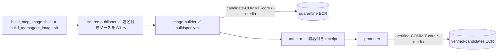

# コンテナイメージとビルド

## 全体像

本番で動くコンテナはすべて `linux/arm64` で、外部イメージはタグではなく arm64 の child digest で固定する。ビルドは「ビルドだけ」と「デプロイ」を分けており、このページが扱うのはイメージを作って検査済みの候補置き場（verified-candidates）へ載せるまで。release リポジトリへの昇格と ECS タスク定義の差し替えは [リリースゲートとデプロイ](release-gates-and-deploy.md) を見る。

| イメージ | Dockerfile | ベース / 実行ユーザー | 入口 | ビルド経路 |
|---|---|---|---|---|
| MCP core（`teamagent-mcp`） | `infra/docker/Dockerfile.teamagent-mcp` | Chainguard Python 3.14 / UID 10001 | `ENTRYPOINT []` ＋ consumer ごとの Python command | `build_mcp_image.sh` → CodeBuild `buildspec.yml` |
| media worker（`teamagent-media-worker`） | `infra/docker/Dockerfile.teamagent-media-worker` | 固定した Alpine Chromium 由来の `scratch` 最終段 / UID 10001 | `python -m teamagent.media.tool_worker` | core と同じビルドで一緒に作る |
| OpenClaw（`teamagent-openclaw`） | `infra/docker/Dockerfile.openclaw` | Chainguard Node / UID 65532 | `node /opt/teamagent/entrypoint.mjs` | `build_openclaw_image.sh` → `openclaw-provenance-buildspec.yml` |
| TikTok acquire | 別リポジトリ `tiktok-data-service` 側 | — | — | `build_tiktok_image.sh` → `tiktok-buildspec.yml` |
| Hermes（本人メモの学習係） | `infra/docker/Dockerfile.hermes` | 公開 Wolfi の Python 3.13 / UID 10001 | `python -m aico_hermes.server`（ポート 8790） | ローカルの `docker build` だけ。Terraform には未配線 |

`Dockerfile.alpine-experiment` と `Dockerfile.wolfi-experiment` は、実際のスキャンがゲートを満たせず採用しなかった実験の残り（`RUNTIME_CONTRACT.md` の「採用根拠にしない」節）。

## core / media の runtime contract

`infra/docker/RUNTIME_CONTRACT.md` が文章版で、機械が読む正本は `runtime-contract.json`・`runtime-consumers.json`・各 Dockerfile の OCI label。

**責任の分け方**: core は Python・TeamAgent 本体・E5・MCP・DB/AWS クライアントを持ち、Node・Playwright・Chromium・ffmpeg・yt-dlp は持たない。media worker はその逆で、ブラウザと動画ツールを持ち、boto3/botocore・DB・Slack/OAuth・MCP・E5・AWS task role を持たない。両者は別イメージ・別タスクで、同じタスク定義に戻してはならない。media worker は 1 プロセスで 1 ジョブを処理して終了する（ジョブの受け渡しは [動画・TikTok 分析](../workflows/video-and-tiktok-analysis.md)）。

この境界は Dockerfile の中で assert している。core のビルダーは `media/operations.py`・`worker.py` を消し、`playwright`・`yt_dlp`・`claude_agent_sdk` などが import できないこと、`node`・`chromium`・`ffmpeg` などの実行ファイルが無いことを確かめる。media の最終段は `boto3`・`psycopg`・`slack_sdk`・`mcp`・`sentence_transformers` などが import できないこと、`mcp_gateway` と E5 キャッシュが無いことを確かめ、どれかが残ればビルドが落ちる。

**両タスク共通の実行条件**:

- UID/GID `10001:10001`、読み取り専用の root filesystem、書き込めるのは新しく作る `/tmp` だけ。`HOME`・`TMPDIR`・`XDG_*` はすべて `/tmp/teamagent/**` を指す。
- Linux capability は `ALL` を落とす。media の Chromium は `--no-sandbox` 禁止で、user namespace sandbox を使う。Fargate では独自 seccomp を指定できないため、隔離した Fargate タスクで sandbox が実際に動くことを別ゲートで確かめるまで media の本番デプロイは止める（fail closed）。
- healthcheck はシェル・curl を足さず、`/app/.venv/bin/python` と `urllib.request` の exec 形式で `/healthz` を叩く。

**consumer ごとの起動コマンドとメモリ**（`runtime-consumers.json`）: core イメージ 1 つを 6 つの ECS consumer が使い回す。各 consumer は空の entryPoint と絶対パスの Python command の組で登録されており、ここに無い組み合わせは使えない。

| consumer | command | メモリ MiB |
|---|---|---:|
| mcp | `scripts/run_mcp_vertex_entrypoint.py` | 4096 |
| connect-web | `-m teamagent.connect_web` | 1024 |
| canary | `scripts/run_canary_health.py` | 512 |
| ingest | `scripts/run_ingest_fargate.py` | 4096 |
| morning-digest | `scripts/run_morning_digest_fargate.py` | 2048 |
| x-buzz-worker | `-m teamagent.workers.x_buzz_job` | 1024 |
| media-worker（media イメージ） | entryPoint `-m teamagent.media.tool_worker` | 4096 |

core イメージ自身の `CMD` は `run_mcp_http_server.py` だが、本番の MCP タスクは command を `run_mcp_vertex_entrypoint.py` に差し替える（Vertex の認証情報を `/tmp` に書き出してから HTTP サーバを exec する。詳細は [MCP gateway](../architecture/mcp-gateway.md)）。dispatcher Lambda などの renderer は entryPoint と command を上書きできない（`may_override_entry_point_or_command: false`）。

## Dockerfile の共通の作り

- **入力を中身で固定する**: 外部イメージは arm64 child digest、`uv`・`python`・`node`・`chromium`・`ffmpeg` はバイナリの SHA-256、torch の wheel は `uv.lock` 内の URL とハッシュ、E5 は 40 桁の upstream commit で固定する。core は `uv sync --frozen --no-dev --extra mcp --extra embeddings` で入れ、E5 は `HF_HUB_OFFLINE=1` で読めることをビルド中に確かめる。
- **runtime receipt**: core のビルダーは `infra/codebuild/teamagent_runtime_contract.json` の SHA-256 と、build arg で渡された base64 の receipt が契約の値と一致するかを検査し、最終段の label に receipt を焼き込む。
- **社内プロキシの CA**: `--mount=type=secret,id=teamagent_ca` で渡し、build arg やレイヤーには残さない。秘密は ECS が実行時に注入し、ビルド時には入れない。
- **ビルドコンテキスト**: core / media の `.dockerignore` は `**` で全部除外してから必要なファイルだけ許可し、`.env`・`*.pem`・`*.key`・tfstate を明示的に除外する。
- **media 固有**: 上流 Chromium イメージの filesystem を `scratch` 最終段にコピーし、上流の書き込み可能な `VOLUME /data` を引き継がない。インストール済み apk 一覧を `media-apk.lock` とバイト比較し、base に同梱の openssl・expat・util-linux は CVE 修正版を明示 pin する。yt-dlp は wheel/sdist のハッシュを確かめてから、秘密検出に引っかかった許可外 extractor を消す。
- **OpenClaw 固有**: 公式イメージは中身を取り出す元としてだけ使い、plugin は `ADD --checksum` で取得する。脆弱な推移依存は reviewed 版の tarball で上書きしてから剪定し、JSON5 の設定は不変の canonical JSON に変換する。起動時の検査は [OpenClaw gateway](../architecture/openclaw-gateway.md)。
- **provenance の焼き込み**: `org.opencontainers.image.revision`（commit）・`io.teamagent.build.context-sha256`・release contract / approval の SHA-256・各 pin 値を OCI label にし、core は `/app/provenance/` にパッケージ一覧と base digest も残す。

## CodeBuild のビルド鎖（core / media）

**launcher**（`infra/deploy/build_teamagent_image.sh`、ルートの `build_mcp_image.sh` はこれを exec するだけ）: タグ・ソースパス・project を上書きする引数を受け付けない。一時的な bare リポジトリに remote の `dev` と `main` を取得し、`main` が merge-base であること、archive した tree が一致することを確かめる。受け取るのは署名済み承認レコードの場所だけ。4 つの CodeBuild project を順に起動し、最後に verified-candidates の digest が quarantine で検査した digest と同じかを確かめる。ECS・EventBridge・Terraform には一切触れない。

**`infra/codebuild/buildspec.yml`**:

1. `pre_build`: AWS アカウントとリージョンを確かめる。Terraform が埋め込んだハッシュで補助スクリプト（`verify_ecr_scan.py` など）を照合する。`GIT_BRANCH` は `dev` 固定で、承認レコードのキーが commit とハッシュに結びついているかを確かめる。source publisher の署名を `aws kms verify` で検証し、CodeBuild が使ったソースが署名済みの S3 VersionId そのものかを確認する。ビルドコンテキストは `canonical_build_context.py` が作った決定的な tar（並び順・所有者・mode・mtime を正規化し、読み取り中の変更を検出したら失敗）を使う。
2. `build`: 既定の docker ドライバは attestation を拒否するので、`docker-container` ドライバの buildx を作る。同じコンテキスト tar から core と media を `--provenance=mode=max --sbom=true` でビルドし、quarantine リポジトリに push する。ビルド後にもう一度 tar の SHA-256 を確かめる。CodeBuild のフェーズ境界で export した値が消えることがあるため、値は `/tmp/teamagent-cross-phase.env` 経由で次のフェーズへ渡す。
3. `post_build`: タグから digest を引き、arm64 child digest を解決して、OCI config の revision と契約値を照合する。`aws ecr wait image-scan-complete` の後に `verify_ecr_scan.py` を通し、4 つの digest を exported variables として出す。

**TikTok**: 別リポジトリ（`main` の完全な commit）を、そのリポジトリの `scripts/build_acquire_image.sh` でビルドし、commit をタグにして quarantine に push する。buildspec は Trivy 0.70.0 のアーカイブを SHA-256 で確かめてからインストールし、ECR scan ゲートは例外を読まない `--deny-all` モードで動かす。**OpenClaw**: `infra/openclaw/build-bundle.sh` が core だけを push-by-digest で quarantine に出す（`--media-image` は古い呼び出し元との互換のために受け付けるだけで、ビルドしない）。例外ファイルは `ecr_scan_exceptions_openclaw.json`。

## ECR scan ゲート（`verify_ecr_scan.py`）

判定対象は INFORMATIONAL から CRITICAL まで全重大度で、次のどれかに当たると exit 1 でビルドを落とす。

- scan が `COMPLETE` でない、応答が `nextToken` 付きで途中までしか無い、リポジトリや digest が push したものと違う、集計数と個別 finding の件数が合わない、basic と enhanced の結果が混ざっている。
- 例外に無い finding がある。例外は CVE・重大度・パッケージ・インストール版の 4 つが完全に一致したときだけ効き、版が上がれば別物として扱う。
- 期限（`expires_on`）が過ぎた例外、重複した例外、必須項目（`owner`・`reason` など）が欠けた例外がある。
- **finding が消えたのに例外が残っている（stale）**。`stale_exception_policy` は `fail` 以外を受け付けない。

core・media・openclaw の例外ファイルはどれも `exceptions: []` なので、今は全重大度で 0 件でないと通らない。例外を足すときは上の 7 項目をそろえて期限を付け、修正版が入ったら同じ変更で消す（残すと stale で落ちる）。

## Trivy ゲート（ローカル証跡）

`infra/docker/build_local_runtime_evidence.sh` は push しない証跡ビルドで、worktree が dirty なとき、出力先がすでに存在するときは拒否する。exact な `git archive` から作ったコンテキストで `--load` ビルドし、タグではなく不変の image ID に対して Trivy の vuln スキャン（全重大度）と secret スキャン、CycloneDX SBOM、補助の Grype を実行する。最後に `SHA256SUMS` を作り、それを含めて再検証した結果を `FINAL_VERIFICATION.json` に残す。

`verify_trivy_zero.py` → `verify_runtime_evidence.verify_trivy_pair` は、2 つのレポートが同じ image を指すことを確かめたうえで、**UNKNOWN〜CRITICAL と secret のどれか 1 件でもあれば失敗**させる。4 件の既知 CVE が残っていても失敗する。suppression・`.trivyignore`・VEX・`--ignore-unfixed` は使わない。ローカル証跡の receipt では ECR と Fargate のゲートを `NOT_RUN_LOCAL_*` と書き（`generate_runtime_receipt.py`）、push・ECR scan・デプロイは権限を持つ別の経路が行う。

## immutable tag と digest 参照

- `infra/terraform/ecr.tf` の全リポジトリは `IMMUTABLE`・`scan_on_push = true`・AES256。同じタグは二度 push できないので、タグは commit から作り（`candidate-<commit>-<subject>`・`verified-<commit>-<subject>`）、使い回さない。
- リポジトリは 3 段: quarantine（2 日で全部 expire）→ verified-candidates（`rejected-*` タグだけ 2 日で expire）→ release（lifecycle 無し）。release に lifecycle が無いのは、タグの無い OCI referrer や署名が消えると rollback 用の証跡がたどれなくなるため。
- 本番の execution role すべてに quarantine / verified-candidates からの pull を拒否する明示的な Deny policy を付けている。
- Terraform の `mcp_image` などは release リポジトリの `@sha256:` digest だけを validation で受け付ける（タグ参照は plan 時点で落ちる）。

## ドキュメントとの食い違い（コードが正）

- `RUNTIME_CONTRACT.md` の core 入力（Python `3.14.6`・builder digest `sha256:2eac…`）と media の版（Python `3.14.5-r2`・Node `24.18.0-r0`・yt-dlp `2026.6.9`）は古い。Dockerfile と `infra/codebuild/teamagent_runtime_contract.json` は Python `3.14.7`・builder `sha256:9510…`、media は Node `24.18.1-r0`・yt-dlp `2026.8.19`。
- `infra/docker/runtime-contract.json` の yt-dlp 節も `2026.6.9` のままで、`tests/infra/test_runtime_contract.py` はその古い値を assert している（Dockerfile 側のテストは新しいハッシュを見ている）。
- 文書は Trivy の採用条件を「CRITICAL・HIGH・secret が 0」と書くが、`verify_trivy_pair` はそれより厳しく、全重大度 0 を要求する。
- `deploy_connectweb_unified.sh` と `register_ingest_td.sh` は廃止済みのスタブで、タスク定義の登録はしない。

## テスト

実行手順と extra の指定は [テストの走らせ方](../testing/running-tests.md)。

- `tests/codebuild/test_ecr_scan_gate.py`: 例外の完全一致・版違い・stale・期限切れ・未完了スキャン・`--deny-all`。
- `tests/infra/test_dockerfile_teamagent_mcp.py` / `test_dockerfile_teamagent_media_worker.py`: digest pin、core/media の境界、UID と読み取り専用、yt-dlp の除去、HIGH を例外に置かないこと。
- `tests/infra/test_runtime_contract.py`: consumer とメモリ・command の対応、digest だけの Terraform 入力、ローカル証跡ビルドが push しないこと。
- `tests/infra/test_canonical_build_context.py`、`tests/codebuild/test_buildspec_contract.py`、`tests/scripts/test_openclaw_runtime_contract.py`。
