# HMAC 鍵束とローテーション

## 何を守っているか

Aico は Slack のボタン `value` やレポートの短縮 URL に、改竄されては困る情報（Gmail の thread、所有者ハッシュ、S3 の bucket/key、有効期限）を載せる。これらは HMAC-SHA256 で署名したトークンにしてあり、その鍵の読み込み・検証・世代交代を 2 つのモジュールが受け持つ。

| 層 | 場所 | 役割 |
|---|---|---|
| 鍵束（keyring） | `src/teamagent/hmac_keyring.py` | 環境変数から用途別の主鍵・旧鍵を読み、形と使い回しを検査して `HmacKeyring` を作る。署名は主鍵だけ、検証は有効な全鍵。設定が 1 つでも不正なら `None`（fail-closed） |
| 耐久状態 | `src/teamagent/hmac_durable_state.py` | 本番で、鍵の世代・T0・期限・発行を許すワークロードを DynamoDB の 1 レコードと照合する。時刻は AWS 応答の `Date` ヘッダを使い、ローカル時計を信用しない |
| IaC とゲート | `infra/terraform/hmac_keyrings.tf`・`hmac_rotation.tf`・`scripts/hmac_rollout_gate.py` | Secrets Manager の VersionId 固定、ECS タスク定義の前提条件、段階遷移の CAS（条件付き更新）で「期限前に旧鍵を消す」「古いタスクが署名し続ける」を防ぐ |

たとえるなら、鍵束は「合鍵の束」、耐久状態は「どの合鍵がいつまで有効かを書いた管理台帳」、ゲートは「台帳を書き換えてよい手順書」。束を持っているだけでは使えず、台帳と一致したときだけ扉が開く。

## どのトークンがどの鍵を使うか

鍵束は **mail_action** と **report_link** の 2 ドメインに分かれ、同じ鍵束の中でもトークン種別ごとに別の purpose で署名する。

| トークン | 実装（`src/teamagent/` 配下） | ドメイン（主鍵の環境変数） | purpose | 最大 TTL |
|---|---|---|---|---|
| ✏️ 返信下書きボタン | `skills/morning_digest/draft_token.py` | mail_action（`MAIL_ACTION_HMAC_SECRET`） | `teamagent.mail-action.draft` | 24h |
| 📅 予定登録ボタン | `skills/morning_digest/event_token.py` | mail_action | `teamagent.mail-action.event` | 24h |
| ☑️ 確認済み／取り消しボタン | `skills/morning_digest/ack_token.py` | mail_action | `teamagent.mail-action.ack` | 24h（取り消しは 1h 固定） |
| レポート短縮リンク `/r/<token>` | `adapters/report_link_token.py` | report_link（`REPORT_LINK_HMAC_SECRET`） | `teamagent.report-link` | 7 日 |

発行 TTL は `MAIL_ACTION_TTL_S`（1..86400）と `REPORT_LINK_TTL_S`（1..604800）。未設定なら最大値、設定されていて空・符号付き・範囲外などなら発行を止める（既定値へ黙って戻さない）。

<!-- openwiki: broken internal link [/openwiki/integrations/google-oauth-and-token-store.md] link "/openwiki/integrations/google-oauth-and-token-store.md" is root-absolute, which no real consumer resolves against the repository root (not a coding agent reading the page, not GitHub's Markdown renderer, not a local viewer); use a path relative to this file instead. Fix the href or restore the target, then delete this comment. -->
<!-- openwiki: broken internal link [/openwiki/architecture/caller-identity-and-button-bindings.md] link "/openwiki/architecture/caller-identity-and-button-bindings.md" is root-absolute, which no real consumer resolves against the repository root (not a coding agent reading the page, not GitHub's Markdown renderer, not a local viewer); use a path relative to this file instead. Fix the href or restore the target, then delete this comment. -->
**対象外の署名鍵**: OAuth の CSRF state（`OAUTH_STATE_SECRET`・`SLACK_OAUTH_STATE_SECRET`）と MCP の caller claim（`TEAMAGENT_CALLER_CLAIM_SECRET`）はこの鍵束を通らず、各モジュールが単一鍵で直接 HMAC を取る。世代管理や T0 の契約は無い。詳しくは [Google OAuth とトークン保管](/openwiki/integrations/google-oauth-and-token-store.md)・[呼び出し元の証明とボタン束縛](/openwiki/architecture/caller-identity-and-button-bindings.md)。

<!-- openwiki: broken internal link [/openwiki/workflows/digest-buttons.md] link "/openwiki/workflows/digest-buttons.md" is root-absolute, which no real consumer resolves against the repository root (not a coding agent reading the page, not GitHub's Markdown renderer, not a local viewer); use a path relative to this file instead. Fix the href or restore the target, then delete this comment. -->
ボタントークンの発行と押下処理の流れは [朝ダイジェストのボタン処理](/openwiki/workflows/digest-buttons.md) を参照。

## 署名と検証の仕組み

- **purpose のフレーム化**: 署名前に `teamagent-hmac\0v1\0` ＋ purpose 長 ＋ purpose ＋ payload 長（8 バイト）＋ payload を連結する（`_domain_separated_message`）。draft の署名が event や report として通ることは、仮に鍵を共有していても起きない。
- **署名は主鍵だけ**: `HmacKeyring.sign` は主鍵で HMAC を取り、先頭 `digest_bytes`（各トークンとも 16 バイト）に切る。耐久状態が必須なら、署名のたびに `durable_issuance_guard` が DynamoDB を読み直し、発行が許されていなければ `HmacKeyConfigurationError` を投げる。
- **検証は早期終了なし**: `verify` は有効な全鍵（主鍵＋期限内の旧鍵）と定数時間比較し、主鍵で一致しても残りを比べる。長さ違いの署名も全鍵と比べてから落とす。
- **旧形式（version 1・フレーム無し）**: `verify_legacy_previous` は旧鍵だけで検証し、主鍵は使わない。新規トークンが旧形式へ退行することはない。ack トークンは新機能なので旧形式の分岐自体が無い。
- **鍵束は秘密を漏らさない**: `repr`/`str` は `<redacted>`、`pickle` などの直列化は `TypeError`。

各トークンの decode 側は、署名に加えて `typ`・有効期限・所有者ハッシュ（ボタン）や許可バケット・許可プレフィックス `vseo-reports/`・`vseo-proposals/`（レポート）を確かめ、どれか外れれば `None` を返す。

## 主鍵の検査（fail-closed）

`_load_keyring` は主鍵を次の条件で拒否し、そのドメインの鍵束を `None` にする。

- UTF-8 で 32 バイト未満か 4096 バイト超、前後に空白がある（`$(cat key.txt)` の末尾改行が典型）。
- DSN（`postgres:`・`redis:` など）・`jdbc:`・Slack 資格情報（`xoxb-` など、`xapp-`）の形をしている。
- プロセス内の資格情報らしい環境変数（名前に `SECRET`/`TOKEN`/`PASSWORD` などを含むもの）や、32 バイト以上の任意の環境変数と同じ値。
- もう一方のドメインの主鍵・旧鍵と同じ値。

`DATABASE_URL` や `SLACK_BOT_TOKEN` への fallback は存在しない。鍵束が `None` だと、ボタンは描画されず、レポートは短縮 URL をやめて従来の presigned URL を返す（`skills/_shared/report_delivery.py` が `REPORT_LINK_HMAC_CONFIG` を不足前提として記録する）。

鍵束が作れない理由は実行時には見えないので、`scripts/check_mail_action_button_key.py` が同じ判定を理由コード（`missing`・`not_stripped`・`too_short`・`reuses_process_credential`・`looks_like_credential`・`reuses_other_purpose` など）だけで出す。鍵の値・環境変数名は出さないので、本番の単発 ECS タスクで実行してよい。

## ローテーションの固定期限（verifier-first）

鍵の交代は「検証側を先に新旧両対応にし、発行側を後から切り替える」順で行う。基準時刻 T0（Unix 秒）を 1 度だけ永続化し、次の式で旧鍵の有効期間を決める。

```text
発行側の切り替え期限   = T0 + 900
旧鍵の期限（排他的）   = T0 + 900 + ドメインの最大TTL（mail 86400 / report 604800）
旧鍵が有効             = now < 旧鍵の期限
```

最大 TTL は「いま設定されている TTL」ではなく「ドメインの上限」。切り替え直前に旧鍵で発行されたトークンも、寿命いっぱいまで検証できる。T0 は最大 300 秒（`HMAC_MAX_FUTURE_T0_SKEW_S`）までの未来値しか受け付けない。旧鍵関連の環境変数は `..._PREVIOUS_SECRET`・`..._PREVIOUS_ROTATION_STARTED_AT`・`..._PREVIOUS_GENERATION` で、旧鍵と T0 は必ず同時に有無が揃っていなければならない。

**一度きりの移行経路**: `..._PREVIOUS_IS_LEGACY=1` のときだけ、旧鍵を「バイト列そのまま」で受け入れ、version 1 の旧形式トークンの検証に限って使う（新形式 version 2 の検証鍵には入れない。入れると旧資格情報の保持者が新形式トークンを作れてしまうため）。mail_action には、旧 worker が Slack トークンで署名していた下書き・予定トークン用の `MAIL_ACTION_HMAC_LEGACY_WORKER_SECRET` も同じ期限内だけ検証用に足せる。専用鍵どうしの交代（dedicated_rotation）ではこの経路は有効にならない。

## 耐久状態（本番）

本番タスクは `TEAMAGENT_HMAC_STATE_REQUIRED=1` を持つ。値が `1` 以外なら設定エラーで、無効化にはならない。このモードでは鍵束を作るたびに、タスクの環境変数（世代 ID・T0・`TEAMAGENT_HMAC_ROTATION_EPOCH`・`TEAMAGENT_HMAC_PROVENANCE`）から `HmacRuntimeExpectation` を組み、DynamoDB テーブル `<project>-<env>-hmac-state`（キーは `scope` と `DOMAIN#<domain>`）の強整合読み取り結果と突き合わせる。レコードには鍵の値は入っていない。

- **時刻**: 応答の `Date` ヘッダを信頼時刻とし、`high_water = max(high_water, 信頼時刻)` を条件付き書き込みで進める。30 秒ごとのチェックポイントと、旧鍵の期限に達した瞬間だけ書き込み、期限到達時は `previous_retired` を立てて旧世代を `retired_generations` に加える。以後、時計の巻き戻しやタスクの再起動・古いタスク定義の再投入で旧鍵が復活することはない。
- **一致条件**: 主鍵世代・旧鍵世代・T0・期限・rotation epoch が一致し、主鍵世代と provenance が退役集合に入っていないこと。外れれば鍵束は `None`。
- **発行の許可**: レコードの `stage` が `issuing` か `complete` で、かつタスクの provenance が `issuer_provenances` に含まれるときだけ署名できる。`preload` の間は検証だけできる。
- **起動時検査**: `require_runtime_startup` が、MCP サーバ（`scripts/run_mcp_http_server.py`、両ドメイン）・connect-web（report_link）・朝ダイジェストの Fargate タスク（mail_action）・Slack bot worker（両ドメイン）の起動時に照合し、合わなければ起動しない。`scripts/check_hmac_runtime_state.py` は同じ検査を真偽値だけ出す。

**docs との食い違い**: `docs/security/hmac_rotation_contract.md` はプロセス内の高水位ロックを「第 1 層」、DynamoDB を 2 層目のように書くが、コードでは必須モードのときプロセス内の高水位（`_previous_key_runtime_eligible`）は使われず、DynamoDB の判定だけで旧鍵の有効性が決まる。プロセス内の仕組みが働くのは必須モードでない（ローカル・テスト）ときだけ。また同文書の purpose 一覧には ack（`teamagent.mail-action.ack`）が載っていない。

## Terraform とゲート

**rollout phase**（ドメインごと）: `blocked`（既定。そのドメインを使うタスクは前提条件で止まる）→ `bootstrap_pin`（移行専用。`AWSCURRENT` 参照を VersionId 固定するだけ）→ `legacy_migration`（専用主鍵＋database-url の旧鍵＋固定 T0）→ `dedicated_rotation`（新旧の専用鍵＋固定 T0）→ `steady`（主鍵のみ）。

- 秘密の値は Terraform に入らない。ECS の `valueFrom` は `ARN:::VersionId` で固定し、世代 ID は `ARN@VersionId`。環境変数と secrets の配線は `hmac_keyrings.tf` の `mail_action_hmac_*`／`report_link_hmac_*` が正本で、MCP は両方、connect-web は report_link だけ、朝ダイジェストは mail_action だけを受け取る。
- `mcp`・`connect_web`・`morning_digest` の各タスク定義には、遷移が契約（`validate_hmac_rotation_transition` と同じ条件を HCL で書いたもの）を満たすことを求める resource 単位の `precondition` がある。`-target` でタスク定義だけ apply してもこの検査は飛ばせない。
- `hmac_rotation.tf` には ARN 単位の旧鍵・T0 変数があり、`runtime_guard.tf` の遷移検査と IAM の許可 ARN に使われる。`hmac_keyrings.tf` の VersionId・phase 変数とは別系統なので、両方を揃えて更新する必要がある（Terraform 内で両者を直接突き合わせる式は見当たらない）。
- `terraform_data.hmac_live_task_gate` が apply 中に `scripts/terraform_hmac_gate.py` を呼び、実環境と保存済み plan を照合する。

**`validate_hmac_rotation_transition`**: 秘密を受け取らず、デプロイ済みと提案の世代 ID・T0・現在時刻・最大 TTL だけで判定する。`code == "ok"` だけが合格で、主な失敗コードは `primary_changed_without_previous`（旧鍵を残さず主鍵を替えた）・`previous_generation_mismatch`（新しい旧鍵がデプロイ済み主鍵でない）・`t0_changed`・`future_t0`・`removal_before_deadline`・`expired_previous_not_removed`。必ず「実際にデプロイされている状態」を入れること（新しく作った値どうしを比べても再起動をまたぐ不変性は保証されない）。レンダリング済みタスク定義や worker の `hmac.env` の検査は `scripts/preflight_hmac_rotation.py` が行う。

**`scripts/hmac_rollout_gate.py`**: ECS／EventBridge の実タスク定義、`ListSecretVersionIds` による VersionId、worker の起動証明、AWS 応答時刻を観測し、DynamoDB の台帳を CAS で進める。`GetSecretValue` は呼ばず、出力は結果コードだけ。台帳の段階と耐久状態の `stage` は次の順に進む。

```mermaid
flowchart LR
  I[initialized] -->|connect-web-preloaded<br/>stage=preload| C[connect_web_preloaded]
  C -->|worker-verified<br/>stage=preload| W[worker_verified]
  W -->|mcp-stable-and-old-drained<br/>stage=issuing| M[mcp_stable_and_old_drained]
  M -->|complete<br/>stage=complete| F[complete]
  F -->|期限後: prepare-cleanup → complete-cleanup| S[主鍵のみ]
```



<!-- openwiki: broken internal link [/openwiki/operations/release-gates-and-deploy.md] link "/openwiki/operations/release-gates-and-deploy.md" is root-absolute, which no real consumer resolves against the repository root (not a coding agent reading the page, not GitHub's Markdown renderer, not a local viewer); use a path relative to this file instead. Fix the href or restore the target, then delete this comment. -->
旧鍵の撤去は期限後に `prepare-cleanup`（旧世代を即座に退役扱いにし、主鍵のみの候補とロールバックの provenance を一時的に許可）→ 主鍵のみのタスクをデプロイ → `complete-cleanup`（旧鍵・T0・legacy 印を一括で外す）の段階で行う。以前の一発撤去 `retire-previous` は `cleanup_staging_required` で必ず失敗する。デプロイ全体のゲートは [リリースゲートとデプロイ](/openwiki/operations/release-gates-and-deploy.md) を参照。

## テスト

- `tests/test_hmac_keyring.py`・`tests/test_hmac_keyring_diagnostics.py`: フレーム化、主鍵検査、期限、旧形式の検証範囲、理由コード。
- `tests/test_hmac_durable_state.py`・`tests/test_hmac_migration_contract.py`: DynamoDB のレコード照合、高水位、退役、発行許可。
- `tests/scripts/test_hmac_rollout_gate.py`・`tests/scripts/test_preflight_hmac_rotation.py`・`tests/infra/test_hmac_rollout_terraform.py`: ゲートの段階遷移と Terraform の前提条件。

<!-- openwiki: broken internal link [/openwiki/testing/running-tests.md] link "/openwiki/testing/running-tests.md" is root-absolute, which no real consumer resolves against the repository root (not a coding agent reading the page, not GitHub's Markdown renderer, not a local viewer); use a path relative to this file instead. Fix the href or restore the target, then delete this comment. -->
走らせ方は [テストの走らせ方](/openwiki/testing/running-tests.md) を参照（CI と同じ `--extra dev --extra mcp`）。
