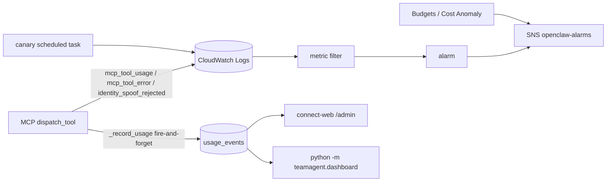

# 観測・利用記録・コスト管理

## 全体像

Aico の「何が起きたか」は 3 つの経路で残る。どれも**利用者の処理を止めない**（記録の失敗はログだけ残して握り潰す）のが共通の設計。

| 経路 | 書く側 | 置き場 | 読む側 |
|---|---|---|---|
| 構造化ログ（structlog JSON） | 各プロセス（MCP サーバ・スケジュールタスク等） | CloudWatch Logs（ロググループごと） | metric filter → アラーム → SNS、Logs Insights、ダッシュボード |
| 利用記録 | `UsageRecorder` / `MetricsSnapshotter` | RDS の `usage_events` / `runtime_metrics` | 管理画面（`teamagent.dashboard`、connect-web の `/admin`） |
| 例外 | `capture_skill_exception` 等 | Sentry（DSN があるときだけ） | Sentry 画面（`request_id` tag で絞る） |

費用はさらに別に、AWS 請求全体を Budgets / Cost Anomaly Detection が見張る。LLM 呼び出しごとの `cost_usd` の出し方、CloudWatch のコスト metric filter が `cost_usd` キーを持つ行を全部足す仕様、動画クォータと外部 SaaS 台帳（`CostGuard`）は [Bedrock / Gemini 呼び出しとリトライ・コスト](../integrations/bedrock-gemini-and-retry.md) にある。

## 構造化ログと request_id

- `observability/logging_config.py` の `configure_logging()` が structlog をプロセス全体で設定する。env `STRUCTLOG_FORMAT=json` のときだけ `JSONRenderer`、それ以外は `ConsoleRenderer`（ローカルとテストは人間が読める形のまま）。共通 processors は `merge_contextvars → add_log_level → TimeStamper(iso, key="timestamp") → StackInfoRenderer → format_exc_info`。`event`・`level`・`timestamp` と付随キー（`latency_ms`・`cost_usd` など）がトップレベルの JSON キーになり、CloudWatch の `{ $.field }` セレクタにそのまま当たる。
- このモジュールができる前は `structlog.configure()` がどこでも呼ばれておらず、本番ログが console 形式だったため JSON 前提の metric filter が一度も当たらず、アラームが鳴らない状態だった（モジュール冒頭の経緯）。アラームは欠測を `notBreaching` にしているので、**JSON で出ていないと無音になる**。
- `configure_logging()` を呼ぶ入口は `scripts/run_mcp_http_server.py`・`runtime/slack_bot.py`・`scripts/ingest_sources.py`（Fargate の `run_ingest_fargate.py` から runpy 経由）・`scripts/reembed_chunks.py`。`scripts/run_canary_health.py`・`scripts/run_morning_digest_fargate.py`・`teamagent.connect_web` は呼んでいない。これらのタスク定義にも `STRUCTLOG_FORMAT=json` は入っているが、env だけでは切り替わらない（structlog の既定は ConsoleRenderer）。カナリアの metric filter は JSON セレクタなので、実ログが JSON になっているかは確かめる必要がある（コードからは確認できない）。
- request_id: `SkillContext.request_id` の既定は `req-<uuid 先頭 12 桁>`。`bind_logger()` が `request_id`・`skill`・`user_id` を束ねたロガーを返す。MCP の `mcp_tool_usage` / `mcp_tool_error`、`usage_events.request_id`（UNIQUE）、Sentry の `request_id` tag が同じ値でつながる。
- ログに入れないもの（CLAUDE.md の規約）: 生の入力（PDF 全文・顧客名・会話履歴・メール本文・email）。エラー時も `request_id` と例外の型名だけを出す。connect-web は `/admin?user=<email>` をアクセスログで `/admin?<redacted>` に伏せる（`_RedactAdminUserAccessLog`）。

## Sentry

- `init_sentry()` は `SENTRY_DSN` が空なら何もせず False を返す（テスト・開発で副作用なし）。有効時は `send_default_pii=False`、`traces_sample_rate=0.05`、`profiles_sample_rate=0.0`、`attach_stacktrace=True`、`max_breadcrumbs=30`。`LoggingIntegration(event_level=None)` でログからの自動送信を止め、例外は `capture_skill_exception` / `capture_event_exception` の明示呼び出しに一本化している（二重送信防止）。
- スクラブは二重: `EventScrubber` のキー名 denylist（既定＋ `pdf_text`・`query`・`content`・`answer`・本人メモ系の `utterance` / `snapshot` / `memo_context` など）と、`before_send` による値の正規表現スクラブ（Slack / AWS / Anthropic / Google のトークン形、秘密鍵、接続文字列のパスワード、email・電話番号。1 フィールド 2000 文字で切る）。本人メモ系モジュールのフレームはローカル変数ごと落とす（日本語の発話は正規表現を素通りするため）。`extra.request_id` は tag に昇格する。
- `redact_secrets()` は秘密だけを伏せ、長さ制限も PII マスクもしない。資料本文を LLM に渡す `attachment_assist` のように、2000 文字で黙って切れては困る経路で使う。
- **初期化しているのは `slack_bot._run()` だけ**（AsyncioIntegration のため async 文脈で呼ぶ）。現行の Slack 受け口は OpenClaw → MCP で、`run_mcp_http_server.py` は `init_sentry()` を呼ばず、Terraform のタスク定義にも `SENTRY_DSN` は無い。したがって MCP プロセス内の `capture_skill_exception`（gmail / gcalendar adapter が呼ぶ）は何もしない。本番の例外は CloudWatch の `mcp_tool_error` で見る（[全体構成](../architecture/overview.md)）。

## usage_events（1 リクエスト 1 行の利用記録）

`runtime/usage_recorder.py` の `UsageRecorder`:

- `write()` は `INSERT ... ON CONFLICT (request_id) DO NOTHING`（リトライや再入で重複しない）。未知の `status` は `ok` に倒し（CHECK 制約違反で落とさない）、`query_text` は 2000 文字で切る。接続は `app_role="teamagent_app"`。
- `record()` は同期書き込みを `run_in_executor` に逃がし、例外は `usage_event_write_failed`（request_id だけ）を出して握り潰す。

MCP 側（`mcp_gateway/server.py`）の記録:

- 成功時と例外時の両方で `_record_usage` を呼ぶ。例外時は `status="error"`・`cost_usd=0`・`error_code=<例外の型名>`。`cost_usd` は skill 出力の `total_cost_usd`（ログ側は二重計上を避けて `tool_cost_usd` というキー。詳細は [MCP gateway](../architecture/mcp-gateway.md)）。
- 本文として残すのは非空の `query` 引数だけで、それ以外の引数（メール本文など）は入れない。`via="mcp"`。`user_id` には署名検証済み claim の Slack ID だけを使う（[呼び出し元の証明とボタン束縛](../architecture/caller-identity-and-button-bindings.md)）。
- 記録器はプロセスに 1 つ遅延生成し、初期化失敗も None としてキャッシュする。書き込みは fire-and-forget の task で、応答の critical path に入らない。切り離しジョブ（video_algorithm の detach）は別スレッドから `call_soon_threadsafe` で本体の loop に渡す。`USAGE_EVENTS_DISABLE=true` で記録を止められる。

テーブルと権限（[PostgreSQL スキーマとマイグレーション](../data/postgres-schema-and-migrations.md)、[RLS と実行ロール](../data/rls-and-app-role.md)）:

| migration | 内容 |
|---|---|
| 0007 | `usage_events`（`request_id` UNIQUE、`status` は `ok/error/queue_full/timeout`）と `usage_event_calls`。RLS は SELECT を `app.user_role='admin'` に限定。`teamagent_app` は INSERT、read-only ロール `teamagent_dashboard`（NOLOGIN）は SELECT。`oauth_tokens` は暗号化列を除く列だけを dashboard に GRANT |
| 0009 | 既定権限で付いていた `teamagent_app` の SELECT/UPDATE/DELETE を REVOKE |
| 0023 | `query_text` 列を追加（2026-08-13 の裁定による本文の唯一の例外） |
| 0024 | `ON CONFLICT` に必要な `request_id` 列だけの SELECT と、`teamagent_app` 向け SELECT ポリシーを追加（無いと本番で permission denied → RLS 違反で書き込みが全部失敗していた） |

`usage_recorder.py` の docstring は「SELECT 不可（書くだけ）」のままだが、0024 以降は `request_id` 列だけ読める。`usage_event_calls` はテーブルがあるだけで、`src/` に書き込む処理は無い。

## runtime_metrics（同時実行とプールのスナップショット）

`MetricsSnapshotter` は `RequestGate` の `GateMetrics` と接続プールの `PoolStats` を一定間隔（既定 15 秒、`RUNTIME_METRICS_INTERVAL_S`）で `runtime_metrics` に 1 行 INSERT する。順序は「メトリクス読み取り → DB 接続の借用 → 書き込み」で、自分の接続を `in_use` として数えない。プール無効時の列は NULL、`instance_id` は `host:pid`。

起動しているのは `slack_bot.build_app()` だけで、MCP サーバは起動しない。退役した Socket Mode Bot の経路なので、現行構成では新しい行が増えない前提で読むこと。

## 管理画面

同じ集計クエリ（`dashboard/queries.py`）を 2 つの入口が使う。どちらも `app_role="teamagent_dashboard"`・`user_role="admin"` で SELECT するだけで、復号や本文（`query_text` 以外）は扱わない。

| 入口 | 起動と認証 | 表示 |
|---|---|---|
| `python -m teamagent.dashboard` | ローカル起動（`DASHBOARD_HOST=127.0.0.1`・`DASHBOARD_PORT=8787`、RDS へは SSM トンネル）。Google id_token 検証＋`email_verified`＋会社ドメイン（`hd`）＋ `DASHBOARD_ALLOWED_EMAILS` の allowlist。セッションは stdlib の HMAC 署名 Cookie（既定 8 時間。`DASHBOARD_SESSION_SECRET` が無ければ起動ごとの乱数鍵）。`DASHBOARD_DEV_BYPASS` で認証を飛ばせる | KPI・日次・skill 別・利用者別・`runtime_metrics`・連携状況・エラー一覧 |
| connect-web `GET /admin` | connect-web の検索ログイン済みで、email が `CONNECT_ADMIN_EMAILS`（未設定ならコード内の既定 1 名）に入っていること。それ以外は未登録ルートと同じ 404 で存在を隠す | KPI・日次・skill 別・作業束（7 日 / 30 日）・利用者別・エラー・質問フィード（`?user=` で絞り込み） |

- `/admin` は集計関数ごとに read-only 接続を分け、1 つが失敗しても他の表示は残す（失敗は `notes` に型名だけ出す）。`?user=` は 254 文字を超えたら捨て、SQL にはプレースホルダで渡す。
- 作業束は tool 名 → 「調べる / 作る / 整える / 秘書」の固定表で、表に無い tool は必ず「その他」に入る。新しいツールを足しても画面は壊れないが、束に入れたければ `_WORK_TYPE_TOOLS` などに追加する。
- 日付は JST で区切る。ただしローカル dashboard の「当月コスト」は `date_trunc('month', NOW())`（DB セッションのタイムゾーン）で区切っている。

## CloudWatch: metric filter・アラーム・ダッシュボード

通知先はすべて SNS `…-openclaw-alarms`（`cloudwatch.tf`）。メール購読はこの Terraform state の外で管理し、runtime guard が確認済みのメール 1 件だけを許す。

| ロググループ | metric（filter） | アラーム |
|---|---|---|
| `/teamagent/<env>/teamagent-mcp` | `McpIdentitySpoofRejected`（`event="identity_spoof_rejected"`） | 5 分で 1 件以上 |
| 同上 | `McpToolError`（`event="mcp_tool_error"` または `level="error"`） | 5 分で `error_count_threshold`（既定 3）件以上 |
| 同上 | `McpCostUSD`（`cost_usd` を持つ行） | 日次合計が `daily_cost_threshold_usd`（既定 5 USD）超 |
| 同上 | `OAuthConnectFailed`（`oauth_connect_fail_closed` / `oauth_connect_url_failed`） | 5 分で 1 件以上 |
| 同上 | `McpCitationValidity`（`citation_validity` の値） | なし（ダッシュボードのみ） |
| `/teamagent/<env>/openclaw` | `OpenClawStartupFailure`（起動時の設定違反・entrypoint エラー） | 5 分で 1 件以上 |
| `/teamagent/<env>`（旧 EC2 系） | `BedrockCostUSD`・`SkillLatencyMs`・`ErrorCount` | 日次コスト・p95 レイテンシ・5 分のエラー数 |
| `/teamagent/<env>/canary-health` | `CanaryUnhealthy`・`CanaryHeartbeat` | 下の「合成カナリア」 |

- 件数系のアラームは欠測を `notBreaching` にしている。逆に `runtime_monitoring.tf` の ECS 実行タスク数アラーム（mcp / connect-web / openclaw）は欠測を `breaching` にし、「動いていない」を異常として拾う。同じファイルに ECS メモリ、connect-web API の 5xx、Lambda のエラーとスロットル、RDS の接続数・CPU クレジット・空きメモリのアラームもある。
- `citation_validity` を JSON キーで出すログは現行のランタイムに無い（`score_faithfulness` を呼ぶのは評価用の scripts だけ）ので、`McpCitationValidity` にはデータが入らない。
- ダッシュボードは 2 枚。`…-openclaw-pilot` は MCP のコスト・なりすまし拒否・ツールエラー、Container Insights の CPU / メモリ、本人解決とエラーの直近ログ。`…-ingest` は引用 KPI と検索イベントのログ。`…-ingest` の説明文は「ingest は worker EC2 で動き CloudWatch に届かない」としているが、現行 Terraform には Fargate の ingest スケジュール（`ingest_schedule.tf`、専用ロググループあり）もあり、説明文が古い可能性がある。

## 合成カナリア

`scripts/run_canary_health.py` は ECS Scheduled Task（既定 `rate(1 hour)`、MCP イメージを流用）で、Slack user_id → 本人 email の解決を本番と同じ resolver（`build_slack_identity_resolver`）で 1 回試す。per-user 機能すべての前提なので、bot token の失効などで壊れると全部が無音で止まるため。書き込みはしない。

- 判定は `evaluate_canary`: すべて合格なら True、**空の結果は False**（何も検査できていない＝異常）。`canary_health_result`（`overall` と `check_*`）を出し、失敗なら exit 1。
- アラームは 2 本で役割が違う。`canary_unhealthy` は失敗の計数（欠測は `notBreaching`）。`canary_heartbeat_missing` は生存確認で、1 時間窓で 2 回続けて結果が無いと鳴る（欠測は `breaching`、`enable_canary_health` と `canary_rule_enabled` が両方真のときだけ作られる）。ルールの有効・無効は `infra/deploy/terraform_runtime_migrations.json` が決めており、変数の既定値を書き換えて有効化してはいけない（[Terraform の構成](terraform-layout.md)）。

## AWS Budgets と Cost Anomaly Detection

`infra/terraform/budgets.tf`。方針は**通知だけで自動停止はしない**（誤検知で全断するのを避ける）。

- 月次コスト予算 `monthly_budget_usd`（既定 250 USD）。実績 80%・実績 100%・予測 120% で SNS に通知。
- Cost Anomaly Detection はサービス別（`DIMENSIONAL` / `SERVICE`）の監視で、1 件の異常の影響額が `cost_anomaly_impact_usd`（既定 50 USD）以上のときに即時通知。SNS 宛ては `IMMEDIATE` しか使えない（日次・週次はメール限定）。Cost Explorer 系のリソースは `us-east-1` の provider alias で作る。
- Budgets と Cost Anomaly が SNS に publish できるよう、`aws_sns_topic_policy.alarms_cost` を付けている。アラーム用トピックのポリシーを定義しているのはこのリソースだけで、中身は `budgets.amazonaws.com` と `costalerts.amazonaws.com` への `sns:Publish` の 1 文だけ。トピックポリシーは丸ごと置き換わるので、CloudWatch アラームからの配信がこのポリシーの下で通るかは実環境で確かめる必要がある（このページでは確認していない）。

## ログの PII スキャン

`scripts/pii_log_scan.py` は手で走らせるスクリプト（CI には組み込まれていない）。Logs Insights で指定時間の**新しい順 10000 行**を取り、Python 側で Slack / Anthropic / AWS / Google のトークン形、email、電話番号、2000 文字超の長文、`--customers` で渡した顧客名を数える。サンプルはマスクして最大 3 件。exit code は 0 = 検出なし、1 = 疑いあり、2 = 設定・接続エラー。

既定の `--log-group` は旧 EC2 系の `/teamagent/dev` なので、現行の MCP を調べるときは `--log-group /teamagent/<env>/teamagent-mcp` を明示する。顧客名はコードに書かず、引数で渡す。

## 変更するときの注意

- 新しいエントリポイントを足したら、`main()` の最初で `configure_logging()` を呼ぶ。呼ばないと、タスク定義に `STRUCTLOG_FORMAT=json` があっても JSON にならず、metric filter が当たらない。
- metric filter やアラームが拾う `event` 名（`mcp_tool_error`・`identity_spoof_rejected`・`canary_health_result` など）を変えると、アラームが黙って鳴らなくなる。変えるときは Terraform も一緒に直す。
- `cost_usd` キーを新しいログに足すと日次コストに合算される（[Bedrock / Gemini 呼び出しとリトライ・コスト](../integrations/bedrock-gemini-and-retry.md)）。
- `usage_events` に本文を足さない。例外は `query_text` だけ（裁定済み）。新しい列は RLS と GRANT が今の最小権限のまま効くかを確かめる。

## テスト

- `tests/observability/test_logging_config.py`（JSON でトップレベルキーになる・既定は console・多重呼び出しが無害）、`tests/observability/test_sentry.py`。
- `tests/runtime/test_usage_recorder.py`（app_role・2000 文字で切る・未知 status・DB エラーを握り潰す）、`tests/runtime/test_metrics_snapshot.py`。
- `tests/test_mcp_gateway_server.py` の usage 系（記録器の例外で応答が変わらない・`USAGE_EVENTS_DISABLE`・エラー時の記録・初期化失敗のキャッシュ）。
- `tests/dashboard/`（auth・config・queries・render）、`tests/connect_web/test_admin_usage.py`（`/admin` のゲートと表示）。
- `tests/scripts/test_canary_health.py`（判定の純関数だけ。ログの形式は検査していない）。
