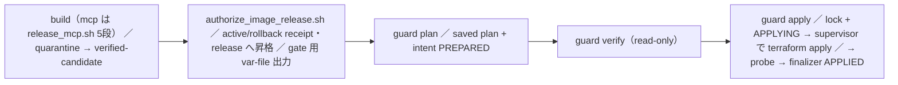

# リリースゲートとデプロイ

## 結論

- 本番 ECS（task definition・service・EventBridge）を変える入口は `infra/deploy/terraform_runtime_guard.sh` の `plan` → `verify` → `apply` だけ。ビルド（`scripts/aws/release_mcp.sh` など）は「焼く」まで、`infra/deploy/authorize_image_release.sh` は release リポジトリへの昇格と Terraform 用 var-file の書き出しまでで、どちらも ECS に触れない。
- 旧入口（`infra/terraform/plan_image_release.sh`・`apply_image_release_plan.sh`・`apply_openclaw.sh`・`apply_resilience.sh`・`update_image_release_controls.sh`、`infra/deploy/register_ingest_td.sh`・`promote_hmac_task.sh`・`deploy_connectweb_unified.sh`）はすべて理由を表示して `exit 64` する stub。
- guard は手順を守る運用者向けの協調制御で、管理者権限に対する認可境界ではない（README とスクリプト冒頭に明記）。管理者は AWS CLI で直接 RegisterTaskDefinition などを打てるが、それは受容済みリスクであり正規経路ではない。

イメージの種類とビルドは [コンテナイメージとビルド](container-images-and-build.md)、state と .tf の配置は [Terraform の構成](terraform-layout.md)、HMAC 鍵束の世代移行は [HMAC 鍵束とローテーション](hmac-keyring-and-rotation.md)。

## 全体の流れ

## buildspec 世代 publish（ビルドの前提）

CodeBuild プロジェクトは buildspec を evidence bucket の `codebuild-buildspecs/<project>/<64hex>.yml`（content-addressed key）で pin している。リリース契約 JSON は buildspec に base64 で焼き込まれるため、契約を 1 バイト変えるだけで世代（key）が動く。

- repo 側の期待値は `infra/deploy/buildspec_generation_inputs.json` の `expected_generation_sha256`（approval-publisher・mcp-source-publisher・image-attestor・image-promoter の 4 プロジェクト）。世代に効く入力は同ファイルの `inputs` 18 件。
- S3 への publish と `UpdateProject` は管理者が別に行う作業なので、PR だけ先に入ると取り残される。取り残したまま撃つと段1 は通り、段2 だけが `embedded release contract hash mismatch` で落ちる。
- `release_mcp.sh` は段1 より前に `assert_published_generation.py` で live の pin と期待値を照合し、不一致なら撃たない（段1 を通すと承認レコードが 1 本無駄になるため）。インライン buildspec（pin 外れ）も失敗扱い。
- 5 段目（promoter）の昇格先は `verified-candidate` で、完了メッセージは「本番への適用は別途」。

## release authorization

`authorize_image_release.sh --pipeline mcp|tiktok|openclaw --channel active|rollback` は、期限内の署名済み candidate receipt を source-free attestor で再検証し、source-free promoter に release タグを作らせる。Terraform は実行しない。mcp / openclaw では `--terraform-gate-vars-out` に owner-only の JSON var-file（`image_deployment_consumer_manifest`・`image_release_receipt_catalog`・`image_release_consumer_receipt_bindings`）を書き出し、これを guard に渡す var-file へ合成する。本番 image 変数に書けるのは release リポジトリの `@sha256:` だけで、可変タグは証跡にならない。

## Terraform 側のゲート（`infra/terraform/image_release_gate.tf`）

- 対象は `infra/codebuild/image_deployment_consumers.json` の 8 consumer（mcp・connect_web・openclaw・canary・ingest・morning_digest・x_buzz_worker・tiktok_acquire）。manifest はこの registry と順序・項目まで完全一致し、長さ 8 でなければならない。mode は `receipt-required` か `no-image-transition`。
- `deployment_requested` はどれか 1 つでも image 変数や manifest/receipt が非空なら true。本番 image を持つ plan は常にゲート対象になる。
- `data.external.signed_image_release_gate` が `infra/deploy/run_image_deployment_gate.sh terraform-gate` を呼び、実体は `infra/codebuild/release_evidence.py`。runner は exact trusted automation session（`teamagent-dev-terraform-runtime-automation/teamagent-terraform-worker`）以外で起動すると落ち、受け付けるコマンドも 8 種の allowlist だけ。
- `terraform_data.production_image_release_gate` の precondition は 3 本: manifest 構造が registry と一致・影響する pipeline の契約が `release.ready=true`・gate の結果が `verified == "true"` かつ mode 一致。`triggers_replace` は intent UUID で、wall-clock を入れない（review 時の plan と最終 plan を完全一致で再現するため）。
- image を持つ ECS task definition（`fargate.tf`・`connect_web.tf`・`ingest_schedule.tf`・`morning_digest_schedule.tf`・`canary_schedule.tf`・`tiktok_acquire.tf`・`x_research.tf`・HMAC 系）はすべて `depends_on` でこのゲートにつながる。

## guard の plan（saved plan を作る）

モードは 2 つ。`--runtime-sync` は live との完全同期（image は変えない）、`--runtime-migration ID` は git 管理の `infra/deploy/terraform_runtime_migrations.json` にある期限付き entry だけを使う。migration の kind は次の 3 種。

| kind | 用途 | 必要な receipt |
|---|---|---|
| runtime | image 差し替えを含む runtime 移行。候補 task definition を実 Fargate で起動して検証する preflight あり | preflight + alarm 配送・versioning・log readiness・alarm migration の計 5 種 |
| activation | runtime の後段。schedule の `DISABLED`→`ENABLED` など | 同上 + 直前 runtime の apply receipt |
| config | image・rule・dispatcher を変えない構成変更（KMS 鍵新設・IAM statement 追加・env 追加）。preflight は Fargate を起動しない | preflight だけ（他 4 種は拒否） |

`plan` の処理順（`review-plan|plan)` 分岐）:

1. `TF_*`（`TF_VAR_*`・`TF_CLI_ARGS*` 含む）・`AWS_PROFILE`・`AWS_ENDPOINT_URL*` などを消去して拒否。guard が読む helper 群が git 管理下でクリーンかも検査する。
2. live を snapshot し、live 由来の値を `-var` で注入する（`build_live_injection_args` が唯一の実装）。sync では desired image = live image、rule 状態も live のまま、intent UUID は guard が新規生成、consumer manifest は live state から no-image-transition で作る。`activation_freeze_enabled` は freeze 宣言から決め、`enable_media_worker=true`・`enable_tiktok_acquire=true`・`require_alarm_delivery=true` は固定で注入する。
3. `terraform plan -input=false -refresh=true -lock-timeout=5m -var-file=<必須> -out=<plan>`（`-target` は使わない）。
4. `validate_plan`: task definition の env / secrets を live と完全一致で要求（追加・変更・削除すべて禁止）。例外は config kind の `to.allowed_env_changes[<component>]` に書いたキーだけ。
5. `activation_freeze_check.py assert-plan-preserves-freeze` → live を再 snapshot（plan 中の別デプロイを検出）→ intent を `PREPARED` で作成。

`review-plan` は apply 可能な plan も intent も作らず、全変更の contract だけを抽出する。これを migration の `reviewed_plan` に commit して `enabled=true` にしてから `plan` を撃つと、contract の完全一致が要求される。この commit 時点では manifest の 2 migration（runtime / activation）はどちらも `enabled=false` で `expires_at` も過ぎているため、使えるのは `--runtime-sync` か、新しく review した entry だけ。

## guard の apply（ロック・ledger・supervisor）

- 書き込み系の操作は `assert_trusted_automation_identity` で exact trusted automation session に限る。
- ロックは 3 層: (1) provenance の lease ロック（intent ledger テーブル上。apply 中は heartbeat で延長）、(2) guard の共有 deployment lock（`teamagent-tflock` への条件付き put、TTL 7200 秒）、(3) Terraform 自身の backend lock。
- apply が途中で失敗すると、EXIT trap（`cleanup_apply_command`）が ECS / EventBridge saga を `failed` で閉じて baseline に戻し、OpenClaw は前の revision へ戻して検証し、intent を `RECONCILE_REQUIRED` にしてからロックを解放する。finalize 済みの receipt が見つかった場合は、失敗扱いにせず回収する。`state-rebind-apply` だけは die してもロックを TTL まで残し、復旧判断が済むまで他の apply を止める（意図した fail-closed）。
- intent ledger の状態遷移: `PREPARED` →（lease ロック取得と同じ DynamoDB transaction）`APPLYING` →（receipt claim の条件付き作成と同じ transaction）`CONSUMED` → finalizer で `APPLIED`。失敗時は `APPLYING` / `CONSUMED` から `RECONCILE_REQUIRED`。一度 `APPLYING` に入った plan・intent・receipt は再利用できない。再試行・ロールフォワード・ロールバックはどれも、新しい active/rollback receipt・新しい intent・新しい full saved plan で行う。
- `infra/terraform/terraform_apply_supervisor.py`: saved plan を fd で開いて sha256 と inode を照合し、`/proc/<pid>/fd/<n>` 経由で `terraform apply -input=false -lock=true -lock-timeout=5m` を独立 process group で起動する。30 秒ごとに `heartbeat-deployment-lock` を打ち、失敗したら process group 全体を TERM→KILL して終了コード 75。apply 後に plan の digest / inode を再照合する。`/proc` を使うので、実行環境は Linux の worker が前提。
- apply 前に ECS（mcp / connect-web）と EventBridge の saga を `begin` して rollback 用の baseline を固定し、apply 後に `verify` する。

apply 後の検証（すべて通るまで intent は `APPLIED` にならない）:

1. live runtime が saved plan の desired state と一致すること。backend / workspace / lineage / serial の再照合。
2. post-apply service probe: canary の task definition を `ecs run-task` し、command override で mcp と connect-web の `/healthz`、connect-web が返す app HTML の provenance 4 値（VersionId・SHA-256・Vault manifest・build inputs）を確認する。7 項目すべて true のログを 5 分以内に確認できなければ die。
3. saved plan が OpenClaw の revision を変える場合だけ OpenClaw rollout gate（`infra/openclaw/run-live-rollout-gates.mjs`）を通す。forced rollback DM QA は `--forced-rollback-dm-qa-deadline-epoch` を指定したときだけ走る。
4. `infra/deploy/deployment_apply_finalizer.py commit` が 1 つの transaction で、saga の終端化・intent の `APPLIED`・共有ロック解放・apply receipt の永続化をまとめて行う。途中でプロセスが落ちても receipt を回収できる（`recover`）。

ingest を手で走らせる正規経路は、デプロイ後の `scripts/aws/run_ingest_task.sh`（family 名で最新 ACTIVE revision を run-task し、exit code を検証する）。

## activation freeze

宣言は `infra/deploy/activation_freeze.json`、判定は `infra/deploy/activation_freeze_check.py`（AWS にはアクセスしない）。軸は 2 本あり、互いに独立。

| 軸 | 値 | 決めること |
|---|---|---|
| `generation_publisher_freeze.state` | `pending_v2` / `active` / `released` | repo 側ゲートの強さ。`released` 以外では frozen surface の変更を CI で落とす |
| `aws_enforcement.mode` | `declaration_only` / `attached` | AWS 側の Deny policy を principal に attach するか |

この commit 時点の宣言は `state=active`・`mode=declaration_only`。`production_deployment_freeze` は `released`（デプロイ自体は解除済み）で、generation freeze とは別の判断として扱われている。

- **frozen surface**: `buildspec_generation_inputs.json` の 18 inputs + `additional_publisher_paths`。CI の `activation-freeze` job が全 PR で `assert-frozen-surface`（`fetch-depth: 0` 必須）を実行する。意図的に触るときは同じ PR で `unlock` を `active` にし、`scope_paths`（実際に変えた path と完全一致。余分があっても拒否）・`reason`・`gate` を書く。
- **execution line**: `assert-execution-line` が、`activation_execution_allowlist.json` の base からの commit 列を SHA（40 桁）と subject の完全一致で照合し、force push と履歴改変を検出する。
- **AWS 側の Deny**: `infra/terraform/activation_freeze_policy.tf`。`activation_freeze_enabled`（既定 false）が true のときだけ policy と attachment が作られる。宣言が `active` のとき guard は自動で true を注入する。guard を通さない plan で注入を忘れると freeze リソースが destroy 候補になり、`assert-plan-preserves-freeze` が FATAL で止める。`declaration_only` のときは attachment の create も FATAL。root は identity policy では止められない（SCP が要るので射程外）。

## 地雷

| やりがちな操作 | 起きること | 正しい経路 |
|---|---|---|
| 素の `terraform plan/apply`・`-target` | `use_*` / `enable_*` の多くは既定 false で、ON/OFF の真実源は git 管理外の tfvars。値が抜けると機能が落ちる。live 値の注入も env parity 検査も効かず、`activation_freeze_enabled` を渡し忘れると freeze の Deny policy が destroy 候補になる | guard の `plan`（`--var-file` 必須） |
| AWS CLI で直接 RegisterTaskDefinition / UpdateService | 旧スクリプトは `exit 64`。直接打つと Terraform state と live の revision がずれ、`state-rebind-precheck` / `state-rebind-apply`（1 address ずつ rm→import）で付け替える作業が必要になる | release authorization → guard |
| tfvars のフラグだけ切り替えて `--runtime-sync` | env parity 検査で plan が die する | config migration の `allowed_env_changes` |
| apply が失敗したので同じ plan で再実行 | intent は `APPLYING` の時点で燃えている。ledger は `RECONCILE_REQUIRED` | state と runtime を照合してから、新しい receipt・intent・plan で出し直す |
| 契約 JSON を変えて publish せずにビルド | 段2 で hash mismatch | 世代を publish して `UpdateProject` してからビルド |

## docs とコードの食い違い

- `docs/runbooks/activation_freeze.md` には「現在の状態は `pending_v2`」とあるが、宣言ファイルは `active`。runbook は `aws_enforcement.mode` の軸を説明していない。
- checker の `desired-attachments-var` は `activation_freeze_attachments_enabled` の値を導くが、この commit の .tf にこの変数は無く、guard も注入しない。attachment は `activation_freeze_enabled` 1 本で作られる。
- `promote_hmac_task.sh` の案内文は、退役済みの `plan_image_release.sh` / `apply_image_release_plan.sh` を正規経路として挙げている（正しくは guard）。
- `infra/terraform/README.md` にはライブの digest・VersionId・通知先などが直書きされていて、古くなりうる。値は guard が live から取り直すので、README の値を根拠にしない。

## テスト

- `tests/scripts/test_terraform_runtime_guard.py`: guard の契約（strict sync での consumer 別 image 照合など）。`tests/scripts/test_supply_chain_adopt.py` は `-var=runtime_guard_live=` の構築が `build_live_injection_args` の 1 か所だけであることを固定している。
- `tests/codebuild/test_image_release_gate_contract.py`・`tests/codebuild/test_image_deployment_consumers.py`・`tests/codebuild/test_release_evidence.py`: ゲートと ledger。
- `tests/codebuild/test_terraform_apply_supervisor.py`・`tests/infra/test_stage_saved_plan.py`・`tests/infra/test_deployment_apply_finalizer.py`・`tests/infra/test_ecs_service_apply_saga.py`・`tests/infra/test_eventbridge_apply_saga.py`。
- `tests/scripts/test_activation_freeze.py`・`tests/scripts/test_activation_freeze_policy.py`・`tests/scripts/test_release_mcp_generation_preflight.py`。
