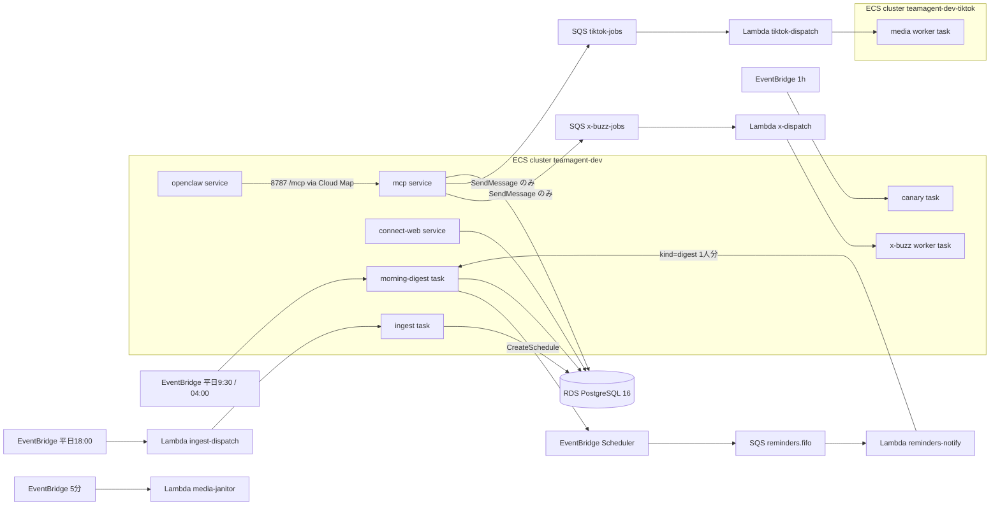

# Terraform 構成（ECS・スケジュール・Lambda）

## 位置づけと操作入口

`infra/terraform/` は 1 つの state で、社内ユーザーが使う唯一の live 環境を管理する（名前は `dev` だが本番扱い。`rds.tf` のコメントもそう書いている）。backend は S3＋DynamoDB ロック、provider は `allowed_account_ids` で 1 アカウントに固定している（`main.tf`）。

素の `terraform plan/apply`、`-target` 指定、旧来の image だけ差し替えるスクリプトは使わない。入口は `infra/deploy/terraform_runtime_guard.sh` の `plan --var-file FILE ...` → `verify` → `apply` だけ。仕組みは次のとおり。

- guard スクリプトが live の状態・preflight・migration manifest（`infra/deploy/terraform_runtime_migrations.json`）から一時変数 `runtime_guard_live` を組み立てて Terraform に渡す。tfvars には保存しない（`runtime_guard.tf`）。
- 常に存在する `terraform_data.runtime_guard` と、各 runtime リソースの `precondition { condition = local.runtime_guard_verified }` が、この値が無いときや live と一致しないときに plan を止める。`-target` を使っても `depends_on` でこの guard を必ず通る。
- guard は手順を守る運用者のための仕組みで、管理者に対する権限境界ではない。管理者は AWS API を直接叩いて迂回できる。このリスクは受容済み（`deployment_boundary.tf`）。

<!-- openwiki: broken internal link [/openwiki/operations/release-gates-and-deploy.md] link "/openwiki/operations/release-gates-and-deploy.md" is root-absolute, which no real consumer resolves against the repository root (not a coding agent reading the page, not GitHub's Markdown renderer, not a local viewer); use a path relative to this file instead. Fix the href or restore the target, then delete this comment. -->
<!-- openwiki: broken internal link [/openwiki/operations/container-images-and-build.md] link "/openwiki/operations/container-images-and-build.md" is root-absolute, which no real consumer resolves against the repository root (not a coding agent reading the page, not GitHub's Markdown renderer, not a local viewer); use a path relative to this file instead. Fix the href or restore the target, then delete this comment. -->
イメージの digest 指定・リリースゲート・保存済み plan の流れは [リリースゲートとデプロイ](/openwiki/operations/release-gates-and-deploy.md) と [コンテナイメージとビルド](/openwiki/operations/container-images-and-build.md) を参照。

## 全体像

## 常駐する ECS サービス

3 サービスとも Fargate・`desired_count = 1`・default VPC の public subnet で `assign_public_ip = true` にしている。外から入る通信は SG で塞ぎ、public IP は外向き通信（Slack・Bedrock・Secrets など）のためだけに使う。どのサービスも `prevent_destroy` と `precondition` で runtime guard に縛られている。

| サービス | 定義 | 起動コマンド・ポート | 通信の制限 | デプロイ設定 |
|---|---|---|---|---|
| mcp | `fargate.tf` | `scripts/run_mcp_vertex_entrypoint.py`・8787 | 8787 への ingress は openclaw SG からだけ。Cloud Map `teamagent-mcp.teamagent.internal` で名前解決 | circuit breaker でロールバック・`wait_for_steady_state`。タスク定義は HMAC の昇格済み ARN（`local.hmac_promoted_task_definition_arns.mcp`） |
| openclaw | `fargate.tf`・`openclaw_state.tf` | image 既定（Slack Socket Mode） | ingress なし（外向きのみ） | `deployment_maximum_percent = 100`／`minimum_healthy_percent = 0`。EFS の状態ディレクトリへの書き手を常に 1 つに保つため、入れ替え中は一瞬 0 台になる |
| connect-web | `connect_web.tf`・`api_gateway_hardening.tf` | `python -m teamagent.connect_web`・8788 | 8788 は VPC CIDR からだけ。外からは API Gateway → internal ALB → IP ターゲットグループ（`/healthz`）の順で届く | `enable_connect_web` で作る。ALB の転送ルールの切り替えは Terraform の外（`aws elbv2 modify-rule`） |

<!-- openwiki: broken internal link [/openwiki/architecture/caller-identity-and-button-bindings.md] link "/openwiki/architecture/caller-identity-and-button-bindings.md" is root-absolute, which no real consumer resolves against the repository root (not a coding agent reading the page, not GitHub's Markdown renderer, not a local viewer); use a path relative to this file instead. Fix the href or restore the target, then delete this comment. -->
<!-- openwiki: broken internal link [/openwiki/workflows/proposal-jobs.md] link "/openwiki/workflows/proposal-jobs.md" is root-absolute, which no real consumer resolves against the repository root (not a coding agent reading the page, not GitHub's Markdown renderer, not a local viewer); use a path relative to this file instead. Fix the href or restore the target, then delete this comment. -->
mcp のタスク定義は ARM64 で、`local.teamagent_runtime_container` を共通で使う（UID 10001・読み取り専用ルート・capabilities 全削除・`/tmp` だけ書き込める）。Slack caller claim の使い捨て nonce 表（`mcp_caller_claim_nonces`）と提案書ジョブの台帳（`proposal_builder_jobs`）という 2 つの DynamoDB 表も `fargate.tf` にある（[caller claim](/openwiki/architecture/caller-identity-and-button-bindings.md)、[提案書ジョブ](/openwiki/workflows/proposal-jobs.md)）。

`mcp_image` と `openclaw_image` は、空でない固定リポジトリの完全 digest でなければ validation で弾かれる（`variables_fargate.tf`）。そのため、サービスに付いている `count = var.mcp_image == "" ? 0 : 1` は実際には常に 1 になる。image を空にしてサービスを消すことはできない。

## スケジュールで起動するタスクと、キューで起動するワーカー

morning_digest・ingest・canary・x_buzz はどれも常駐せず、呼ばれたときだけ動く使い捨ての Fargate タスク。x_buzz を除く 3 つは `mcp_image` をそのまま使い、`command` だけを差し替える。

| 名前 | 起動経路 | 既定の起動時刻（UTC の式 → JST） | 作成スイッチ | 実行内容 |
|---|---|---|---|---|
<!-- openwiki: broken internal link [/openwiki/workflows/morning-digest.md] link "/openwiki/workflows/morning-digest.md" is root-absolute, which no real consumer resolves against the repository root (not a coding agent reading the page, not GitHub's Markdown renderer, not a local viewer); use a path relative to this file instead. Fix the href or restore the target, then delete this comment. -->
| morning_digest | EventBridge rule → ECS RunTask | `cron(30 0 ? * MON-FRI *)` → 平日 9:30 | `enable_morning_digest` | `scripts/run_morning_digest_fargate.py`（[朝ダイジェスト](/openwiki/workflows/morning-digest.md)） |
| morning_digest planner | 上と同じタスク定義を command override で起動 | `cron(0 19 ? * SUN-THU *)` → 月〜金 4:00 | 同上。rule が ENABLED になるのは `enable_reminders && morning_digest_personalized` のときだけ | `--mode=planner`。当日の個人別配信予約を作るだけで、配信はしない |
<!-- openwiki: broken internal link [/openwiki/workflows/ingest-pipeline.md] link "/openwiki/workflows/ingest-pipeline.md" is root-absolute, which no real consumer resolves against the repository root (not a coding agent reading the page, not GitHub's Markdown renderer, not a local viewer); use a path relative to this file instead. Fix the href or restore the target, then delete this comment. -->
| ingest | EventBridge rule → Lambda `ingest-dispatch` → RunTask | `cron(0 9 ? * MON-FRI *)` → 平日 18:00 | `enable_ingest_schedule` | `scripts/run_ingest_fargate.py`（[ingest](/openwiki/workflows/ingest-pipeline.md)） |
| canary | EventBridge rule → ECS RunTask | `rate(1 hour)` | `enable_canary_health` | `scripts/run_canary_health.py`。Slack の本人解決だけを合成テストする（256 CPU / 512 MB） |
| x_buzz | mcp → SQS `x-buzz-jobs` → Lambda `x-dispatch` → RunTask | スケジュールなし（依頼ごと） | `enable_x_research` と `x_buzz_image` | `python -m teamagent.workers.x_buzz_job`。image は main とは別に固定した digest |
<!-- openwiki: broken internal link [/openwiki/workflows/video-and-tiktok-analysis.md] link "/openwiki/workflows/video-and-tiktok-analysis.md" is root-absolute, which no real consumer resolves against the repository root (not a coding agent reading the page, not GitHub's Markdown renderer, not a local viewer); use a path relative to this file instead. Fix the href or restore the target, then delete this comment. -->
| media worker | mcp → SQS `tiktok-jobs` → Lambda `tiktok-dispatch` → RunTask（専用 cluster） | スケジュールなし | `enable_media_worker`（旧名 `enable_tiktok_acquire` も同じ意味） | タスクロールを持たない使い捨てのメディア処理（[動画・TikTok 分析](/openwiki/workflows/video-and-tiktok-analysis.md)） |

EventBridge から直接 ECS を起動するターゲットには `retry_policy`（最大 1 回・イベントの有効期限 3600 秒）が付いている。x_buzz と media で権限の持ち方は同じ。mcp のタスクロールには `sqs:SendMessage` などしか渡さず、`ecs:RunTask` と `iam:PassRole` は dispatcher Lambda にだけ持たせる（`x_research.tf`・`tiktok_acquire.tf`）。

### rule の ENABLED / DISABLED は誰が決めるか

`ingest_rule_enabled`・`morning_digest_rule_enabled`・`canary_rule_enabled` の既定値はどれも `false`。ただし runtime guard が次の 2 点を確かめる。

- 変数の値が `runtime_guard_live` の値と一致すること。
- live の値が、選んだ migration の `to.rule_states` と一致すること。

したがって rule の点灯・消灯は、変数の既定値を書き換えても通らない。migration manifest を経由して変える。canary が止まっていて通知も来ないのは、アラームの設定ミスではなく rule が DISABLED になっているからで、`canary_schedule.tf` のコメントもそう注意している。

canary のアラームは役割の違う 2 本で成り立っている。

- `canary-unhealthy`: 失敗の回数を数える。データが無いときは `notBreaching`。
- `canary-heartbeat-missing`: 生きているかを見る。データが無いときは `breaching`。これは `enable_canary_health && canary_rule_enabled` のときだけ作られる。

## Lambda（dispatch・janitor・reminder）

Lambda のコードは `infra/terraform/lambda/<name>/handler.py` にあり、`archive_file` で zip にして python3.12 で動かす。Agent SDK のループを動かす Lambda（`aws_lambda_function.agent`）は `lambda_iam.tf` でコメントアウトされたままで、存在しない。

- **ingest-dispatch**（`ingest_schedule.tf`）: `reserved_concurrent_executions = 1` にして、同じイベントが重ねて届いても判断を 1 本ずつ行う。同じ family で RUNNING のタスクが無ければ起動する。`INGEST_MAX_RUNTIME_HOURS`（既定 20）以内のタスクが残っていれば起動しない。それを超えたタスクは `StopTask` してから起動し直す。経過時間は `startedAt` が無ければ `createdAt` で測る。ListTasks と DescribeTasks の結果が食い違ったら例外にして、二重起動を防ぐ側に倒す（fail-close）。`clientToken` は EventBridge のイベント ID とタスク定義 ARN から作るので、再試行しても起動は 1 回にまとまる。
- **x-dispatch**（`x_research.tf`）: `batch_size = 1` で `ReportBatchItemFailures` を使う。SQS メッセージを削除（ack）するのは、DynamoDB の job が `done` になったときだけ。`queued` なら RunTask して状態を `dispatched` に条件付きで更新し、メッセージはわざと失敗として返して残す。キューの可視性タイムアウトは 1800 秒、`maxReceiveCount = 24` なので、約 12 時間は完了を待ち続けられる。
- **tiktok-dispatch**（`tiktok_acquire.tf`）: 同時実行は最大 2。タスクロールを持たない Fargate を起動し、S3 には presigned な読み書き権限だけを渡す。ECS の `STOPPED` イベントも EventBridge 経由で受けて、終わり方を確定させる役も兼ねる。この非同期呼び出しが失敗したら（最大 2 回再試行・有効期限 6 時間）invocation DLQ へ送る。
- **media-janitor**（`tiktok_acquire.tf`）: `rate(5 minutes)` で、期限切れの job prefix を消す。消す前に行ごとの所有者とバージョンを確かめ、他の処理と競合しないようにする。DynamoDB TTL と S3 lifecycle は取りこぼし用の予備にすぎない。途中でエラーが出たら呼び出しを失敗させ、EventBridge に再試行させる。成果物の保存期間は validation で 30 日に固定されている。
- **reminders-notify**（`reminders.tf`）: EventBridge Scheduler のワンタイム予約 → SQS FIFO（内容で重複除去・保持 1 時間・3 回失敗で DLQ・DLQ に溜まったらアラーム）を消費する。投稿先は `D` で始まる DM チャンネルに限る。`kind=digest` の予約は、morning-digest タスクを `MORNING_DIGEST_MODE=single` で 1 人分だけ起動する。そのための `DIGEST_*` env は `enable_reminders && enable_morning_digest && morning_digest_personalized` のときだけ入る。RunTask が `failures[]` を返したら例外にして、SQS の再試行と DLQ に任せる。ログに予定名や個人は出さない。

## スイッチ変数の種類

| 形 | 例 | 効き方 |
|---|---|---|
| スタックを作るかどうか | `enable_connect_web`・`enable_ingest_schedule`・`enable_morning_digest`・`enable_canary_health`・`enable_x_research`・`enable_media_worker`・`enable_reminders` | `count` でリソース一式を作るか決める。既定値は `false` |
| 基盤（既定 ON） | `enable_vpc_endpoints`・`enable_cloudtrail`・`enable_bedrock_invocation_logging` など | 既定値は `true` |
<!-- openwiki: broken internal link [/openwiki/architecture/tool-registry-and-feature-flags.md] link "/openwiki/architecture/tool-registry-and-feature-flags.md" is root-absolute, which no real consumer resolves against the repository root (not a coding agent reading the page, not GitHub's Markdown renderer, not a local viewer); use a path relative to this file instead. Fix the href or restore the target, then delete this comment. -->
| mcp の env になる機能フラグ | `enable_report_shorturl` → `USE_REPORT_SHORTURL`（`"1"/"0"`）、`use_web_research_tool` → `USE_WEB_RESEARCH_TOOL`（`"true"/"false"`）、`enable_progress_notify` → `ENABLE_PROGRESS_NOTIFY` | `aws_ecs_task_definition.mcp` の `environment` に書き出す。フラグごとに値の表し方が違うので、アプリ側の読み方と合わせる（[ツール登録と機能フラグ](/openwiki/architecture/tool-registry-and-feature-flags.md)） |
| rule の状態 | `*_rule_enabled` | 上で書いたとおり、migration manifest が正 |

変数どうしの前提条件は、mcp タスク定義の `precondition` が apply の前に止める。

- `enable_scrape_tools`・`enable_proposal_builder`・`enable_omiyage_report` を使うには media worker が要る。
- `use_web_research_tool` を使うには `enable_scrape_tools` が要る（Gemini の認証 env がそちらのブロックで入るため）。
- proposal builder を使うには、S3 の bucket・key・VersionId・SHA-256・サイズと KMS ARN をすべて固定する必要がある。

変数の description には、有効にする順番も書いてある。`use_calendar_event_tool` を点けてから `morning_digest_calendar_button` を点ける（逆だと押しても反応しないボタンが出る）。`enable_reminders` を点けてから `morning_digest_reminders` を点ける。`morning_digest_personalized` の前に migration 0026 を当てる。

多くのフラグは `runtime_guard_live` にも含まれていて、live と完全に一致しないと plan が通らない。本番での ON/OFF の正は git 管理外の tfvars と live のタスク定義にある。コードを読んでも実際の値は分からない（`use_web_research_tool` の description にも同じ注意がある）。

## ネットワークとデータ層

- **VPC**: default VPC とそのすべての subnet を data source で参照する（`rds.tf`）。`enable_vpc_endpoints`（既定 `true`）で bedrock-runtime・secretsmanager・kms・ecr.api・ecr.dkr・logs の interface endpoint と、S3・DynamoDB の gateway endpoint を作る（`vpc_endpoints.tf`）。
<!-- openwiki: broken internal link [/openwiki/data/postgres-schema-and-migrations.md] link "/openwiki/data/postgres-schema-and-migrations.md" is root-absolute, which no real consumer resolves against the repository root (not a coding agent reading the page, not GitHub's Markdown renderer, not a local viewer); use a path relative to this file instead. Fix the href or restore the target, then delete this comment. -->
- **RDS**: PostgreSQL 16（既定 `db.t4g.micro`・gp3・暗号化あり）。parameter group で `rds.force_ssl=1`・`pg_stat_statements`・1 秒以上かかったクエリのログを有効にしている。バックアップは 7 日。`deletion_protection = true` は environment 名に関係なく常に有効。IAM DB 認証も有効。パスワードは `random_password` で作って Secrets Manager の `<project>/<env>/db_password` に置き、`ignore_changes = [password]` にしている。pgvector の `CREATE EXTENSION` は Terraform ではなく SQL マイグレーションで行う（[スキーマとマイグレーション](/openwiki/data/postgres-schema-and-migrations.md)）。
- **DB への経路**: DB の SG への 5432 番の ingress は、使う側ごとに `aws_security_group_rule` を足している（`db_from_mcp`・`db_from_connect_web`・`db_from_ingest`・`db_from_morning_digest`・`db_from_worker`・`db_from_bastion`）。openclaw 用のルールは無いので、openclaw から DB には届かない。
- **踏み台**: `bastion.tf` の t4g.nano（Amazon Linux 2023 ARM）。SSM Session Manager で入り、SSH 鍵は使わない。
- **旧 EC2 worker**: `worker.tf` の t4g.medium もまだ state にある（IMDSv2 必須・user_data はディレクトリを作るだけ・HMAC の precondition 付き）。踏み台と worker はどちらも `ignore_changes = [ami]` にしている。`most_recent` の AMI が更新されるたびに、関係ない apply で EC2 が作り直されるのを防ぐため。

## コードとコメントの食い違い（コードが正）

- `ingest_schedule.tf` のコメントは「毎週月 18:00 UTC = 火 03:00 JST」、rule 名は `ingest-weekly` だが、`ingest_schedule_expression` の既定値は `cron(0 9 ? * MON-FRI *)`（平日 18:00 JST）。
- `main.tf` の冒頭コメントは「Lambda（Agent SDK ループ実行）」を挙げているが、その Lambda はコメントアウトされている。実在する Lambda は上の 5 つだけ。
- `fargate_ingest_cpu` のコメントには「実運用値は CLI（register-task-definition）で上書き」とあるが、`infra/deploy/register_ingest_td.sh` は退役済みで、実行すると必ず失敗する。Terraform が描くのは既定値の 1024 CPU / 4096 MB。live がどちらの値かはコードからは確定できない。

## 関連ページ

<!-- openwiki: broken internal link [/openwiki/operations/release-gates-and-deploy.md] link "/openwiki/operations/release-gates-and-deploy.md" is root-absolute, which no real consumer resolves against the repository root (not a coding agent reading the page, not GitHub's Markdown renderer, not a local viewer); use a path relative to this file instead. Fix the href or restore the target, then delete this comment. -->
- [リリースゲートとデプロイ](/openwiki/operations/release-gates-and-deploy.md)
<!-- openwiki: broken internal link [/openwiki/architecture/overview.md] link "/openwiki/architecture/overview.md" is root-absolute, which no real consumer resolves against the repository root (not a coding agent reading the page, not GitHub's Markdown renderer, not a local viewer); use a path relative to this file instead. Fix the href or restore the target, then delete this comment. -->
- [全体構成](/openwiki/architecture/overview.md)
<!-- openwiki: broken internal link [/openwiki/architecture/tool-registry-and-feature-flags.md] link "/openwiki/architecture/tool-registry-and-feature-flags.md" is root-absolute, which no real consumer resolves against the repository root (not a coding agent reading the page, not GitHub's Markdown renderer, not a local viewer); use a path relative to this file instead. Fix the href or restore the target, then delete this comment. -->
- [ツール登録と機能フラグ](/openwiki/architecture/tool-registry-and-feature-flags.md)
<!-- openwiki: broken internal link [/openwiki/operations/hmac-keyring-and-rotation.md] link "/openwiki/operations/hmac-keyring-and-rotation.md" is root-absolute, which no real consumer resolves against the repository root (not a coding agent reading the page, not GitHub's Markdown renderer, not a local viewer); use a path relative to this file instead. Fix the href or restore the target, then delete this comment. -->
- [HMAC 鍵束とローテーション](/openwiki/operations/hmac-keyring-and-rotation.md)
<!-- openwiki: broken internal link [/openwiki/operations/observability-and-cost.md] link "/openwiki/operations/observability-and-cost.md" is root-absolute, which no real consumer resolves against the repository root (not a coding agent reading the page, not GitHub's Markdown renderer, not a local viewer); use a path relative to this file instead. Fix the href or restore the target, then delete this comment. -->
- [可観測性とコスト](/openwiki/operations/observability-and-cost.md)
