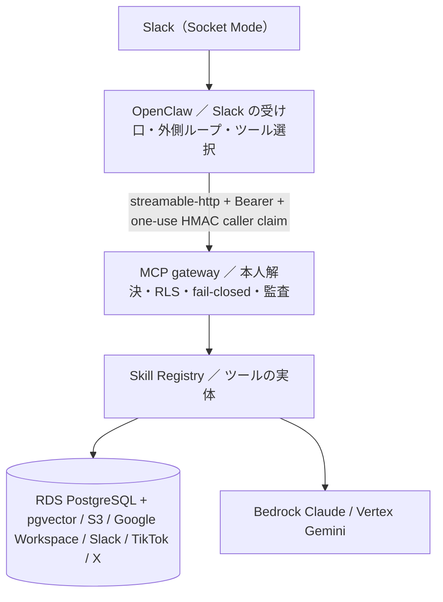

# クイックスタート

Aico は、社内の営業メンバーが Slack で話しかけると、社内資料の検索・クライアントカルテ・提案書生成・メール要約と下書き・カレンダー・TikTok/X 分析などを実行する AI 秘書です。このリポジトリ（teamagent）はその本体で、Slack の受け口から AWS 上のデータ・モデル呼び出しまでを含みます。

- 開発の基準ブランチは `dev` です。`main` は大きく遅れているので、PR は `dev` 宛てに出します。
- `docs/` 配下や README の一部には旧設計の歴史文書が混ざっています。コードと食い違ったらコードを正とします。

## 全体の流れ

各層の責任範囲は [全体構成](architecture/overview.md) にまとまっています。受け口の設定は [OpenClaw ゲートウェイ](architecture/openclaw-gateway.md)、信頼境界は [MCP gateway](architecture/mcp-gateway.md) と [呼び出し元の証明とボタン束縛](architecture/caller-identity-and-button-bindings.md) です。

## やりたいこと別の入口

| やりたいこと | まず読むページ | 主なコード |
|---|---|---|
| ツールを足す・出し入れする | [ツール登録と機能フラグ](architecture/tool-registry-and-feature-flags.md)、[3層分離と Skill の契約](architecture/layering-and-skill-contract.md) | `src/teamagent/orchestrator/factory.py`、`src/teamagent/skills/`、`infra/openclaw/openclaw.config.json5` |
| 呼び出しが本人として扱われる仕組みを知る | [MCP gateway](architecture/mcp-gateway.md)、[Slack の本人確認と連携](integrations/slack-identity-and-oauth.md) | `src/teamagent/mcp_gateway/`、`src/teamagent/adapters/slack_client.py` |
| Google 連携・トークン保管を触る | [Google OAuth とトークン保管](integrations/google-oauth-and-token-store.md) | `src/teamagent/adapters/google_auth.py`、`src/teamagent/connect_web/` |
| DB・RLS を触る | [スキーマとマイグレーション](data/postgres-schema-and-migrations.md)、[RLS と実行ロール](data/rls-and-app-role.md) | `infra/migrations/`、`src/teamagent/adapters/pgvector_client.py` |
| 朝ダイジェストとボタン | [朝ダイジェスト](workflows/morning-digest.md)、[ボタン処理](workflows/digest-buttons.md) | `src/teamagent/skills/morning_digest/`、`infra/openclaw/caller-identity-plugin/` |
| メール・カレンダー系ツール | [メール・カレンダー・Slack 要約系ツール](workflows/mail-tools.md) | `src/teamagent/skills/mail_*`、`src/teamagent/adapters/gmail_client.py` |
| 社内資料の検索・取り込み | [社内資料検索](workflows/knowledge-search.md)、[資料取り込み](workflows/ingest-pipeline.md) | `src/teamagent/skills/search/`、`src/teamagent/ingest/` |
| 提案書・動画分析などの長時間ジョブ | [長時間ジョブの切り離し](architecture/detached-jobs-and-async-notify.md)、[提案書ジョブ](workflows/proposal-jobs.md)、[動画・TikTok 分析](workflows/video-and-tiktok-analysis.md) | `src/teamagent/skills/proposal_builder/`、`src/teamagent/skills/video_algorithm/` |
| X / Web リサーチ | [X リサーチと Web リサーチ](workflows/research-tools.md) | `src/teamagent/skills/x_research/`、`src/teamagent/skills/web_research/` |
| モデル呼び出し・リトライ・費用 | [Bedrock / Gemini 呼び出し](integrations/bedrock-gemini-and-retry.md)、[観測・コスト管理](operations/observability-and-cost.md) | `src/teamagent/adapters/bedrock_client.py`、`src/teamagent/adapters/gemini_client.py` |
| イメージを作って本番へ出す | [コンテナイメージとビルド](operations/container-images-and-build.md)、[リリースゲートとデプロイ](operations/release-gates-and-deploy.md)、[Terraform 構成](operations/terraform-layout.md) | `infra/docker/`、`infra/terraform/` |
| 署名鍵を回す | [HMAC 鍵束とローテーション](operations/hmac-keyring-and-rotation.md) | `src/teamagent/hmac_keyring.py` |
| テストを走らせる | [テストの走らせ方と CI](testing/running-tests.md)、[ルーティング検証と評価](testing/routing-and-eval.md) | `.github/workflows/ci.yml`、`tests/` |

## ツールが本番の Aico に届くまでの4段

ツールは次の4段がすべて揃って初めて利用者から使えます。「実装済み」と「稼働中」は別物なので、どの段で止まっているかを常に確かめます。

1. **Skill を実装する**：`src/teamagent/skills/<name>/` にスキーマと本体を置き、登録する。
2. **factory に登録する**：`build_production_tools()` に `USE_<X>` などの環境変数で出し入れできる形で追加する。環境変数の判定は `"1"` / `"true"` / `"yes"` だけが真で、既定は偽なので、新しいツールは既定で無効になる。
3. **OpenClaw に見せる**：`infra/openclaw/openclaw.config.json5` の `toolFilter.include` にツール名を足す。factory にあっても include に無ければ、OpenClaw からは見えない。
4. **本番で有効にする**：mcp の ECS タスクの環境変数で `USE_<X>` を有効にし、Terraform で反映して run-task で確かめる。

詳しくは [ツール登録と機能フラグ](architecture/tool-registry-and-feature-flags.md) を参照してください。

## 本番に触る前の地雷（要点）

- **有効化スイッチの変数は既定が無効**：`enable_morning_digest`・`enable_ingest_schedule`・`enable_connect_web` はどれも既定値が `false` です。tfvars に明記せずに plan/apply すると、動いているスケジュールや ECS タスクが削除対象になります。
- **ECS タスクのコマンドは venv の python を直接呼ぶ**：Terraform のタスク定義は `/app/.venv/bin/python` を直接起動します（`uv run` は使わない）。
- **ingest のタスク定義を直接登録しない**：イメージは Terraform の手順で反映します。手順は [リリースゲートとデプロイ](operations/release-gates-and-deploy.md) にあります。

## テストを走らせる（最短）

CI は `uv.lock` から `dev`・`mcp`・`media` の extras をハッシュ固定・`--no-deps` で入れてから `pytest tests/` を走らせます。TikTok 系のテストのために `npm ci --prefix tools/tiktok_scraper` も実行します。ローカルでも最低 `--extra dev --extra mcp`（media 系は `--extra media` も）を入れないと、CI には無い失敗が出ます。詳しくは [テストの走らせ方と CI](testing/running-tests.md) を参照してください。
