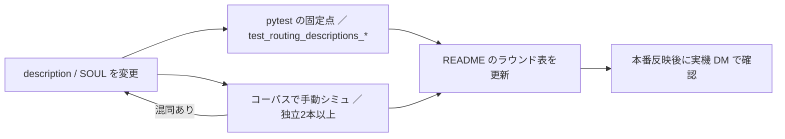

# ルーティング検証と評価

## 何を測る仕組みか

Aico の「正しく動くか」は、決定的に測れる部分と LLM の判断に依存する部分に分かれる。このリポジトリはその境目をはっきり分けている。

| 対象 | 何を見るか | どこで | CI で回るか |
|---|---|---|---|
| ツールの棲み分け（ルーティング） | 発話から正しいツールが選ばれ、引数を捏造しないか | `tests/routing/`（コーパス＋手動シミュ手順） | 回らない（LLM 依存） |
| description・台帳の固定点 | トリガー語・相互排他注記・参照先の実在・本番登録 | `tests/skills/test_routing_descriptions_*.py` ほか | 回る |
| オーケストレーション評価 | L2 `run_agent` が期待ツールを踏み、禁止ツールを避け、反復上限内に収まるか | `src/teamagent/orchestrator/eval.py` ＋ `scripts/eval_orchestration.py` | 採点ロジックだけ回る。実行は手動・課金あり |
| 検索精度評価 | `search` の top-1 / top-5 / MRR / 0 件応答 | `scripts/run_eval.py` ＋ gold set ／ `scripts/compare_retrieval.py` | 回らない（DB と Bedrock が要る）。部品のテストだけ回る |

CI は `pytest tests/ -q` を実行するので、下に挙げる pytest はすべて CI で走る。依存の揃え方は [テストの走らせ方](running-tests.md)。

## ルーティング検証（tests/routing）

### 前提: ルーターは name+description しか見ない

OpenClaw の外側ループ（Haiku）は、ツールの **name と description だけ**で 1 本を選ぶ（[OpenClaw gateway](../architecture/openclaw-gateway.md)）。似たツール（X 系どうし、TikTok 系と動画分析系、メール系とカレンダー系）の取り違えは、description の書き方でしか防げない。そこで次の 2 つを組み合わせている。

1. **コーパス** `tests/routing/catalog_routing_corpus.jsonl`（現在 84 行）: 期待ラベル付きの発話集。正例・境界例・敵対例と、新しいツールに奪われてはいけない対照例が入っている。
2. **手動シミュ**（`tests/routing/README.md` の手順）: LLM を「name+description だけで 1 本選び、引数も出すルーター」に見立てて発話を伏せたまま流し、期待ラベルと突き合わせる。独立 2 本以上の多数決。

コーパスの突き合わせは LLM 依存で非決定的なので pytest のゲートにはしていない。description を変えたら手動で再シミュし、同時に下の pytest の固定点を壊さないことが運用上の約束。

### コーパスの 1 行

| フィールド | 意味 |
|---|---|
| `id` / `utterance` / `note` | 行の識別子・発話・メモ |
| `expect` | 第一候補のツール名。`__ask_back__` は「どのツールも呼ばず聞き返すのが正解」を表す sentinel |
| `alt_ok` | 許容する代替ツール |
| `forbid` | 選んではいけないツール |
| `arg_rules` | 引数の契約。`must_be_absent` / `must_be_present` / `must_equal:<値>` の 3 種。ツールが合っていても引数を捏造したら不合格 |

採点は 3 段で、`expect`/`alt_ok` に一致するか、`forbid` を選んでいないか、`arg_rules` を満たすか、の順に見る。`forbid` と `arg_rules` は、顧客名を言わない依頼（「今週の空いてる時間を教えて」など）でルーターが required 引数に依頼文の断片を詰め、Gmail の完全一致検索が必ず 0 件になった本番の失敗から足された（README の R4 節）。

### シミュの手順

1. OpenClaw から見えるツール（`infra/openclaw/effective-tool-scope.json` で `enabledBy` が `never` 以外のもの）の name+description を集める。
2. サブエージェントに渡し、コーパスの `utterance` を伏せたまま流す（独立 2 本以上）。
3. 3 段で採点し、混同したペアを description の修正で潰して再実行する。
4. 結果を README のラウンド表に追記する。

README の R5d 節は、SOUL.md を system prompt として読ませる「本番近似シミュ」も試している。name+description だけのルーターでは SOUL の誤った一般化（例: 切り出しの制約を動画分析全般に広げてツールを呼ばずに断る）を再現できないため。ただし OpenClaw の実行時の注入内容と同一ではないので、最終確認は本番への反映後に実機の DM で行う。

README の R4 結果欄（メール・カレンダー系 18 行）は「未実施」のままになっている。

## description と台帳を固定する pytest

LLM の選択そのものは測れないので、pytest は「ルーティング指示が文として正しく存在し、指す先が実在して本番で呼べるか」を固定する。

### `tests/skills/test_routing_descriptions_catalog.py`

- **トリガー語・相互排他注記**: 例えば `x_voice_search` の description に「商材名が主語」と `x_needs_mining` への誘導があること、`tiktok_search` に `tiktok_acquire` / `search_surface_check` / `video_algorithm` への誘導と「今すぐ／即時」の性格が書かれていること、など部分文字列の存在を検査する。
- **コーパスの形式**: id が重複しない。`expect`/`alt_ok`/`forbid` が登録済みの skill 名を指す。`forbid` が `expect`/`alt_ok` と矛盾しない。`arg_rules` のキーが候補ツールの入力スキーマに実在し、`must_be_absent` の引数は required ではない（required だとその行は永久に不合格になる）。検査数が 8 未満なら空振りとみなして落ちる。
- **R4 行の凍結**: 本番 QA 由来の 18 行（`freebusy-*` / `agenda-*` / `mailnc-*` / `oauth-02..04` / `r4neg-*`）を `R4_REQUIRED_IDS` で固定し、消すと赤になる。
- **ダングリング参照**: OpenClaw に出る description（`effective-tool-scope.json` を正本として解決）と `infra/openclaw/SOUL.md` に現れる snake_case の識別子のうち、登録済み skill でも、入出力スキーマのフィールド名でも、`NON_TOOL_IDENTIFIERS`（エラーコードなど）でもないものがあれば失敗する。改名・削除・タイプミスで「そっちで出来ます」と案内した先が存在しない状態を防ぐ。
- **台帳と factory の一致**: `factory.build_production_tools` を AST で読み、各 `ToolSpec` を囲む `_envflag(...)` を静的に抽出して、台帳の `enabledBy`（`always` / `envAllTrue` / `never`）と突き合わせる。重い依存（embedder・boto3・psycopg）を作らずに「どの env で何が登録されるか」を決められる（[ツール登録と機能フラグ](../architecture/tool-registry-and-feature-flags.md)）。
- **本番未配線の扱い**: `NOT_WIRED_IN_PRODUCTION`（`video_approval` / `operation_log` / `knowledge_search_url`）は台帳の `never` と完全一致しなければならない。コーパスで本番未配線のツールを期待している行は `CORPUS_ROWS_EXPECTING_UNWIRED_TOOLS` の 4 行（`vapproval-01` / `vapproval-02` / `boundary-04` / `neg-ksurl-01`）に限られ、増減すると赤になる。これらはシミュでは必ず不合格になる既知の負債。

### 関連する固定点

| テスト | 担当 |
|---|---|
| `tests/skills/test_routing_descriptions_mail_calendar.py` | メール・カレンダー系の利用者語彙（「要返信」「今日」など）と、他ツールに同じ語が出るときは正しい先を指す誘導になっていること |
| `tests/skills/test_client_name_guard_contract.py` | ルーターが作りうる捏造 `client_name` が Gmail を叩く前にガードで止まり、「連携は正常です」の案内と error コードが返ること。参照する発話 id がコーパスから消えたら赤 |
| `tests/skills/video_capture/test_video_capture.py` | YouTube の切り出し依頼でもツールを呼ぶ（断らない）ことの固定（R5 由来） |

### description を変えるときの手順

新しい失敗例は、まずコーパスに行として足す（必要なら `forbid` / `arg_rules` も）。本番で実際に起きた発話は凍結リストへの追加も検討する。

## オーケストレーション評価（eval）

L2 オーケストレーター（[オーケストレータ](../architecture/orchestrator.md)）のツール選択を測る。

### 決定的な採点（`src/teamagent/orchestrator/eval.py`）

- `GoldCase`: `goal`（依頼文）、`expect_all`（全部呼ぶべき）、`expect_any`（最低 1 つ）、`forbid`（呼んではいけない）、`max_turns`（既定 8）、`needs_flags`（実行に必要な env。例: `USE_MAIL_TOOLS`）。
- `score_case(case, tool_calls, num_turns)` は純関数。呼ばれたツール列を重複除去（順序保持）し、必須の欠落・`expect_any` 不充足・禁止ツール使用・反復上限超過のどれも無ければ合格。不合格理由は `CaseScore.reasons` で人が読める形になる。
- `GOLD_CASES` は 10 本（検索のみ、カルテ、調査のみで提案禁止、ドラフト→レビュー、mail 制約つきなど）。`expect_*` は LLM の自由度を残すため最小限にしてある。実 eval の結果で期待を直した例（`proposal_review` は内部で過去事例を検索するので `search` を必須にしない）もある。
- CI の `tests/orchestrator/test_orchestration_eval.py` は全分岐と gold set の健全性（id 一意・期待が空でない・mail を期待するケースは `USE_MAIL_TOOLS` を `needs_flags` に持つ）を課金ゼロで検査する。

### 実行（`scripts/eval_orchestration.py`・課金あり）

各ケースを実際に `run_sdk_agent` で回し（`cost_cap_usd=0.5`、実行上限は `max_turns + 2`）、`score_case` で採点、`score_faithfulness` で回答の `chunk_id` 引用が実取得の hits に含まれるか（捏造引用）も集計する。`needs_flags` が env で満たされないケースは黙って打ち切らず、SKIP として明示ログに出す。前提は `CLAUDE_CODE_USE_BEDROCK=1`・`AWS_REGION`・`DATABASE_URL` で、欠けると終了コード 2。引数に数を渡すと先頭 N ケースだけ回す。

注意（コードとの食い違い）:

- このスクリプトは `scripts.run_orchestrator_prod` から `_build_system_prompt` を import するが、現行の `run_orchestrator_prod.py` にはその関数が無く、`teamagent.orchestrator.agent_config.build_orchestrator_system_prompt` を使っている。現状のままでは import で失敗するので、回す前に import 先を `build_orchestrator_system_prompt` へ直す必要がある。
- モデルの既定値も本番経路と違う。eval は `TEAMAGENT_BEDROCK_MODEL` → `BEDROCK_MODEL_ID` → US の Sonnet プロファイルの順で決めるが、`orchestrator_model_from_env()` の既定は Haiku。本番と同じ条件で測るなら env でモデルを明示する。

引用の忠実性の判定（`faithfulness.py`）は LLM judge を使わない決定的な下限チェックで、文単位の主張が根拠に支持されているかまでは見ない。

## 検索精度評価

### `scripts/run_eval.py`（gold set による A/B）

`SearchSkill` を MCP を通さず直接組み立て、gold set（`data/eval/sales_gold_set.yaml`）の各 query を `top_k=5` で実行する。検索ノブは env から読み（`USE_COHERE_RERANK`・`USE_CONTEXTUAL`・`USE_FB_DRIVE_MATCH`・`PROMPT_VERSION`・`SEARCH_*`・`EMBEDDER_BACKEND`/`EMBEDDING_COLUMN` など）、使った値を結果の `config` に残す。

- **判定**: hit の本文に `expect_keywords` が全部含まれ、`expect_source_type`・`expect_client_name`（部分一致）・`expect_metadata` がすべて合えばマッチ。top-5 の中で最初にマッチした順位から top-1 / top-5 / MRR を出す。
- **ネガティブケース**: `expect_zero_hits` のケースは 0 件を返したときだけ正解。0 件応答の母数は gold set のネガティブ件数で固定している（以前は実際に 0 件だった件数を母数にしていて、誤ってヒットを返したケースが分母から抜けていた）。
- **中断耐性**: 1 ケースごとに `data/eval/results/<label>_<ts>_partial.jsonl` へ追記・flush する。Ctrl-C ではそこまでを集計して終了コード 130 で partial を残し、正常完走では consolidated JSON を保存して partial を消す。`data/eval/results/` は `.gitignore` 対象。
- **比較**: `--compare baseline rerank ...` は評価を回さず、各 label の最新結果 JSON を表にし、基準（既定は先頭、`--baseline` で変更）との差分と top-5 で新たに通った / 落ちた case_id を出す。
- **権限**: 評価用の `SkillContext` は `user_role="admin"` と会社グループを直接渡す（メールは `EVAL_USER_EMAIL`）。MCP 経由では `user_role` が常に `member` になるので（[MCP gateway](../architecture/mcp-gateway.md)）、見える範囲は本番の利用者より広い。

CI では `tests/eval/test_gold_set_structure.py`（gold set の構造: `version`/`cases`、20 ケース以上、id 一意、型、0 件ケースはキーワード空、`_match_hit` の分岐）と `tests/scripts/test_run_eval.py`・`test_run_eval_compare.py`（集計・partial・比較表示）が走る。

### `scripts/compare_retrieval.py`

固定の 5 クエリで、通常の `proposals_chunks.text` と Contextual Retrieval の `proposals_chunks_contextual.contextualized_text` のベクトル検索 top-5 を並べ、top-1 score の差を出す。`--embedding-col` で e5 と Cohere の列を切り替えられる（`EMBEDDER_BACKEND` と組で指定）。列名は SQL に直接埋めるため、`ALLOWED_EMBEDDING_COLUMNS` の許可リスト以外は拒否する。接続先は `DATABASE_URL`。検索の仕組み自体は [ナレッジ検索](../workflows/knowledge-search.md)。
