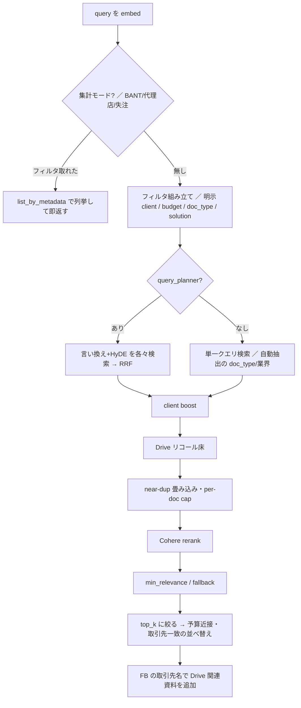

# 社内資料検索（search / clientkarte / knowledge_deliver）

## 位置づけ

営業が過去の提案書・議事録・営業フィードバック（FB）を自然文で探す機能群。同じ検索パイプラインを 3 つの面から使う。

| 面 | 入口 | 使う部品 |
|---|---|---|
| Slack（@Aico） | MCP ツール `search` / `knowledge_deliver` / `clientkarte` / `knowledge_search_url`（[MCP gateway](../architecture/mcp-gateway.md)） | `SearchSkill.run` |
| 他 Skill | `SearchSkill.retrieve_hits`（要約なし・ヒットだけ） | 提案書の下書き・レビュー・recommend など |
| ブラウザ | connect-web の `/search`・`/api/v1/search` | 同じ `SearchSkill` を lazy-singleton で保持 |

`SearchSkill` は embedder を常駐させる重いオブジェクトなので、`orchestrator/factory.py` の `build_production_tools` で 1 つだけ作り、`knowledge_deliver`・提案書系へ共有注入する。env から引数を決めるのは `resolve_search_skill_config()` 1 か所で、MCP 経路・`runtime/slack_bot.py`・connect-web が同じ既定で組む（過去に経路ごとに既定値がずれていたのを QW-2 で揃えた。`tests/orchestrator/test_search_skill_config_parity.py`）。

検索対象（`documents` + `chunks`、`cls_*` 分類メタ、`suppressed`・テンプレのフラグ）を作る側は [ingest（取り込み）](ingest-pipeline.md)。

## 主な設定（env）

| env | 既定 | 効果 |
|---|---|---|
| `USE_NEW_SCHEMA` | OFF | `documents`+`chunks` の横断検索。OFF だと旧 `proposals_chunks` 単表（以下の段はほぼ全部 new_schema 前提） |
| `USE_COHERE_RERANK` / `SEARCH_RERANK_POOL_SIZE` / `SEARCH_RERANK_RETURN_SIZE` | OFF / 30 / 100 | 広めに取って Bedrock の Cohere Rerank で並べ直す |
| `SEARCH_DRIVE_POOL_FLOOR` | 15 | rerank プールに入る Drive 資料の最低件数（0 で無効） |
| `SEARCH_CAMPAIGN_POOL_FLOOR` | 3 | 実績を聞く意図のとき、プールに入る施策実績（ショート動画 DB の案件ごとの実績文書）の最低件数（0 で無効） |
| `SEARCH_MIN_RELEVANCE` / `_FALLBACK` | 0.0 / 0.0 | rerank スコアの足切りと、全部落ちたときの救済用しきい値 |
| `USE_CLIENT_BOOST` | **ON**（factory 既定） | 既知の取引先名を含むクエリで、取引先で絞った検索を追加する |
| `USE_AGGREGATION_MODE` / `USE_KNOWLEDGE_FILTERS` / `USE_QUERY_PLANNER` | OFF | 一覧クエリの列挙 / 資料種別・業界の自動抽出 / Haiku による言い換え・HyDE |
| `SEARCH_DEDUP_RESULTS`・`BOILERPLATE_EXCLUDE_SEARCH`・`DOC_DEDUP_EXCLUDE_SEARCH`・`TEMPLATE_EXCLUDE_SEARCH` | OFF | 資料の被り・テンプレ・重複取り込みの除外 |
| `SEARCH_RESULT_GUARD` / `SEARCH_WEAK_RESULT_THRESHOLD` | ON / 0.3 | 決定論の警告ヘッダ |
| `PROMPT_VERSION` / `SEARCH_MAX_TOKENS` | `v2d` / 800 | 要約プロンプトと出力上限 |
| `USE_SEARCH_TWO_STAGE` / `SEARCH_ANSWER_SOURCE_LINKS` | OFF | 二段返し / 回答末尾の資料リンク |

`USE_CLIENT_BOOST` は `SearchSkill.__init__` の引数既定だと False だが、factory は ON で渡す。`docs/poc/PROGRESS_AND_NEXT_PLAN.md` には「既定 OFF」とあり、コードとずれている（コードが正）。フラグ全般の仕組みは [ツール登録と機能フラグ](../architecture/tool-registry-and-feature-flags.md)。

## 検索パイプライン（`_retrieve`）

- **RLS**: 最初に `ctx.metadata` の `user_email` / `user_groups` / `user_role` で `PgVectorClient.connection(app_role="teamagent_app", ...)` を開き、以降の SQL はすべてその接続で走る。本人に見えない文書はどの段でもヒットしない（[RLS と実行ロール](../data/rls-and-app-role.md)）。
- **集計モード**: `extract_aggregation_filter` が「BANT A」「代理店」「直販」「失注（BANT C と見なす）」を拾ったときだけ、意味検索をやめてメタデータで列挙する。1 件も無ければ通常検索へ進む。
- **フィルタの 2 種類**: 自動で付けたもの（業界・`extract_knowledge_filters` の資料種別）は、0 件なら外して再検索する（fail-open）。ユーザーが明示したもの（`filter_client` は `__client__` で `cls_project`/`client_name`/`title` の部分一致、budget/doc_type/solution は sticky）は、再検索でも必ず残す。`filter_client` は括弧・敬称・法人格を剥がしてからパターンにする（`client_match.normalize_filter_client`）。
- **除外の最後の砦**: フィルタを外しても 0 件で、boilerplate・重複・テンプレ除外のどれかが効いているときは、除外を全部外して 1 回だけ再検索する。救えたヒットには `is_low_confidence=True` を付ける（`SEARCH_EXCLUSION_RESCUE`、既定 ON）。
- **client boost**: 取引先の語彙（`client_name` と `cls_project` の和集合）に部分一致したら、`__client__` で絞った検索をプールへ足す。明示の `filter_client` や planner が抽出した取引先があるときは走らない（別の取引先が混ざるのを防ぐ）。語彙キャッシュのキーは `(user_groups, user_role, lower(email))` で TTL 付き（`SEARCH_CLIENT_VOCAB_TTL_S`、既定 600 秒）。以前は最初の呼び出し者の可視範囲で作った語彙を全員が共有しており、閲覧制限付き文書の取引先名が漏れていた。
- **Drive リコール床**: 営業 FB の行が埋め込み空間で大きな塊になり、dense 上位 30 件が FB だけで埋まって Drive 資料が rerank に届かなかった（実測で Drive の最上位は 78 位）。rerank が有効で、プール内の `source_type='gdrive'` が床に届かないときだけ、Drive に限った検索を 1 回足す。順位は rerank が決め、失敗しても本体は続く。
- **施策実績のリコール床**（2026-09-29 追加）: 施策実績の文書は `cls_solution` を持たないため、自動抽出の `cls_solution=動画広告` の AND や提案 PDF の枠の占有で rerank に届かなかった。実績を聞く意図（`is_campaign_results_intent`）のときだけ、プール内の施策実績が `SEARCH_CAMPAIGN_POOL_FLOOR` 未満なら施策実績に限った検索を 1 回足す。
- **rerank**: `top_n=min(件数, return_size)` で広く返し、閾値を掛けてから `top_k` に絞る。成功時は `score` を rerank の関連度で上書きし、dense のスコアは `metadata.dense_score` に残す。Bedrock が失敗したら dense の順位のまま返す。
- **関連度の閾値**: `score < SEARCH_MIN_RELEVANCE` は落とす。全部落ちて fallback が 0 より大きければ、fallback 以上を低信頼として救う。

## 回答の組み立て（`run`）

1. **警告ヘッダ（result_guard）**: 要約に入る前に、検索結果の数値だけで `build_result_header` がヘッダを決める。top1 スコアが閾値未満なら「関連度が低い」、業種を指定したのにその業種の資料が 0 件なら「その業種の資料なし」、指定した取引先と top1 の取引先が違えば「別クライアント」。取引先の判定は語境界つきの一致と別名辞書で行い、本文は見ない。判定できないときは警告しない。LLM のプロンプトに任せないのは、関係ない取引先の資料が関連資料の顔で出る事故が実際に起きたため。
2. **資料名 → Drive URL の解決**: Slack や管理シートの行に書かれた資料名を `resolve_file_urls_by_titles` でまとめて Drive の実ファイル URL にする。失敗しても回答は続く。
3. **要約**: `load_prompt("search", PROMPT_VERSION, "system")` と `[chunk_id, score, 日付]` 付きの抜粋を Bedrock `converse` に渡す（system はキャッシュする）。低信頼のヒットがあれば「断定しない」注意を足す。回答に紛れ込んだ `chunk_id` は後処理で消す。呼び出しとリトライは [Bedrock / Gemini 呼び出しとリトライ](../integrations/bedrock-gemini-and-retry.md)。
4. `include_answer=False` のときは要約を丸ごと飛ばし、`answer=''`・コスト 0 で返す（Web UI の先出し用）。
5. ヘッダを回答の先頭に付ける。実ファイルが解決済みで `knowledge_deliver` が ON なら、末尾に「実ファイルをお送りしますか？」を 1 つだけ付ける（ツールは呼ばない）。
6. 各ヒットの日付は根拠のある値だけを返す。`SearchHitOut` の validator が `date_basis` を `title_date` → `modified_at` → `none` の順で決め、`none` のときは日付フィールドを空にする。`source_uri`（`slack://`・`gdrive://`）は `exclude=True` で外へ出さない。

`SearchHitOut.score` の説明文は「cosine 類似度」だが、rerank が有効なら中身は rerank の関連度になる。`knowledge_deliver` の配信しきい値はこの値を前提にしている。

### 二段返し（`USE_SEARCH_TWO_STAGE`、既定 OFF）

ON のときは、ヒット一覧と定型文（`TWO_STAGE_NOTICE`）をすぐ返し、要約は daemon thread で作って Slack に後から投稿する。対象は MCP gateway が `ctx.metadata["search_two_stage_allowed"]` を立てた `search` ツールの呼び出しだけで、connect-web・`slack_bot` からの直呼び・`knowledge_deliver` 内部の検索は対象外。投稿先は `resolve_followup_target` が `ctx.metadata` の `channel_id`（あれば `thread_ts`）か、本人の email の DM に限る。どちらも無ければ後追いをやめて、その場で要約する。既定チャンネルへ逃がす経路は持たない。

## clientkarte（取引先カルテ）

`list_client_timeline_recent` が `is_sales_fb='true'` かつ `client_name LIKE %名前%` の FB から最新 N 件を取り、古い順に並べる。Bedrock がそこから提案履歴・温度感・次アクションをまとめる。出典の Slack permalink は LLM に書かせず、サーバ側で最大 3 件付ける。

関連資料の同梱（`KARTE_ATTACH_DOCS`、既定 ON）は機能まるごとの kill switch で、OFF なら資料を DB から引かない。守りは次のとおり。

- `classify_client_name` が依頼文の断片（「の」など）と判定した名前では資料経路に入らない（実際に `client_name="の"` で 8 件を掴んだことがある）。
- 行の取引先が要求と矛盾する資料は `belongs_to_client` で落とし、`document_count` にも数えない。
- どこに出すかを先に決めてから副作用を起こす。L2 オーケストレーターの途中ステップでは副作用なし。DM で呼ばれたらその場に一覧を足す。チャンネル・スラッシュコマンドなら一覧と実ファイルは本人 DM に送り、チャンネルには資料名を含まない 1 行の通知だけを出す。
- 添付は最大 `KARTE_ATTACH_DOCS_MAX`（既定 3、上限 5、0 で添付しない）。1 ファイル 50MiB まで。同じ人に同じ file_id を送るのは `KARTE_ATTACH_DOCS_DEDUP_TTL_S`（既定 600 秒）のあいだプロセス内の台帳で止める。

## knowledge_deliver（実ファイル配信）と knowledge_search_url

`knowledge_deliver`（`USE_KNOWLEDGE_DELIVER`、既定 OFF）は、共有の `SearchSkill.run` を `top_k>=5` で呼ぶ。そのうえで次の条件をすべて満たすヒットだけを配信候補にする。

- Drive の file_id が取れる（gdrive は `source_uri`、FB 行は解決済みの `url`）。
- `score >= KNOWLEDGE_DELIVER_MIN_SCORE`（既定 0.5）。
- 低信頼ではない。
- 業界の指定とヒットの業界が矛盾しない。

候補は Drive から読み取り専用でダウンロードする。聞かれたチャンネル・スレッドがあればそこへ、無ければ本人 DM へ添付し、一時ディレクトリは必ず消す。0 件のときは理由を分けて `note` に書く（「記録なし」「FB は見つかったが実ファイルに紐づかない」「関連度基準に未達」「取得失敗」）。資料が存在しないと誤読されるのを防ぐため。

`knowledge_search_url`（`USE_KNOWLEDGE_SEARCH_URL_TOOL`、既定 OFF）は `CONNECT_BASE_URL` から `/search`・`/search/graph` の URL を組むだけで、データは読まない。env が未設定なら壊れた相対リンクは返さず「未公開」と返す。同じ関数を MCP gateway の `_inject_search_web_links` が使い、`search` の応答に `web_url`/`graph_url` を足す（`USE_AILAVAULT_DEEPLINKS` のときは `/app#client:<名前>` も足す）。

## 検索 Web UI（connect-web）

- **認証**: Google id_token を検証し（`CONNECT_SEARCH_ALLOWED_EMAILS`、または `CONNECT_SEARCH_ALLOWED_HD` でドメイン全体）、HMAC 署名の cookie `ta_search_session`（8 時間）を発行する。API は cookie が無ければ 401、画面は `/search/login` へリダイレクトする。
- **`POST /api/v1/search`**: 検索時の RLS メタは `user_email`=本人、`user_groups=[メールのドメイン]`、`user_role="user"`（MCP 経路の `member` とは値が違うが、どちらも admin ではない）。予算バンドと資料種別は allowlist で受け、`top_k` は 1〜50 に丸める。`SEARCH_CONCURRENCY`（既定 4）のセマフォで同時実行を絞る。待っているあいだにクライアントが切断していたら、embed や要約を走らせずに 499 を返す。`skill.run` は `asyncio.to_thread` で動かす。画面は `include_answer=false`（ヒット先出し）と `true`（要約）を並行して叩く。要約があるときだけ `answer_id`（本文 SHA-256 の先頭 16 桁）を付ける。
- **`POST /api/v1/feedback`**: 👍/👎（`rating` ±1）か、回答への 4 段階評価（`score` 1〜4、3 以上を +1 に換算）を `search_feedback` に保存する。`user_email` は cookie から取り、回答やチャンクの本文は保存しない。評価には本人ごとに 60 秒 30 件のプロセス内上限がある（429）。migration 0022 が未適用の DB では、旧 7 列に落として再試行する。0022 で `teamagent_app` から SELECT を剥がし、書き込み専用にした（`note` に自由記述が入るため）。
- **`/search/graph`・`/api/v1/graph`**: `graph.build_graph` が、RLS で見える資料をノード、共有する `cls_project` > `client_name` > `cls_industry` をエッジにする。業界のエッジは 5 件以下のグループに限り、鎖状にだけ張る。`GRAPH_CONCEPT_EDGES` が ON なら、埋め込みの kNN から弱いエッジを足す。
- **`/search/client/{client}`・`/api/v1/client/{client}`**: Web 版のカルテ（FB 50 件と関連資料）。LLM は使わない。
- `/app`（Aico Vault）は単一の HTML で、利用者ごとの RLS は掛からない。allowlist を通った全員が同じ内容を見る。

## 変更するときの注意

- 新しい再検索の経路を足すときは、明示フィルタ（sticky・`__client__`）・除外フラグ・`source_types` を必ず引き回す。boost 経路だけ除外が効かない、という抜けは過去に何度も見つかっている。
- 警告ヘッダの文言や判定はプロンプトではなく `result_guard.py` で直す。ログには検索語・資料名・取引先名を出さない（`search_client_guard_decision` のキーは契約テストで固定）。
- 人に届く送信（後追い投稿・DM 添付）は、宛先を `ctx.metadata` にあるものだけに限る。

## テスト

- `tests/skills/search/`: `test_drive_pool_floor.py`・`test_filters_wiring.py`・`test_result_guard.py`・`test_two_stage.py`・`test_dedup_order_and_rescue.py`・`test_include_answer.py`・`test_aggregation.py`・`test_query_planner.py` など。`tests/skills/test_search_skill.py`。
- `tests/skills/clientkarte/`、`tests/skills/knowledge_deliver/test_knowledge_deliver.py`、`tests/test_knowledge_search_url_skill.py`。
- `tests/connect_web/test_search_routes.py`・`test_search_async_offload.py`・`test_search_filter_allowlist.py`・`test_answer_rating_widget.py`・`test_graph.py`・`test_client_karte_routes.py`、`tests/adapters/test_search_feedback_migrations.py`。
- 走らせ方は [テストの走らせ方](../testing/running-tests.md)。
