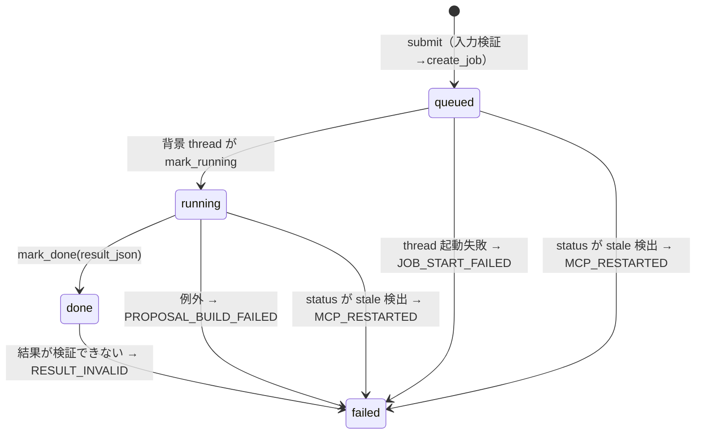

# 提案書・資料生成ジョブ

## 全体像

提案書系のツールは「数十秒で返る同期ツール」と「数十分かかるため job_id を返して裏で進める submit/status 型」に分かれる。ツールの登録は `src/teamagent/orchestrator/factory.py` の `build_production_tools`、OpenClaw に見せるかどうかは `infra/openclaw/openclaw.config.json5` の `toolFilter` が決める（[ツール登録と機能フラグ](../architecture/tool-registry-and-feature-flags.md)）。

| ツール | 型 | 登録フラグ（既定） | OpenClaw 公開 | 成果物 |
|---|---|---|---|---|
| `proposal_draft` | 同期 | 常時登録 | include | 過去提案を踏まえたドラフト骨子（文章） |
| `proposal_review` | 同期 | 常時登録 | include | 過去の勝ち筋・失注理由と照合した診断（文章） |
| `proposal_builder_submit` / `_status` | submit/status | `USE_PROPOSAL_BUILDER_TOOLS`（OFF） | include | 統合 FMT（83 枚）の PPTX を依頼元へ添付 |
| `omiyage_report_submit` / `_status` | submit/status | `USE_OMIYAGE_REPORT_TOOLS`（OFF） | include | TikTok 検索データ確認資料の PPTX 2 通を添付 |
| `proposal_deck` | 同期（部品） | `USE_PROPOSAL_DECK_TOOLS`（OFF） | **exclude** | FMT v2 の 95 枠を埋めた PPTX |
| `proposal_campaign` | 同期（部品） | `USE_PROPOSAL_CAMPAIGN_TOOLS`（OFF） | **exclude** | KW ごとの TikTok 実物サムネ（証拠画像） |
| `proposal_builder`（同期版） | 同期 | 登録されない | **exclude** | Python からの互換呼び出し用 |

長時間ジョブを OpenClaw の打ち切り（約 6 分）から切り離す共通の考え方と、`proposal_builder_submit` の完了を見張る `async_job_notify` は [長時間ジョブの切り離しと完了通知](../architecture/detached-jobs-and-async-notify.md) にある。このページはジョブ本体を扱う。

## proposal_draft / proposal_review（同期）

どちらも `SearchSkill.retrieve_hits` で過去提案・営業 FB を引き、Bedrock `converse`（prompt `v1`、system はキャッシュ）で文章を作る。factory は検索インスタンスを 1 つだけ作り、両者に同じものを注入する（埋め込みモデルの二重ロード回避。検索の中身は [社内資料検索](knowledge-search.md)）。

- `proposal_draft` は類似が 0 件なら Bedrock を呼ばず、定型の「見つかりませんでした」を返す（費用 0）。
- `proposal_review` は提案文の先頭 500 文字を検索クエリにし、0 件でも「一般原則で診断」としてレビューは行う。
- どちらも `publish_report` で HTML レポートを発行できる（`USE_HTML_REPORTS` で対象ツールを指定したときだけ URL が付く）。返却が長いときは `payload_offload` の allowlist 対象。

## proposal_builder（統合 FMT の提案書）

入力は Gemini の調査 JSON（A〜H の厳密スキーマ）と投稿開始日 D が中心で、ほかに `client_name`・`category_term`・`confidential_product_name`・`case_limit`（1〜3）・`max_repair` などを受ける（`skills/proposal_builder/schema.py`）。

### submit / status と job の状態

1. `ProposalBuilderSubmitSkill.run` は Gemini JSON を**先に**検証してから（不正なら job 行を作らない）、`pb_` + 32 桁 hex の job_id で `queued` 行を作り、入力と `SkillContext` を深いコピーにして daemon thread を起動し、即座に `queued` と `retry_after_seconds`（`PROPOSAL_JOB_RETRY_AFTER_SECONDS`、既定 30）を返す。
2. 背景 thread は `mark_running` で行を取り（条件付き更新に負けたら何もしない）、別の heartbeat thread が `PROPOSAL_JOB_HEARTBEAT_SECONDS`（既定 30）ごとに `updated_at` を更新する。
3. 終了時は `mark_done`、例外時は `mark_failed(PROPOSAL_BUILD_FAILED, error_summary=…)`。例外の要約と発生箇所はログにも残す（型名だけでは原因が追えなかった反省）。
4. `ProposalBuilderStatusSkill` は `queued`/`running` の行の `updated_at` が stale 閾値（`max(PROPOSAL_JOB_STALE_SECONDS, heartbeat×3)`、既定 180 秒）より古ければ、MCP タスクが入れ替わって thread が消えたとみなし `MCP_RESTARTED` で failed にする。書き込みは観測した `updated_at` を条件にした CAS なので、同時に来た heartbeat に負ければ上書きしない。
5. `failed` の要約は URL を伏せてから（`sanitize_llm_text`、300 文字）利用者向けメッセージに入れる。モデルが失敗理由を推測で説明する事故を防ぐため。

`pb_` で始まらない job_id は、store に**触れる前に** `JOB_KIND_MISMATCH` で拒否する。同じ台帳にお土産資料の `omy_…` 行が同居しており、それを `ProposalBuilderOutput` として読むと検証失敗で `RESULT_INVALID` に壊してしまうため。

### 生成パイプライン

`_execute` → `_run_pipeline` の主な段:

1. `parse_gemini_research` と `sanitize_unverified_numbers`: 同じ JSON オブジェクト内に出典 URL の無い数値を伏せ、出典 URL の登録簿を作る。
2. アカウント候補の選定（`selectors.load_and_select_accounts`、上位 5 件）と、社内 RAG からの事例候補検索（`search_case_candidates`）。RAG が落ちても代わりの事例を作らず、事例なしで続けて draft にする。
3. `confidential_product_name` が真なら、ブランド名を調査 JSON・ブリーフ・制約・カテゴリ語・補助枠から伏せ（`本商品` に置換）、ブランド名を含む URL を証拠から外し、`forbidden_output_terms` として Composer にも禁止させる。
4. TikTok 実測（media が設定されているときだけ）: 最大 6 KW × 10 本を検索し、`ProposalCampaignSkill` で 1 位のサムネを証拠画像にする。失敗は警告ログだけで本体は止めない。TikTok の動画 URL 形式でない画像・守秘語を含む画像は捨てる。
5. `ProposalDeckSkill`（prompt `v2`、`PROPOSAL_BUILDER_MODEL_ID` か `BEDROCK_MODEL_ID` を**明示必須**、無ければ `ValueError`）で 95 枠を埋め、`template_profile="proposal-builder-v1"` の統合 FMT に描く。`{{PB-ACCOUNTS}}` などの補助枠は LLM を通さず直接差し込む。競合調査（F）が空なら {41}/{42} を強制スキップする。

### ready / draft と Slack 添付

検証の未解決項目（数値の出典不足、RAG 不可・事例 0 件、アカウントの一致なし、スキップされた枠、競合調査なし）が 1 つでもあれば `draft`、無ければ `ready`。

- `ready` は依頼元に添付する。`draft` は `PROPOSAL_BUILDER_DELIVER_INTERNAL_DRAFTS` が ON のときだけ、ファイル名に `DRAFT_裏取り前_` を付けて添付する（外部提出の防止）。
- 添付先は `ctx.metadata` の `channel_id` / `thread_ts`（依頼元スレッド）が先で、失敗したら `user_email` から本人 DM を開いて送る。
- `PROPOSAL_BUILDER_PUBLISH_READY` が ON なら `ready` の PPTX を公開 URL にもする。ただし公開の最終ゲートは `ProposalDeckSkill._publish_if_enabled` の `USE_PROPOSAL_DECK_PUBLISH` で、これが OFF なら URL は付かない（入力経由で公開を強制されないため）。`ready` なのに Slack 添付も公開 URL も無い場合は成功扱いにせず例外にする。
- 生成物は request ごとの一時ディレクトリに置かれ、結果を台帳に書いた後に `cleanup_output` で消える。

### S3 固定 version 資産（起動時）

統合 FMT（約 143MB）はイメージに入れず、アカウント DB はリポジトリに置かない。どちらも S3 の**特定 object version** として、MCP 起動時に取得する。

- `scripts/run_mcp_vertex_entrypoint.py` は `USE_PROPOSAL_BUILDER_TOOLS` が ON なら `provision_proposal_builder_assets` を呼び、`PROPOSAL_BUILDER_TEMPLATE_PATH` / `PROPOSAL_BUILDER_ACCOUNT_DB_PATH` を設定し、S3 の pin 用 env（`PROPOSAL_BUILDER_TEMPLATE_S3_*`・`PROPOSAL_BUILDER_ACCOUNT_S3_*`・`PROPOSAL_BUILDER_ASSETS_KMS_KEY_ARN`）を消してから MCP サーバを exec する。例外は捕まえないので、資産が揃わなければ MCP は起動しない。
- `adapters/proposal_assets.py` は S3 client を作る前に全設定を検証する（version は `null` 不可、SHA-256 は 64 桁 hex、size は上限内、KMS 鍵 ARN は完全形）。HEAD と GET の応答で VersionId・ContentLength・SSE-KMS の鍵・ChecksumSHA256 を pin と照合し、本文は SHA-256 を計算しながら 0600 の一時ファイルに書き、検証後に `os.replace` で `/tmp/teamagent/proposal-builder/`（0700）へ置く。
- テンプレートの中身も検査する: スライドが 83 枚、数値枠が {1}〜{103} から欠番 {48}〜{55} を除いた 95 個ちょうど、必須の `PB-` 補助枠、版マーカー `{{PB-TEMPLATE:proposal-builder-v1}}`、D からの日付枠（-56〜+21 日、7 日刻み）、旧 FMT の作業指示文が残っていないこと。

## omiyage_report（お土産資料 便1）

営業の「◯◯のお土産資料」に対し、一般 KW・ブランド名・競合名の検索軸ごとに TikTok を実測し、動画解析（media worker で DL とフレーム切り出し → Bedrock の視覚推論でクラスタ分類とテロップ読取）と決定論集計から資料を作る。

- **submit の前段**: `run_preflight` と競合チェックで入力不足なら `needs_input` を返す。次に同時実行の入口制御（`JobAdmission`、プロセス内 `BoundedSemaphore`、`OMIYAGE_MAX_CONCURRENT_JOBS` 既定 3）で、空きが無ければ `busy`（何番目・約何分後）を返す。どちらも **job 行を作らない**。mcp タスクは 1 台（desiredCount=1）の前提なので、プロセス内の上限がそのまま全体の上限になる。
- **job**: job_id は `omy_` + 32 桁 hex、`request_summary.kind="omiyage_report"`。台帳は proposal_builder と同じ `ProposalJobStore`。status 側は入力スキーマの pattern（`^omy_[0-9a-f]{32}$`）と `kind` 照合の二段で、異種の行は読むだけで書き込まない。heartbeat・stale（`OMIYAGE_JOB_*`）・`MCP_RESTARTED` の扱いは proposal_builder と同じ型。
- **検索**: 1 軸あたりの本数は media 契約の上限 `TIKTOK_N_PER_KW_MAX`（30）で必ず clamp する（上限超えを送ると全軸が失敗した事故の再発防止）。全軸失敗なら `OMIYAGE_SEARCH_FAILED`、それ以外の例外は `OMIYAGE_BUILD_FAILED`。一部の軸・解析だけ失敗したときは `partial` として資料と結果文で開示する。
- **成果物**: 計測 JSON（deck_plan）と監査 JSON は `OMIYAGE_DECK_PLAN_BUCKET` が設定されていれば非公開 S3 に保存（未設定・失敗は保存なしで続行）。レンダラは計測 JSON だけを入力に、画像モード PPTX（media worker の `slides` 操作、1920×1080・scale 1）と編集用 PPTX（標準ライブラリの OOXML ライタ）の 2 通を作り、依頼元スレッド→本人 DM の順で添付する。全ファイルが送れたときだけ配達成功。
- `async_job_notify` の対象（`_ASYNC_JOB_TOOLS`）には入っていない。完了はジョブ自身の添付と配信コメントで知らせる。

## ProposalJobStore（共有の job 台帳）

`adapters/proposal_job_store.py`。`PROPOSAL_JOBS_TABLE` があれば DynamoDB、無ければプロセス内で共有するロック付き dict。

- 行は `job_id`・`status`・`created_at`・`updated_at`・`request_summary`（JSON 文字列。入力本文は持たない）・`expires_at`（作成から 7 日の TTL）と、終了時の `result_json` / `error_code` / `error_summary`。
- 遷移はすべて期待 status（必要なら期待 `updated_at`）を条件にした `update_item`。条件不成立は `False` を返し、それ以外の例外はそのまま上げる。**DynamoDB 設定時にメモリへ黙って戻ることはない**（永続境界が消えたら大きく失敗させる）。
- `get_job` は強整合読み取り。`mark_done` の結果は 300KB を超えると `ValueError`（DynamoDB の 1 行上限の手前）。
- DynamoDB テーブルは terraform の `aws_dynamodb_table.proposal_builder_jobs`（hash key `job_id`、TTL `expires_at`、PITR、`prevent_destroy`）。PostgreSQL 側のスキーマ（[PostgreSQL スキーマとマイグレーション](../data/postgres-schema-and-migrations.md)）とは別で、RLS も掛からない。

## media worker との分担

PPTX の描画・TikTok 検索・動画 DL は、ブラウザや python-pptx を持つ media worker が担う。core（MCP）は `adapters/media_job.py` の `MediaJobClient` で SQS に依頼を送り、DynamoDB の結果を強整合で poll し、S3 の成果物を完全性検査つきで取り出す（`MEDIA_TASK_QUEUE`・`MEDIA_JOBS_TABLE`・`MEDIA_JOB_BUCKET` の 3 つが揃って初めて `is_configured`）。受け渡しの詳細は [動画・TikTok 分析](video-and-tiktok-analysis.md)、イメージの境界は [コンテナイメージとビルド](../operations/container-images-and-build.md)。

- `proposal_deck` の描画は `render_proposal_pptx`（`proposal_pptx` 操作）で worker に委譲する。テンプレ・Composer JSON・証拠画像（最大 20 枚）を S3 に置いて渡し、worker 内の python-pptx が 95 枠を埋める。統合 FMT が大きいため、この操作のテンプレと出力だけ上限が 256MB（一般の操作は 128MB）。
- media が未設定で `TEAMAGENT_LOCAL_MEDIA_RUNTIME` が ON のときだけ、プロセス内の `renderer.render_deck` で描く（ローカル開発用）。どちらも無ければ `MEDIA_JOB_NOT_CONFIGURED`。
- Composer（Bedrock 呼び出し）は worker に移さず MCP タスク内に残す。worker は AWS の task role を持たないため。

## 設定と点灯

- terraform の `enable_proposal_builder` / `enable_omiyage_report`（既定 false）がそれぞれのフラグと env を mcp タスクに注入する。どちらも generic media worker が有効でないと `precondition` で apply が止まる。
- job 台帳の IAM（GetItem / PutItem / UpdateItem）はどちらか一方の点灯で付く。`PROPOSAL_JOBS_TABLE` は proposal_builder 側が ON なら proposal_builder のブロックだけが注入する（同名 env の重複は rollout ゲートが拒否するため）。
- proposal_builder は資産読み取り用に、pin した 2 object への `s3:GetObjectVersion` と、S3 経由に限った `kms:Decrypt` を持つ。
- ツールを OpenClaw に出すには、MCP 側のフラグに加えて `toolFilter.include` への追加が要る（人のゲート）。

## 変更するときの注意

- 新しい submit/status 型ジョブを同じ台帳に相乗りさせるなら、固有の job_id プレフィクスと `request_summary.kind` を決め、**既存の status skill 側にも**異種拒否を入れる。片方向だけだと相手の行を `RESULT_INVALID` に壊しうる。
- 背景 thread はプロセス内にしか無い。再デプロイで消えた job は status 照会時に `MCP_RESTARTED` になるだけで再実行されない。
- 利用者に返す文に job_id 以外の内部語・URL を出さない（failed の要約は URL を伏せてから返す）。

## テスト

- `tests/skills/proposal_builder/`: `test_async_jobs.py`（submit→status、stale の `MCP_RESTARTED`、要約のマスク）、`test_security_gates.py`、`test_tiktok_enrichment.py`、`test_research.py`、`test_schema_boundary.py`。
- `tests/adapters/test_proposal_job_store.py`（条件付き遷移・CAS・メモリへ戻らないこと）、`tests/adapters/test_proposal_assets_checksum.py`、`tests/infra/test_proposal_builder_assets_terraform.py`。
- `tests/skills/omiyage_report/`: `test_admission.py`（入口制御と枠の返却）、`test_async_flow.py`（添付・DM 退避・全軸失敗・stale）、`test_search_depth_clamp.py`、`test_fmt_*.py`。
- `tests/skills/proposal_deck/`、`tests/skills/proposal_campaign/`、`tests/skills/proposal/`、`tests/skills/proposal_review/`、`tests/media/`（media 契約と worker）。
