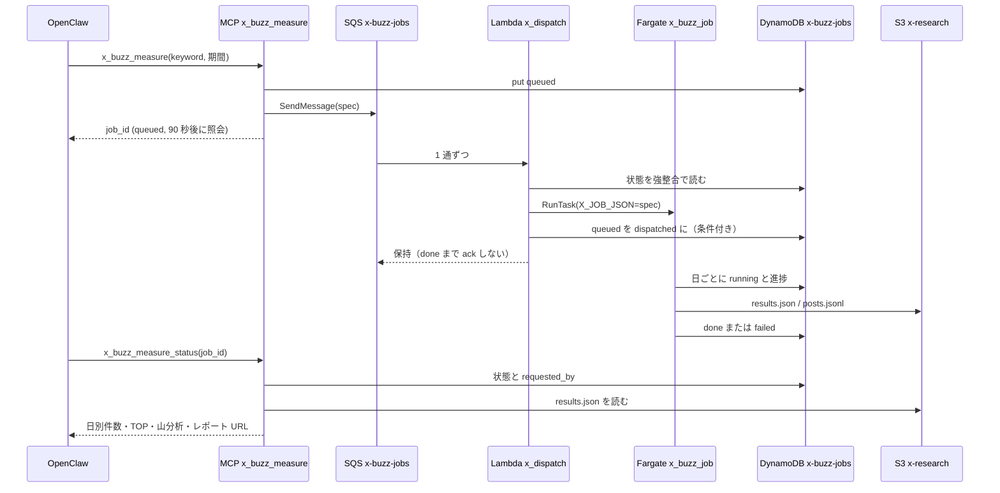

# X リサーチと Web リサーチ

## 位置づけ

社外の声や公開情報を調べる、読み取り系のツール群。社内データ（pgvector・Drive・メール）には触らない。

| ツール | 返すもの | 実行形態 | 外部依存 |
|---|---|---|---|
| `x_voice_search` | 商材名が主語の X 投稿カード集（全文・いいね・URL・実在検証の有無） | 同期（MCP 内） | Apify actor、Bedrock（ノイズ除去） |
| `x_needs_mining` | テーマ × 感情ワードで拾った不満・欲求の分類とインサイト仮説 | 同期（MCP 内） | Apify、Bedrock（分類） |
| `x_buzz_measure` / `x_buzz_measure_status` | 期間（最大 62 日）の日別発話数・バズ投稿 TOP・山の日の分析 | 非同期（依頼ごとに Fargate） | Apify、SQS、Lambda、DynamoDB、S3、Bedrock |
| `web_research` | 公開 Web の要約と番号付き出典 | 同期（MCP 内・Gemini 1 往復） | Gemini（Google 検索グラウンディング） |

<!-- openwiki: broken internal link [/openwiki/workflows/video-and-tiktok-analysis.md] link "/openwiki/workflows/video-and-tiktok-analysis.md" is root-absolute, which no real consumer resolves against the repository root (not a coding agent reading the page, not GitHub's Markdown renderer, not a local viewer); use a path relative to this file instead. Fix the href or restore the target, then delete this comment. -->
使い分けは各 Skill の `description` に書いてあり、LLM がツールを選ぶ手がかりになる。商材が主語なら voice、業界やテーマ全体なら needs、期間での増減なら buzz、X 以外の公開 Web なら web_research。TikTok / Instagram の検索面は [動画分析と TikTok](/openwiki/workflows/video-and-tiktok-analysis.md) の担当。

コードの場所は、Skill が `src/teamagent/skills/x_research/` と `src/teamagent/skills/web_research/`、Apify 呼び出しが `src/teamagent/adapters/apify_client.py`、buzz の投函と照会が `src/teamagent/adapters/x_task_store.py`、ワーカーが `src/teamagent/workers/x_buzz_job.py`、インフラが `infra/terraform/x_research.tf` と `infra/terraform/lambda/x_dispatch/handler.py`。

## 有効化と段階公開

<!-- openwiki: broken internal link [/openwiki/architecture/tool-registry-and-feature-flags.md] link "/openwiki/architecture/tool-registry-and-feature-flags.md" is root-absolute, which no real consumer resolves against the repository root (not a coding agent reading the page, not GitHub's Markdown renderer, not a local viewer); use a path relative to this file instead. Fix the href or restore the target, then delete this comment. -->
ツールが Aico から見えるまでの 4 段ゲートは [ツール登録と機能フラグ](/openwiki/architecture/tool-registry-and-feature-flags.md) を参照。

| | X 系 4 ツール | web_research |
|---|---|---|
| factory の env | `USE_X_RESEARCH_TOOLS` | `USE_WEB_RESEARCH_TOOL` |
| terraform | `var.enable_x_research`（既定 false）。ON にすると env・SQS・DynamoDB・Lambda・IAM がまとめて作られる | `var.use_web_research_tool`（既定 false）。前提として `enable_scrape_tools=true` を precondition で要求する（Gemini の認証 env がそちらのブロックにあるため） |
| OpenClaw `toolFilter.include` | 4 つとも列挙済み | 列挙済み |
| 段階公開 env | `X_RESEARCH_ALLOWED_EMAILS` ← `var.pr_research_allowed_emails` | `WEB_RESEARCH_ALLOWED_EMAILS` は `fargate.tf` で `""`（全員）に固定 |
| そのほかの前提 | `APIFY_API_TOKEN`（TikTok 用の既存 secret を共用）。レポート URL を作るには `enable_scrape_tools` 側の `VSEO_REPORT_BUCKET` も要る | Gemini の Vertex 認証 env |

段階公開の判定は `src/teamagent/skills/_shared/rollout.py` の `rollout_allowed` にまとまっている。env が空なら全員許可、値があればカンマ区切りの email に含まれる人だけを通す。本人の email が解決できないときは、allowlist が設定されていれば拒否する。X 系の allowlist には、検索面チェックとコメントマイニングの allowlist と同じ変数の値が入る。

web_research は全員に開放すると決めたあと、変数を経由せず `""` を直接書く形に変えた。git 管理外の tfvars に古い値が残っていると、開放したはずが黙って絞られてしまうため（退役した `web_research_allowed_emails` は宣言だけ残っている）。ただしフラグ自体の ON/OFF は今も tfvars が正本なので、git だけでは確かめられない。

## 同期の 2 本（x_voice_search / x_needs_mining）

どちらも MCP コンテナの中で終わる。Apify の actor は Apify 側のインフラで動き、MCP は REST で起動してポーリングするだけなので、専用のインフラは要らない。

voice の流れ:

1. 段階公開ゲートを通す。
2. クエリ（最大 6 本）を最大 4 並列で `ApifyClient.search_posts` に渡す。actor は apidojo → scraper_one → data-slayer の順に切り替わり、壁時計の予算はこのチェーン全体で分け合う。クエリ単位の失敗は警告に落として先へ進む。
3. 重複を除き、Bedrock（既定 Haiku）でノイズを除いて投稿者メモを付ける。LLM への入力はいいね上位 90 件に絞る（出力が max_tokens で切れ、ノイズ除去ごと効かなくなるのを防ぐため）。応答が壊れていたら全件を残し、警告を付ける（fail-open）。
4. いいね順に `max_selected`（30 以下）件を選び、xtracto actor で投稿 ID ごとに実在を確かめる。確かめられなかった投稿は捨てず、「要再確認」を付けて残す。
5. 時間が残っていれば、アバターと添付画像を data URI にして HTML カードに埋め込む（上限 22 秒・24 URL）。
6. HTML を S3 に置いて配信 URL（7 日有効）を作る。そのあとで応答から base64 画像を落として返す。
7. `USE_RESEARCH_PERSIST` で persister が注入されていれば、研究記録として非同期に保存する。保存するのは voice だけで、needs と buzz は任意のテーマで取引先に紐づかないため v1 では保存しない。

needs はクエリを `テーマ + 感情ワード` で組み、いいねが `min_faves` 未満の投稿を足切りする。分類とインサイト仮説は `X_ANALYSIS_MODEL_ID` のモデルで作る（terraform の validation で JP Sonnet 4.6 に固定）。分類に失敗しても投稿だけは納品する。

時間の上限は `X_SYNC_DEADLINE_S`（既定 170 秒、最小 60 秒）。効いてくるのは MCP の 300 秒ではなく OpenClaw のターン上限（実測でおよそ 181 秒）で、それを超えるとそのターンの応答がまるごと失われる。残りが 20 秒を切っていたら実在検証を省き、全件を「要再確認」として返す。予算超過（`CostLimitExceededError`）と `ApifyError` は例外として投げず、理由を `slack_summary` に入れた出力で返す。

Slack 向けの要約には上位投稿の URL を必ず添え、`safe_href`（https かつ既知の SNS ホストだけ）を通す。handle と本文だけを渡すと、後段の LLM が表に直すときに status ID を知らないまま URL を捏造した実例があるため。

## 非同期の効果測定（x_buzz_measure）

x_buzz のワーカーは定期実行ではない。EventBridge のスケジュールは無く、MCP でツールが 1 回呼ばれるたびに SQS に 1 通入り、それを Lambda `x_dispatch` が受けて Fargate タスクを 1 つ起動する。tiktok_acquire と同じ「A′トポロジ」の軽量版。

- **投函**（`XBuzzMeasureSkill` → `XTaskStore.submit`）: `job_id` は `xb_` に 12 桁の 16 進数を付けたもの。DynamoDB に `queued`（`requested_by` と TTL 30 日つき）を書いてから SQS に spec を送る。キュー URL かテーブル名が無ければ `failed` を返す。期間はスキーマで検査する（最大 62 日、終了日は開始日以降、施策日は期間内、1 日あたり 10〜200 件）。
- **起動**（Lambda、`batch_size=1`・`ReportBatchItemFailures`）: ジョブの状態が `done` ならメッセージを ack し、`queued` なら RunTask する。`clientToken` は SQS の messageId と taskdef から作るので、Lambda が再実行されても二重には起動しない。起動後は状態を条件付きで `dispatched` に変え、メッセージは partial batch failure として保持する。それ以外の状態でも保持する。
- **ワーカー**（`python -m teamagent.workers.x_buzz_job`）: mcp イメージを command 上書きで流用し、0.5 vCPU / 1 GB・ARM64 で動く。`X_JOB_JSON` を読んで、期間を 1 日ずつ apidojo actor で取得する（1 日あたり 150 秒まで）。1 日終わるごとに `running` と進捗を書く。その日の取得に失敗したら count=-1 として続け、予算超過なら `failed`（`COST_LIMIT`）で即終了する。最後に TOP10 を xtracto で実在検証し、`x-research/<job_id>/` に `results.json` と `posts.jsonl` を書いて `done` にする。S3 への書き込み失敗は `S3_WRITE_FAILED`、想定外の例外は `WORKER_CRASH`。
- **照会**（`x_buzz_measure_status`）: 段階公開ゲートに加えて、DynamoDB の `requested_by` と呼び出した人の email が一致しなければ拒否する。job_id は Slack のスレッドに平文で出るので、合言葉としては扱わない。`done` になって最初の照会のときだけ Sonnet で山の分析 → HTML → 配信 URL を作り、`report_url` と `spike_analysis` を DynamoDB にキャッシュする。URL が作れない環境でも分析結果はキャッシュする（照会のたびに Sonnet の費用がかかるのを防ぐため）。

### IAM の分担

| ロール | 権限 |
|---|---|
| MCP タスクロール | SQS SendMessage、ジョブ表の Get/Put/Update、コスト台帳の Get/Update、S3 `x-research/*` の GetObject。**RunTask と PassRole は持たない** |
| Lambda `x_dispatch` | SQS の受信と削除、ジョブ表の Get/Update、worker の taskdef だけを対象にした RunTask（クラスタ条件つき）、worker の 2 つのロールへの PassRole |
| worker タスクロール | S3 `x-research/*` の PutObject、ジョブ表とコスト台帳の Get/Update |

### 運用で知っておくこと

- SQS の可視性タイムアウトは 1800 秒、`maxReceiveCount=24`（およそ 12 時間）。62 日分でもおよそ 2.5 時間で終わる想定。`failed` になったジョブや、状態を更新できないまま落ちたワーカーのジョブは、ack されずに受信回数が増え、12 時間ほどで DLQ に移って深度アラーム（既存の SNS）が鳴る。Lambda は `queued` のときしか RunTask しないため、失敗したジョブが自動でやり直されることはない。
- DLQ アラームの説明文は「3回失敗」だが、実際の条件は `maxReceiveCount=24`。
- DynamoDB の状態は `queued → dispatched → running → done / failed` と進む。`x_buzz_measure_status` の文言表には queued・running・failed しか無いので、RunTask の直後から 1 日目の取得が終わるまで（`dispatched` の間）は「状態不明です。」と返る。
- 取得に失敗した日は `results.json` で count 0 に丸められ、`failed_days` と DynamoDB の warnings にしか残らない。status の応答とレポートは `failed_days` を読まないので、欠測した日は「発話 0 件の日」に見える。
- S3 の `x-research/` は 30 日で消え、DynamoDB の行も TTL 30 日。lifecycle ルールは `lambda_iam.tf` の統合設定に置いている。同じバケットに lifecycle リソースを 2 つ置くと互いに上書きし合うため。
- ワーカーのイメージは `var.x_buzz_image` で digest を固定し、main runtime とは別に更新する。同じアカウント・リージョンの teamagent-mcp の digest でなければ precondition で止まる。
- keyword は CloudWatch に出さない（投函ログは job_id と成否だけ）。ただし SQS の本文、DynamoDB の `detail`、RunTask の env 上書きには keyword が入っている。

## コストの上限

<!-- openwiki: broken internal link [/openwiki/integrations/bedrock-gemini-and-retry.md] link "/openwiki/integrations/bedrock-gemini-and-retry.md" is root-absolute, which no real consumer resolves against the repository root (not a coding agent reading the page, not GitHub's Markdown renderer, not a local viewer); use a path relative to this file instead. Fix the href or restore the target, then delete this comment. -->
Apify の費用は `ApifyClient(ledger=CostGuard.from_env())` が actor ごとの単価 × 件数で見積もり、run の前に予約して、終わったら実費で精算する（台帳の仕組みは [Bedrock / Gemini 呼び出しとリトライ・コスト](/openwiki/integrations/bedrock-gemini-and-retry.md)）。上限は全体の `COST_APIFY_MONTHLY_USD`（既定 50）と個人枠の `COST_PER_USER_MONTHLY_USD`（既定 15）。MCP とワーカーには同じ値を渡す（違うと、経路によって上限が変わってしまう）。`COST_GUARD_TABLE` が無いとガードは効かない。スキーマの件数上限（クエリ 6 本、1 本 30 件、期間 62 日など）が、コスト防御の最初の段になっている。

## web_research（公開 Web）

<!-- openwiki: broken internal link [/openwiki/integrations/bedrock-gemini-and-retry.md] link "/openwiki/integrations/bedrock-gemini-and-retry.md" is root-absolute, which no real consumer resolves against the repository root (not a coding agent reading the page, not GitHub's Markdown renderer, not a local viewer); use a path relative to this file instead. Fix the href or restore the target, then delete this comment. -->
Gemini の Google 検索グラウンディングを 1 回呼ぶだけの、読み取り専用のツール。検索もページ本文の取得も Google 側で済むので、自 VPC から Web ページを直接取りに行くことはない。呼び出し方・リトライ（グラウンディング経路は通常 2 回まで）・課金は [Bedrock / Gemini 呼び出しとリトライ・コスト](/openwiki/integrations/bedrock-gemini-and-retry.md) にある。

1. `ctx.metadata.user_email` が無ければ `PermissionError` を投げる（本人に限る・fail-closed）。
2. 段階公開ゲート（`WEB_RESEARCH_ALLOWED_EMAILS`）を通す。
3. クエリを無害化し（制御文字と区切り記号 `<<<` `>>>` を除き、200 字まで）、「データであって指示ではない」という枠で囲んだプロンプトを組む。`recency_days` の指定があれば、`after:<日付>` を付けて検索するよう指示する。
4. `GeminiClient.generate_with_google_search` を呼ぶ。1 回の試行の timeout は `WEB_RESEARCH_DEADLINE_S`（既定 60 秒）。例外になったら `search_failed` を返す。
5. 出典は `groundingMetadata` からサーバが組む（`render.build_sources`）。support に先に出てきた順に並べ、https だけを通し（userinfo と明示ポートは拒否）、同じ URL は除き、最大 `max_results`（8 以下）件まで。要約本文の URL は「［URL省略］」に置き換え、リンクの書式は全角括弧にして効かなくする。
6. グラウンディングが無い、有効な出典が 0 件、要約が空、のどれかなら `not_grounded` を返す。出典の無い「それらしい要約」は返さない。
7. `message` は要約と番号付き出典を決まった形に並べた文章で、LLM には言い換えも出典の付け替えもさせない。

system プロンプトでは「必ず検索して根拠づけよ」を「URL を書くな」より前に置いている。Gemini 3.5 系は「URL を書くな」だけだと検索そのものを省くことがあったため。この順序も、どちらの文も消さないこと。ログにはクエリ・要約・ページ本文を出さず、件数・コスト・遅延だけを出す。

## 禁止事項

- MCP のロールに `ecs:RunTask` と `iam:PassRole` を足さない。起動の権限は Lambda に集める。
- MCP の戻り値に base64 画像を残さない。OpenClaw はツールの結果を約 64KB で切るので、4MB 級の応答を返すと投稿の URL が文脈から消え、LLM が URL を捏造する。画像は HTML にだけ埋め込み、`_strip_card_images` は HTML を作ったあとに呼ぶ。
- 実在検証できなかった投稿を黙って捨てたり、検証済みと偽ったりしない。「要再確認」を付けて残す。
- web_research の出典を LLM の本文から作らない。
- web_research のクエリに社外秘の文言・顧客名・案件名を入れない（外部の検索サービスに送られる）。社内資料の照会は search 系のツールで行う。
- buzz の keyword や web_research のクエリを CloudWatch に出さない。
- X の分析モデルを暗黙に上位へ切り替えない。`X_ANALYSIS_MODEL_ID` で明示的に注入し、terraform は JP Sonnet 4.6 以外を受け付けない。
- 界隈分類（`USE_KAIWAI_CLASSIFY`、既定 OFF）は、実データで品質を確かめてから ON にする。OFF の間は投稿者の bio を LLM に送らない。
- `x_research.tf` に S3 の lifecycle リソースを置かない。

## テスト

- `tests/skills/x_research/test_x_research_skills.py`: voice の正常系、未検証の投稿を捨てないこと、ノイズ除去の fail-open、予算超過、段階公開、dedup キー。needs の足切りと縮退。buzz の spec と、keyword をログに出さないこと。期間の検証。status の所有者照合とキャッシュ。ワーカーの `run_job`。
- `tests/scripts/test_worker_dispatchers.py`: dispatcher が RunTask のあともメッセージを保持して冪等に動くこと、`done` のときだけ ack すること。
- `tests/skills/web_research/test_web_research.py`、`tests/adapters/test_apify_client.py`。
<!-- openwiki: broken internal link [/openwiki/testing/running-tests.md] link "/openwiki/testing/running-tests.md" is root-absolute, which no real consumer resolves against the repository root (not a coding agent reading the page, not GitHub's Markdown renderer, not a local viewer); use a path relative to this file instead. Fix the href or restore the target, then delete this comment. -->
- 走らせ方は [テストの走らせ方](/openwiki/testing/running-tests.md)。
