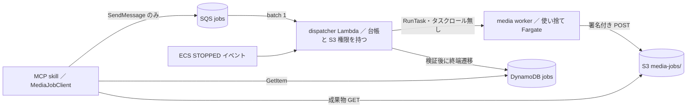

# 動画・TikTok 分析

## 位置づけと分担

動画・TikTok 系のツールは 8 つ（status を入れて 9 つ）あり、どれも既定 OFF の env フラグで `src/teamagent/orchestrator/factory.py` に登録される（[ツール登録と機能フラグ](../architecture/tool-registry-and-feature-flags.md)）。MCP の core イメージには Node・Chromium・ffmpeg・yt-dlp が入っていないため、実際のスクレイプや動画処理は別イメージの media worker に任せる（[コンテナイメージとビルド](../operations/container-images-and-build.md)）。

| ツール | 何をするか | 取得経路 | 分析 | フラグ |
|---|---|---|---|---|
| `tiktok_search` | KW / ハッシュタグの上位動画のメタをその場で取って横断分析 | media job（同期・メタのみ） | Gemini（任意） | `USE_TIKTOK_TOOLS` |
| `tiktok_acquire` / `tiktok_acquire_status` | 指標＋サムネ＋上位 N 本の mp4 を S3 に貯める（分析しない） | media job（非同期・job_id） | なし | `USE_TIKTOK_ACQUIRE` |
| `video_analysis` | 外部の競合動画 1 本の構成・フック・CTA | YouTube は Gemini の file_uri、他は media job の acquire | Gemini | `USE_VIDEO_TOOLS` |
| `video_algorithm` | 検索上位の複数本を時刻付きで分析し「なぜ上位か」をレポート化 | 検索（`tiktok_search` と同じ経路か acquire 成果物）＋動画ごとに acquire / proxy | Gemini | `USE_VIDEO_TOOLS` |
| `search_surface_check` | TikTok×Instagram の検索面の勢力図と自社の在圏判定 | TikTok は acquire 成果物か直接検索、IG は Apify | Bedrock | `USE_SEARCH_SURFACE_TOOL` |
| `tiktok_comment_mining` | 動画 1〜3 本のコメント欄の反応分類 | 本番は Apify（ローカルだけ Chromium） | Bedrock | `USE_TIKTOK_COMMENT_TOOLS` |
| `video_capture` | 指定時刻のフレームを JPEG にしてスレッドへ添付 | media job の acquire → frame、または Slack 添付 | なし | `USE_VIDEO_CAPTURE_TOOL` |
| `video_approval` | 自社編集者の納品動画をオリエンと照合して一次 FB | Drive / YouTube file_uri / 動画 DL | Gemini | `USE_VIDEO_APPROVAL` |

棲み分けは各 skill の `description` に書かれ、モデルのツール選択はそれに従う。「その場で上位リスト」は `tiktok_search`、「素材を貯める」は `tiktok_acquire`、「中身の勝ち筋」は `video_algorithm`、「誰が面を占めているか」は `search_surface_check`、「外部の 1 本」は `video_analysis`、「自社納品物のチェック」は `video_approval`。

## core から見た取得経路の分岐

TikTok 検索・動画 DL・圧縮の各 adapter（`adapters/tiktok_scraper.py`・`adapters/video_download.py`・`video_algorithm` の `_download` / `_shrink`）は同じ順で経路を選ぶ。

1. `MEDIA_TASK_QUEUE`・`MEDIA_JOBS_TABLE`・`MEDIA_JOB_BUCKET` が揃っていれば（`MediaJobClient.is_configured()`）media job に出す。本番はこれ。
2. 揃っていなければ、`TEAMAGENT_LOCAL_MEDIA_RUNTIME=1` のときだけローカルの subprocess（`tools/tiktok_scraper/search.mjs`・yt-dlp・ffmpeg）を使う。
3. どちらでもなければ `TIKTOK_MEDIA_JOB_NOT_CONFIGURED` などで失敗させる（core に無いバイナリへは落ちない）。

media job の呼び方は 2 種類ある。`tiktok_search`・`video_analysis`・`video_algorithm`・`video_capture` は `MediaJobClient.run_sync` で投函→1 秒間隔の照会→成果物の完全性確認つき DL までを 1 回の skill 実行の中で済ませる。`tiktok_acquire` だけは投函して即 job_id を返す非同期型で、結果は `tiktok_acquire_status` で受け取る。

media job の外にある経路は 2 つ。YouTube は Gemini が `file_uri` で直接読むので DL しない（TikTok / IG は Gemini 側で拒否されるため DL して inline で渡す）。Apify は Instagram の検索面、コメント取得、動画 DL 失敗分の補完（opt-in）に使い、token と egress を持つ MCP だけが呼ぶ。

## media job の流れ（A′トポロジ）

- **MCP の権限**（`infra/terraform/tiktok_acquire.tf` の `tiktok_mcp_policy`）: SQS への `SendMessage`、DynamoDB の `GetItem`、S3 の `input/` と `output/` の読み取り、`input/` への書き込みだけ。`RunTask`・`PassRole` は持たない。
- **dispatcher**（`infra/terraform/lambda/tiktok_dispatch/handler.py`）: SQS の canonical envelope を厳密に検証して台帳行を作り、VersionId 固定の GET と、出力名ごとに checksum を強制する POST の署名 URL を発行する。それらを入れた制御ファイルを S3 の `control/<attempt>.env` に置き、ECS の `environmentFiles` override で渡してタスクを起動する。予約同時実行 2・SQS からは `batch_size = 1`。
- **media worker**（`src/teamagent/media/tool_worker.py`、イメージの ENTRYPOINT）: `MEDIA_CONTROL_ZLIB_B64` を展開して `MEDIA_CONTROL_SHA256` と照合し、識別子の env が制御内容と一致しないとき、AWS 資格情報系や `MEDIA_JOBS_TABLE` などの env があるときは起動を拒否する。`media/operations.py` の操作を実行し、許可された出力スロットにだけアップロードして completion を書く。security group は 443 と VPC resolver への egress だけ。
- **終端の確定**: ECS の STOPPED イベントで dispatcher が attempt・checksum・サイズを検証し、DynamoDB を 1 回だけ条件付きで終端に遷移させる。image pull 失敗や OOM で worker が completion を書けずに止まった場合もここで拾う。
- **core 側の検証**: `get_result` は成果物が `media-jobs/<job_id>/attempts/` 配下にあること、manifest の SHA-256 が台帳の値と一致することを確かめ、違えば `MEDIA_ARTIFACT_MANIFEST_*` エラーにする。

操作の種類は `acquire`・`tiktok_acquire`・`proxy`・`frame`・`thumbnail`・`slides`・`proposal_pptx`・`pdf`（`media/contracts.py`）。提案書の PPTX 化もこの worker を使う（[提案書・資料生成ジョブ](proposal-jobs.md)）。

上限と保持:

- 1 ジョブの予算は 15 分（`MAX_JOB_BUDGET_SECONDS`）。成果物の保持は 30 日で、Terraform は `media_artifact_ttl_seconds` を 2592000 以外にできない。
- 削除の正本は 5 分ごとの janitor Lambda。DynamoDB TTL と S3 lifecycle（30 日）は予備。
- SQS の visibility timeout は 180 秒、5 回受信で DLQ（14 日保持）。DLQ の深さに CloudWatch アラームがある。
- acquire できる URL は youtube.com・youtu.be・tiktok.com・instagram.com・instagr.am の配下だけ。この一覧は `media/url_policy.py`・dispatcher・`search.mjs` の 3 か所に同じものがある。

## tiktok_acquire / tiktok_acquire_status

`tiktok_acquire` は `request_id` と入力の SHA-256 から `tk_` ＋ 12 桁の job_id を作り、`TikTokTaskStore.submit` で SQS に投函して `status=queued`・`poll_after_s=75` を返す。投函に失敗したら `status=failed`。依頼者の email の SHA-256（`audit_principal_hash`）を request に焼き込み、status の照会や後段の読み出しでは同じ hash の本人のジョブしか読めない。

worker 側（`operations._tiktok_acquire`）は KW ごとに `search.mjs` を呼び、`--max n_per_kw` 本の投稿を `p<KW番号2桁><順位3桁>` の pid で並べる。bot wall・0 件・取得元の例外は、その KW を `shortfalls` に記録して次の KW へ進む。全投稿のサムネを取得し、`sort`（`display` / `save_rate` / `recent`）で選んだ上位 `videos_per_kw` 本だけ mp4 を DL する。成果物は `posts.normalized.json`・`config.json`・`videos/manifest.json`・`thumbs/<pid>.jpg`・`videos/<pid>.mp4`。

`tiktok_acquire_status` は DynamoDB を読み、`done` なら posts / config / manifest と各動画・サムネに **10 分**の署名 URL を付けて返す（再照会で出し直す）。動画は `s3_key`（機械用）と `url`（人向け）の両方を返し、mp4 本体を応答に埋め込まない。完了を会話へ知らせるのは `async_job_notify`（[長時間ジョブの切り離し](../architecture/detached-jobs-and-async-notify.md)）。

**時間見積もりと組み直し**: 1 ジョブは `KW 数 × (検索 120 秒（n_per_kw が 30 超なら 240 秒）＋ n_per_kw × 50 秒 ＋ videos_per_kw × 120 秒)` の見積もり（`estimate_tiktok_operation_seconds`）が `900 − 30 = 870` 秒以内でないと worker が受け付けない。既定値（n_per_kw=10・videos_per_kw=2）では 2 KW 以上が 1 ジョブに入らないため、`tiktok_acquire` は依頼を断らずに投函計画を組み直す（`skills/tiktok_acquire/plan.py`、2026-09-30 の #481）。そのまま収まればそのまま 1 ジョブ、動画なし（`videos_per_kw=0`）なら指標だけのジョブ（`metadata_only`・サムネの控えを省く）に切り替えて 1 ジョブ 7 KW まで詰め、動画ありなら KW をまとめられるだけまとめて残りを別ジョブに分ける。1 依頼で同時に投函するのは最大 5 ジョブ（`MAX_JOBS_PER_REQUEST`、取得タスク 1 本 16 vCPU のため他の人の分を残す）で、それを超えるときや 1 KW でも収まらないときだけ取得本数、次に動画本数を縮め、変えた点を `adjustments` として返す。複数ジョブになったときは `job_ids` で返す。

**Apify 補完（`USE_TIKTOK_APIFY_FALLBACK`、既定 OFF）**: `done` のうち worker が DL できなかった動画を MCP が Apify で取り直し、`media-jobs/<job_id>/input/apify-*.mp4` に置いて `acquired_via=apify` を付ける。完了見張りの定期照会からは発火しない。(job, pid) ごとに試行済みマーカーを条件付き PUT で置くので、Apify を走らせるのは 1 回だけ。費用の上限は CostGuard で管理する。

## tiktok_search（同期の即時検索）

`search_tiktok` は `MediaJobClient.search_tiktok` を `artifact_mode=metadata_only`・`videos_per_kw=0` で呼び、`posts.json` だけを受け取る。待ち時間は最低 200 秒（Fargate の起動 30〜45 秒＋スクレイプ）。`max_videos` が dispatcher の上限 `TIKTOK_N_PER_KW_MAX = 30` を超えると、SQS に送る前に `ValueError` で落とす（上限を超えた値を送ると dispatcher 側で全ジョブが失敗するため）。`analyze=true` なら上位メタを Gemini で横断分析する。`outputs` に `frames` を入れると `video_algorithm` を後段で走らせて実フレームを付け、`pptx` を入れると media worker で PPTX 化する。

## video_analysis と video_approval

`video_analysis` は URL を `validate_scrape_url` で先に検査してから分岐する。YouTube は `analyze_video_url`（file_uri）、それ以外は `download_video` → media job の acquire（上限 20MB）→ `analyze_video_bytes` の順。DL した bytes は分析後に捨てる。`ANALYSIS_CACHE_ENABLED` なら S3 の分析キャッシュを先に引く。月間クォータ（`VIDEO_QUOTA_ENABLED`、`video_usage` テーブル）は Gemini を呼ぶ直前に 1 本消費し、キャッシュヒットでは消費しない。

`video_approval` は Drive URL を `drive_video`、YouTube を file_uri、その他を DL で取得する。オリエンの 4 観点（必須要素・NG・テロップ / 誤植・尺）と照合し、JSON を防御的にパースして、パースに失敗しても FB 本文は返す。Gemini の inline 上限（約 20MB）を超える動画は ffmpeg で縮めてから渡す。Slack ボットの経路には、案件シートからオリエンを読む処理（`sheet_orientation.py`）と、判定と指摘の要点をシートの右端の空き列に 1 セルずつ書く処理（`sheet_writeback.py`、既存セルは消さない）もある。ただしシートへの書き込みは spreadsheets スコープの再認可が済むまで止めてあり、今は Slack への出力が主。

## video_algorithm（入口と出力の形）

入力は `query` のほか、深掘り本数の `max_videos`（既定 5・`VIDEO_ALGO_MAX_VIDEOS`・1〜10）、一覧に載せる本数の `board_size`（既定 30・5〜30）、`outputs`（既定 `report`＋`slides`、`pptx` は明示要求時だけ）、`acquire_job_id`、`client_name` / `competitors` / `avoid_terms` など。

1. 検索: `acquire_job_id` があれば `TikTokS3Source`（本人の hash で台帳を読み、記録済みの VersionId だけを GET）から posts と動画を読み、スクレイプしない。無ければ `search_tiktok`。
2. 尺が 0 の投稿（カルーセルや画像）を深掘り候補から外す。上位から波状に分析し、成功が `max_videos` 本に届くか候補が尽きるまで繰り返す。波ごとにクォータを先に確保し、1 波目で足りなければ残り本数を示して止め、2 波目以降は残数に丸める。
3. 1 本ごと: media acquire → media proxy（Gemini の上限まで圧縮）→ Gemini で時刻付き構造分析。DL に失敗したら、Apify 補完（opt-in）を試し、それでも駄目ならサムネだけで分析する。
4. 横断分析（`cross_analyze`・synthesis）→ HTML レポート・編集可スライド HTML・PPTX を発行し、`slack_summary` を組む。

出力 `VideoAlgorithmOutput` の主な欄は、`videos`（深掘りした本）・`board`（取得した全メタ）・`cross`・`report_url` / `slides_url` / `pptx_url`（非公開 S3 の署名 URL）・`slack_summary`・`quota_note`・`total_cost_usd`・`generated_at`（順位を取った時刻、JST）。30 秒を超える実行を切り離して完了時に直接投稿する仕組みは [長時間ジョブの切り離し](../architecture/detached-jobs-and-async-notify.md) にある。

## search_surface_check

TikTok 面は `acquire_job_id` があれば acquire 成果物を `rank_display`（検索面の表示順）のまま読み、並べ替えない。無い場合に直接取得できるのは 2 KW まで（`MAX_DIRECT_KEYWORDS`）で、3 KW 以上なら取得せずに「先に `tiktok_acquire(videos_per_kw=0)` を」と返す。IG 面は Apify の Actor（`IG_SURFACE_DEFAULT` で検索面かタグ面かを選ぶ）。勢力図の分類と結論は KW×媒体ごとに Bedrock を 1 回ずつ呼び、自社の在圏は @handle の決定的な一致で判定する。段階公開は `SEARCH_SURFACE_ALLOWED_EMAILS`。

MCP への返却は `mcp_relay_fields` で `slack_summary`・`report_url`・`warnings`・`total_cost_usd`・`keywords`・`measured_epoch` の 6 欄に絞る。上位 30 本の生データを渡すと Aico が文面を組み直してしまうため。上位動画の中身を裏で分析する 2 段目（`run_video_followup`）は、1 段目の上位をそのまま `video_algorithm` の `analyze_videos` に渡す。

## tiktok_comment_mining と video_capture

`tiktok_comment_mining` はまず `get_tiktok_comments`（Chromium でコメント API を傍受）を試す。ただしこれはローカル実行でしか動かないので、本番では常に Apify（clockworks）に縮退する。分類は Bedrock。段階公開は `COMMENT_MINING_ALLOWED_EMAILS`。

`video_capture` は TikTok / Instagram の URL か会話の添付動画を入力にし、acquire（240 秒・80MB）→ frame（180 秒・最大 12 点）の 2 ジョブを直列に回す。範囲外の時刻が 1 点でもあるとジョブ全体が失敗する。media のエラーコードは決まった日本語文に変換し、「0 枚でした」のような応答にはしない。配信先は依頼スレッドか本人 DM だけ。YouTube URL は取得元（yt-dlp が bot 判定で拒否される）にブロックされるため、既定では入口で添付を頼む案内を返す（`VIDEO_CAPTURE_ALLOW_YOUTUBE=1` で受け付けに戻せる）。

## キャッシュ

| キャッシュ | 場所 / フラグ | キー | 失敗時 |
|---|---|---|---|
| 分析キャッシュ（`AnalysisCache`） | S3 `ANALYSIS_CACHE_BUCKET` / `ANALYSIS_CACHE_ENABLED` | YouTube は動画 ID、DL 経路は動画 bytes の SHA-256。どちらも prompt_version・model_id・focus を含む | fail-open（分析を続ける）。保存するのは Gemini の出力テキストだけ |
| `video_algorithm` 結果キャッシュ | 同じ bucket / 専用フラグ `VIDEO_ALGORITHM_RESULT_CACHE_ENABLED` | 出力を変えうる全入力＋依頼者＋prompt / model / synthesis の版 | 読めなければ miss。処理中リース（S3 の条件付き書き込み、既定 1800 秒）を取れなければ課金処理を始めない |
| media 成果物 | `media-jobs/<job_id>/` / 30 日 | job_id（入力のハッシュから決まる） | 署名 URL は 10 分で、status のたびに出し直す |
| 2 段目の結果 | プロセス内 24 時間 | 人・KW・URL 集合 | 再デプロイで消える（[長時間ジョブの切り離し](../architecture/detached-jobs-and-async-notify.md)） |

結果キャッシュの TTL は既定 3600 秒（`VIDEO_ALGORITHM_CACHE_TTL_SECONDS`）。`ANALYSIS_CACHE_ENABLED` と共用しないのは、共用すると次のイメージ更新でリース機構が勝手に有効になり、切るには terraform apply が要るため。

## ドキュメント・コメントとの食い違い（コードが正）

- `tools/tiktok_scraper/README.md` は「動画ファイルはダウンロードしない」「`tiktok_search` が adapter から subprocess で呼ぶ」と書く。実際の `search.mjs` には `--mode download` があり、本番の呼び出しは media worker 経由。
- `adapters/tiktok_video_fallback.py` の docstring は worker の DL 順を「yt-dlp → browser」と書くが、`operations._worker_acquire_order` の既定は `VIDEO_DL_ORDER="browser,ytdlp"`（browser は TikTok だけ）で、タスク定義はこの env を設定していない。
- 2026-09-30 の #481 までは、上の見積もりを超える依頼を入力検証で拒否しており、`search_surface_check` の description にある「3KW 以上は `tiktok_acquire(videos_per_kw=0)` を先に」も既定の n_per_kw=10 では必ず拒否されていた（本番で 08-28〜09-29 に 17 回）。現在は組み直しで通る。
- `docs/runbooks/media_worker_rightsizing.md` は、稼働中のタスク定義の CPU とメモリが Terraform の既定（2048 / 4096、メモリは validation で 4096 に固定）と違っていたことを記録している。
- `src/teamagent/media/worker.py`（DynamoDB / S3 を直接使う 1 ジョブ実行器）は、core と media のどちらのイメージからも削除される（media の Dockerfile は存在しないことを assert する）。本番の入口は `tool_worker.py`。

## 変更するときの注意

- `TIKTOK_N_PER_KW_MAX` は dispatcher の `_bounded_int(..., maximum=30)` と同じ PR で動かす（`tests/media/test_tiktok_n_per_kw_contract.py` が一致を強制）。見積もりの定数も dispatcher に同じものがある。
- MCP のロールに `RunTask` / `PassRole` を足さない。media worker にタスクロールや AWS 資格情報を渡さない。
- 利用者の依頼から作る request には必ず `audit_principal_hash` を入れる。後段（`TikTokS3Source`・status）は hash が一致しない job を読まない。

## テスト

実行手順は [テストの走らせ方](../testing/running-tests.md)（media 系は `--extra media`）。

- `tests/media/`: `test_contracts.py`・`test_tiktok_operations.py`・`test_tool_worker.py`・`test_tool_contracts.py`・`test_deep_search_contract.py`・`test_tiktok_n_per_kw_contract.py`・`test_core_media_delegation.py`。
- `tests/infra/test_media_dispatcher.py`・`test_media_janitor.py`・`test_media_terraform_hardening.py`・`test_dockerfile_teamagent_media_worker.py`。
- `tests/adapters/test_tiktok_task_store.py`・`test_tiktok_scraper.py`・`test_tiktok_video_fallback.py`・`test_analysis_cache.py`・`test_video_algorithm_cache.py`・`test_video_download.py`。
- `tests/skills/` の `tiktok_acquire`・`tiktok_search`・`video`・`video_algorithm`・`search_surface_check`・`tiktok_comment_mining`・`video_capture`・`video_approval`。
